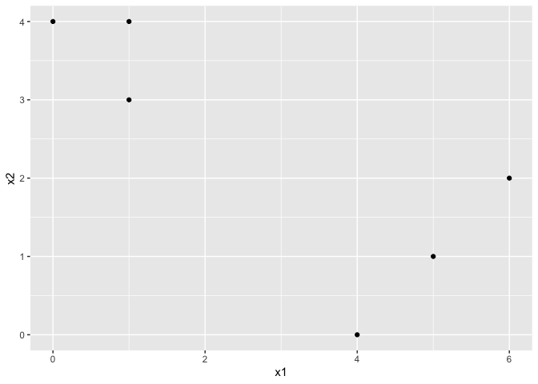
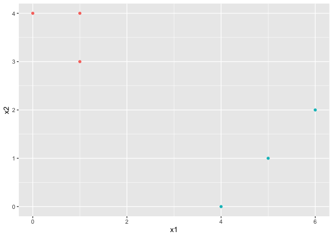
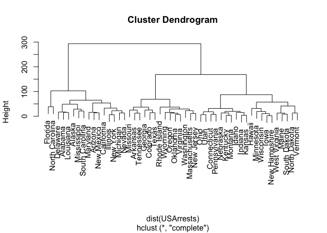
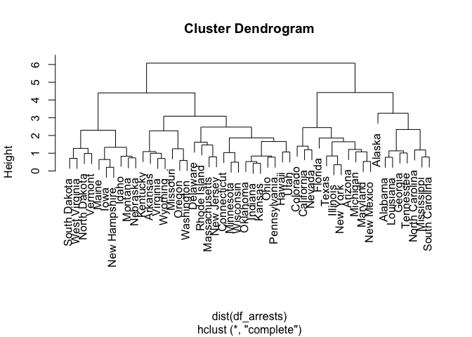
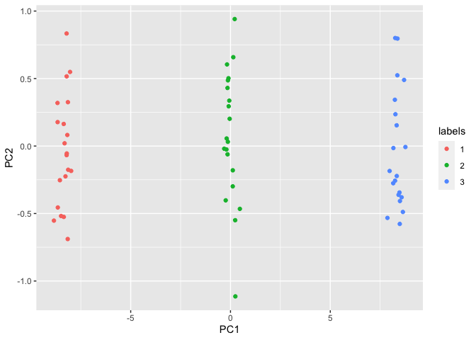
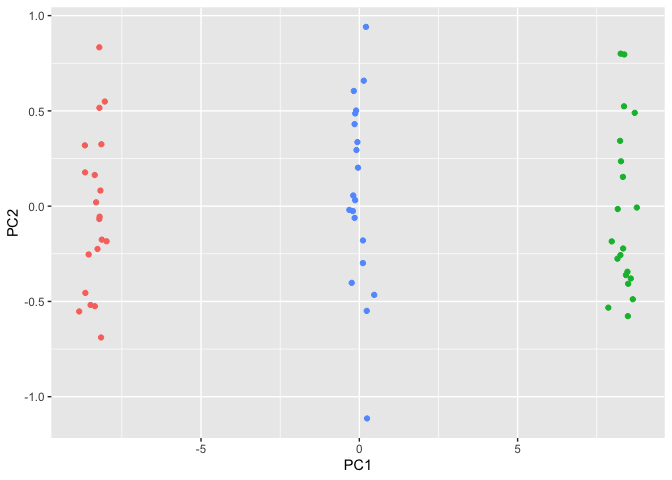
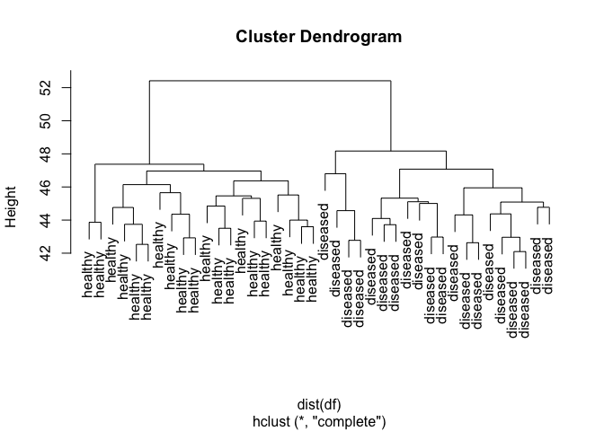

-   [Conceptual](#conceptual)
    -   [Question 1](#question-1)
    -   [Question 2](#question-2)
    -   [Question 3](#question-3)
    -   [Question 4](#question-4)
    -   [Question 5](#question-5)
    -   [Question 6](#question-6)
-   [Applied](#applied)
    -   [Question 7](#question-7)
    -   [Question 8](#question-8)
    -   [Question 9](#question-9)
    -   [Question 10](#question-10)
    -   [Question 11](#question-11)

    library(ggplot2)

## Conceptual

### Question 1

$\frac{1}{|C\_k|}\displaystyle\sum\_{i,i' \in C\_k}\displaystyle\sum\_{j = 1}^{p} (x\_{ij} - x\_{i'j})^2 = \frac{1}{|C\_k|}\displaystyle\sum\_{i,i' \in C\_k}\displaystyle\sum\_{j = 1}^{p} ((x\_{ij} - \bar{x}\_{kj}) - (x\_{i'j} - \bar{x}\_{kj}))^2 = \frac{1}{|C\_k|}\displaystyle\sum\_{i,i' \in C\_k}\displaystyle\sum\_{j = 1}^{p} (x\_{ij} - \bar{x}\_{kj})^2 + (x\_{i'j} - \bar{x}\_{kj})^2 - 2(x\_{ij} - \bar{x}\_{kj})(x\_{i'j} - \bar{x}\_{kj}) = \\\frac{1}{|C\_k|}\displaystyle\sum\_{i,i' \in C\_k}\displaystyle\sum\_{j = 1}^{p} (x\_{ij} - \bar{x}\_{kj})^2 + (x\_{i'j} - \bar{x}\_{kj})^2 = \frac{2}{|C\_k|}\displaystyle\sum\_{i,i' \in C\_k}\displaystyle\sum\_{j = 1}^{p} (x\_{ij} - \bar{x}\_{kj})^2 = 2\displaystyle\sum\_{i \in C\_k}^{n}\displaystyle\sum\_{j = 1}^{p} (x\_{ij} - \bar{x}\_{kj})^2$

Since after the cluster centroids are created, we assign each
observation to the closest centroid using Euclidean distance, the total
within cluster variation is guaranteed to never increase.

### Question 2

#### a

First, fuse observations 1 and 2 at height 0.3. Then fuse observations 3
and 4 at height 0.45. Then fuse these two clusters at height 0.8.

#### b

First, fuse observations 1 and 2 at height 0.3. Then fuse observation 3
with this cluster at height 0.4. Then fuse observation 4 at height 0.45.

#### c

(1, 2) and (3, 4)

#### d

(1, 2, 3) and (4)

#### e

We can swap (1,2) in question A, or (3, 4).

### Question 3

  

    df <- data.frame(
      x1 = c(1, 1, 0, 5, 6, 4),
      x2 = c(4, 3, 4, 1, 2, 0)
    )

    ggplot2::ggplot(data = df) +
      ggplot2::geom_point(ggplot2::aes(x = x1, y = x2))

    x_mat <- as.matrix(df)

    set.seed(1)
    labs <- sample(1:2, 6, replace = TRUE)

    for (i in seq(2)) {
      if (!(i %in% labs)) {
        labs[[i]] <- i
      }
    }

    changed <- TRUE
    while (changed) {
      old_labs <- labs
      centroids <- lapply(
        seq(2),
        function(idx, labs, x_mat) {
          x_mat <- x_mat[labs == idx, ]
          apply(x_mat, 2, mean)
        },
        x_mat <- x_mat, labs = labs
      )

      labs <- apply(
        x_mat, 1, function(row) {
          distances <- sapply(
            centroids,
            function(centroid, row) {
              sum((centroid - row) ^ 2)
            },
            row = row
          )
          which.min(distances)
        }
      )

      if (identical(labs, old_labs)) {
        changed <- FALSE
      }
    }

    df$cluster <- as.factor(labs)

    ggplot2::ggplot(data = df) +
      ggplot2::geom_point(ggplot2::aes(x = x1, y = x2, color = cluster), show.legend = FALSE)

### Question 4

#### a

If the distances between the points in each of the clusters are all the
same, then the fusions will occur at the same height. Otherwise the
fusion for the single linkage tree will occur at a lower height than the
fusion for the complete linkage tree. Therefore there is not enough
information to tell.

#### b

They will occur at the same height, since the maximal dissimilarity is
equal to the minimal dissimilarity for clusters of size 1.

### Question 5

1.  The clustering would group observations into those with higher than
    average number of socks bought and those with lower than average
    number of socks bought.
2.  The clustering would group observations into those who bought
    computers vs those who did not buy computers.
3.  Same as b

### Question 6

#### a

The variance of the first principal component (the first column of the
transformed design matrix) is 10% of the sum of the variances of each of
the features from the original design matrix.

#### b

There are a few problems with this approach:

1.  The scale of X is not specified; prior to PCA, we normally perform
    standardization, so the scale of the principal components might not
    be the same as the scale of the columns of X. We might be
    subtracting two quantities that have very different scales.

2.  Even if X and the principal components are on the same scale, the
    first principal component might be capturing more than just variance
    introduced by the two machines; it could be measuring actual
    variance of gene expressions across samples as well. There is also
    no guarantee that all the variance introduced by the two machines is
    actually captured by the first principal component. So subtracting
    the first principal component might remove actual variation that we
    want to study across samples, as well as not remove all variation
    introduced by the difference in machines. Kind of a lose-lose
    situation. A better solution would be separate each of the tissue
    samples into separate datasets, then standardize each dataset before
    recombining datasets. We can then perform t tests between the `C`
    and `T` for each gene.

#### c

  

    # We will create a situation where 5 gene expressions differ across `C` and `T` and
    # see if we can pick up on them via t.tests. Each machine will have different parameters
    # that affect the measured gene expression.
    n_rows <- 100
    n_cols <- 1000

    machine_params <- list(
      a = list(mean = 0, sd = 1),
      b = list(mean = 3, sd = 4)
    )

    prob_a <- seq(0, 1, length = 100)
    prob_b <- 1 - prob_a

    expressions <- vector("list", length = n_rows)
    machine_used <- rep(0, nrows)
    set.seed(1)
    for (i in seq_along(expressions)) {
      machine <- sample(c("a", "b"), 1, prob = c(prob_a[[i]], prob_b[[i]]))
      machine_used[[i]] <- machine
      params <- machine_params[[machine]]
      expressions[[i]] <- do.call(rnorm, c(n_cols, params))
    }

    x_mat <- do.call(rbind, expressions)
    # Assume the first 50 observations are control, and the next 50 are treatment.
    control_idx <- rep(c("control", "treatment"), each = 50)
    control_idx <- sample(control_idx)

    # Assume these five genes have a difference in expression of 5 units
    differing_genes <- c(1, 10, 100, 500, 999)

    x_mat[control_idx == "treatment", differing_genes] <- x_mat[control_idx == "treatment", differing_genes] + 2.5
    x_mat <- scale(x_mat)

    # Method proposed in book
    principal_component_analysis <- prcomp(x_mat, scale = TRUE)
    x_mat <- x_mat - matrix(principal_component_analysis$x[, 1], 100, 1) %*%  
      matrix(t(principal_component_analysis$rotation)[1, ], 1, 1000)

    treatment <- x_mat[control_idx == "treatment", ]
    control <- x_mat[control_idx == "control", ]

    t_tests <- rep(0, n_cols)
    for (i in seq(n_cols)) {
      t_tests[[i]] <- t.test(treatment[, i], control[, i])$p.value
    }

    bonferroni_p_value <- 0.05 / 1000
    print(which(t_tests <= bonferroni_p_value))

    ## [1]   1  10 500

    machine_a <- x_mat[machine_used == "a", ]
    machine_b <- x_mat[machine_used == "b", ]
    machine_a_control_idx <- control_idx[machine_used == "a"]
    machine_b_control_idx <- control_idx[machine_used == "b"]

    machine_a <- scale(machine_a)
    machine_b <- scale(machine_b)

    x_mat_scaled <- rbind(machine_a, machine_b)
    control_idx <- c(machine_a_control_idx, machine_b_control_idx)

    treatment <- x_mat_scaled[control_idx == "treatment", ]
    control <- x_mat_scaled[control_idx == "control", ]

    t_tests <- rep(0, n_cols)
    for (i in seq(n_cols)) {
      t_tests[[i]] <- t.test(treatment[, i], control[, i])$p.value
    }

    bonferroni_p_value <- 0.05 / 1000
    print(which(t_tests <= bonferroni_p_value))

    ## [1]   1  10 100 500 999

With our new methodology, we have captured the 5 genes that have true
differences in expression between control and treatment, whereas running
the analysis suggested in the book only captures 2 of the 5 genes that
have true differences.

## Applied

### Question 7

First we prove this:
$1 - cor(X,Y) = 1 - \frac{\frac{X^TY - nE(X)E(Y)}{n - 1}}{sd(X)sd(Y)} = 1 - \frac{X^TY}{n - 1} \propto 2(n - 1) - 2X^TY$

Now the Euclidean distance between two observations is defined as

(*X*−*Y*)*T*(*X*−*Y*) = (*X**T*−*Y**T*)(*X*−*Y*) = *X**T**X* − 2*X**T**Y* + *Y**T**Y* = 2(*n*−1) − 2*X**T**Y*

So the two quantities are proportional to one another.  

    x_mat <- as.matrix(USArrests)
    x_mat <- apply(
      x_mat, 1, function(row) {
        (row - mean(row)) / sd(row)
      }
    )

    correlations <- 1 - cor(x_mat)

    distances <- as.matrix(dist(t(x_mat))) ^ 2

    print(correlations / distances)

    ##                  Alabama    Alaska   Arizona  Arkansas California  Colorado
    ## Alabama              NaN 0.1666667 0.1666667 0.1666667  0.1666667 0.1666667
    ## Alaska         0.1666667       NaN 0.1666667 0.1666667  0.1666667 0.1666667
    ## Arizona        0.1666667 0.1666667       NaN 0.1666667  0.1666667 0.1666667
    ## Arkansas       0.1666667 0.1666667 0.1666667       NaN  0.1666667 0.1666667
    ## California     0.1666667 0.1666667 0.1666667 0.1666667        NaN 0.1666667
    ## Colorado       0.1666667 0.1666667 0.1666667 0.1666667  0.1666667       NaN
    ## Connecticut    0.1666667 0.1666667 0.1666667 0.1666667  0.1666667 0.1666667
    ## Delaware       0.1666667 0.1666667 0.1666667 0.1666667  0.1666667 0.1666667
    ## Florida        0.1666667 0.1666667 0.1666667 0.1666667  0.1666667 0.1666667
    ## Georgia        0.1666667 0.1666667 0.1666667 0.1666667  0.1666667 0.1666667
    ## Hawaii         0.1666667 0.1666667 0.1666667 0.1666667  0.1666667 0.1666667
    ## Idaho          0.1666667 0.1666667 0.1666667 0.1666667  0.1666667 0.1666667
    ## Illinois       0.1666667 0.1666667 0.1666667 0.1666667  0.1666667 0.1666667
    ## Indiana        0.1666667 0.1666667 0.1666667 0.1666667  0.1666667 0.1666667
    ## Iowa           0.1666667 0.1666667 0.1666667 0.1666667  0.1666667 0.1666667
    ## Kansas         0.1666667 0.1666667 0.1666667 0.1666667  0.1666667 0.1666667
    ## Kentucky       0.1666667 0.1666667 0.1666667 0.1666667  0.1666667 0.1666667
    ## Louisiana      0.1666667 0.1666667 0.1666667 0.1666667  0.1666667 0.1666667
    ## Maine          0.1666667 0.1666667 0.1666667 0.1666667  0.1666667 0.1666667
    ## Maryland       0.1666667 0.1666667 0.1666667 0.1666667  0.1666667 0.1666667
    ## Massachusetts  0.1666667 0.1666667 0.1666667 0.1666667  0.1666667 0.1666667
    ## Michigan       0.1666667 0.1666667 0.1666667 0.1666667  0.1666667 0.1666667
    ## Minnesota      0.1666667 0.1666667 0.1666667 0.1666667  0.1666667 0.1666667
    ## Mississippi    0.1666667 0.1666667 0.1666667 0.1666667  0.1666667 0.1666667
    ## Missouri       0.1666667 0.1666667 0.1666667 0.1666667  0.1666667 0.1666667
    ## Montana        0.1666667 0.1666667 0.1666667 0.1666667  0.1666667 0.1666667
    ## Nebraska       0.1666667 0.1666667 0.1666667 0.1666667  0.1666667 0.1666667
    ## Nevada         0.1666667 0.1666667 0.1666667 0.1666667  0.1666667 0.1666667
    ## New Hampshire  0.1666667 0.1666667 0.1666667 0.1666667  0.1666667 0.1666667
    ## New Jersey     0.1666667 0.1666667 0.1666667 0.1666667  0.1666667 0.1666667
    ## New Mexico     0.1666667 0.1666667 0.1666667 0.1666667  0.1666667 0.1666667
    ## New York       0.1666667 0.1666667 0.1666667 0.1666667  0.1666667 0.1666667
    ## North Carolina 0.1666667 0.1666667 0.1666667 0.1666667  0.1666667 0.1666667
    ## North Dakota   0.1666667 0.1666667 0.1666667 0.1666667  0.1666667 0.1666667
    ## Ohio           0.1666667 0.1666667 0.1666667 0.1666667  0.1666667 0.1666667
    ## Oklahoma       0.1666667 0.1666667 0.1666667 0.1666667  0.1666667 0.1666667
    ## Oregon         0.1666667 0.1666667 0.1666667 0.1666667  0.1666667 0.1666667
    ## Pennsylvania   0.1666667 0.1666667 0.1666667 0.1666667  0.1666667 0.1666667
    ## Rhode Island   0.1666667 0.1666667 0.1666667 0.1666667  0.1666667 0.1666667
    ## South Carolina 0.1666667 0.1666667 0.1666667 0.1666667  0.1666667 0.1666667
    ## South Dakota   0.1666667 0.1666667 0.1666667 0.1666667  0.1666667 0.1666667
    ## Tennessee      0.1666667 0.1666667 0.1666667 0.1666667  0.1666667 0.1666667
    ## Texas          0.1666667 0.1666667 0.1666667 0.1666667  0.1666667 0.1666667
    ## Utah           0.1666667 0.1666667 0.1666667 0.1666667  0.1666667 0.1666667
    ## Vermont        0.1666667 0.1666667 0.1666667 0.1666667  0.1666667 0.1666667
    ## Virginia       0.1666667 0.1666667 0.1666667 0.1666667  0.1666667 0.1666667
    ## Washington     0.1666667 0.1666667 0.1666667 0.1666667  0.1666667 0.1666667
    ## West Virginia  0.1666667 0.1666667 0.1666667 0.1666667  0.1666667 0.1666667
    ## Wisconsin      0.1666667 0.1666667 0.1666667 0.1666667  0.1666667 0.1666667
    ## Wyoming        0.1666667 0.1666667 0.1666667 0.1666667  0.1666667 0.1666667
    ##                Connecticut  Delaware   Florida   Georgia    Hawaii     Idaho
    ## Alabama          0.1666667 0.1666667 0.1666667 0.1666667 0.1666667 0.1666667
    ## Alaska           0.1666667 0.1666667 0.1666667 0.1666667 0.1666667 0.1666667
    ## Arizona          0.1666667 0.1666667 0.1666667 0.1666667 0.1666667 0.1666667
    ## Arkansas         0.1666667 0.1666667 0.1666667 0.1666667 0.1666667 0.1666667
    ## California       0.1666667 0.1666667 0.1666667 0.1666667 0.1666667 0.1666667
    ## Colorado         0.1666667 0.1666667 0.1666667 0.1666667 0.1666667 0.1666667
    ## Connecticut            NaN 0.1666667 0.1666667 0.1666667 0.1666667 0.1666667
    ## Delaware         0.1666667       NaN 0.1666667 0.1666667 0.1666667 0.1666667
    ## Florida          0.1666667 0.1666667       NaN 0.1666667 0.1666667 0.1666667
    ## Georgia          0.1666667 0.1666667 0.1666667       NaN 0.1666667 0.1666667
    ## Hawaii           0.1666667 0.1666667 0.1666667 0.1666667       NaN 0.1666667
    ## Idaho            0.1666667 0.1666667 0.1666667 0.1666667 0.1666667       NaN
    ## Illinois         0.1666667 0.1666667 0.1666667 0.1666667 0.1666667 0.1666667
    ## Indiana          0.1666667 0.1666667 0.1666667 0.1666667 0.1666667 0.1666667
    ## Iowa             0.1666667 0.1666667 0.1666667 0.1666667 0.1666667 0.1666667
    ## Kansas           0.1666667 0.1666667 0.1666667 0.1666667 0.1666667 0.1666667
    ## Kentucky         0.1666667 0.1666667 0.1666667 0.1666667 0.1666667 0.1666667
    ## Louisiana        0.1666667 0.1666667 0.1666667 0.1666667 0.1666667 0.1666667
    ## Maine            0.1666667 0.1666667 0.1666667 0.1666667 0.1666667 0.1666667
    ## Maryland         0.1666667 0.1666667 0.1666667 0.1666667 0.1666667 0.1666667
    ## Massachusetts    0.1666667 0.1666667 0.1666667 0.1666667 0.1666667 0.1666667
    ## Michigan         0.1666667 0.1666667 0.1666667 0.1666667 0.1666667 0.1666667
    ## Minnesota        0.1666667 0.1666667 0.1666667 0.1666667 0.1666667 0.1666667
    ## Mississippi      0.1666667 0.1666667 0.1666667 0.1666667 0.1666667 0.1666667
    ## Missouri         0.1666667 0.1666667 0.1666667 0.1666667 0.1666667 0.1666667
    ## Montana          0.1666667 0.1666667 0.1666667 0.1666667 0.1666667 0.1666667
    ## Nebraska         0.1666667 0.1666667 0.1666667 0.1666667 0.1666667 0.1666667
    ## Nevada           0.1666667 0.1666667 0.1666667 0.1666667 0.1666667 0.1666667
    ## New Hampshire    0.1666667 0.1666667 0.1666667 0.1666667 0.1666667 0.1666667
    ## New Jersey       0.1666667 0.1666667 0.1666667 0.1666667 0.1666667 0.1666667
    ## New Mexico       0.1666667 0.1666667 0.1666667 0.1666667 0.1666667 0.1666667
    ## New York         0.1666667 0.1666667 0.1666667 0.1666667 0.1666667 0.1666667
    ## North Carolina   0.1666667 0.1666667 0.1666667 0.1666667 0.1666667 0.1666667
    ## North Dakota     0.1666667 0.1666667 0.1666667 0.1666667 0.1666667 0.1666667
    ## Ohio             0.1666667 0.1666667 0.1666667 0.1666667 0.1666667 0.1666667
    ## Oklahoma         0.1666667 0.1666667 0.1666667 0.1666667 0.1666667 0.1666667
    ## Oregon           0.1666667 0.1666667 0.1666667 0.1666667 0.1666667 0.1666667
    ## Pennsylvania     0.1666667 0.1666667 0.1666667 0.1666667 0.1666667 0.1666667
    ## Rhode Island     0.1666667 0.1666667 0.1666667 0.1666667 0.1666667 0.1666667
    ## South Carolina   0.1666667 0.1666667 0.1666667 0.1666667 0.1666667 0.1666667
    ## South Dakota     0.1666667 0.1666667 0.1666667 0.1666667 0.1666667 0.1666667
    ## Tennessee        0.1666667 0.1666667 0.1666667 0.1666667 0.1666667 0.1666667
    ## Texas            0.1666667 0.1666667 0.1666667 0.1666667 0.1666667 0.1666667
    ## Utah             0.1666667 0.1666667 0.1666667 0.1666667 0.1666667 0.1666667
    ## Vermont          0.1666667 0.1666667 0.1666667 0.1666667 0.1666667 0.1666667
    ## Virginia         0.1666667 0.1666667 0.1666667 0.1666667 0.1666667 0.1666667
    ## Washington       0.1666667 0.1666667 0.1666667 0.1666667 0.1666667 0.1666667
    ## West Virginia    0.1666667 0.1666667 0.1666667 0.1666667 0.1666667 0.1666667
    ## Wisconsin        0.1666667 0.1666667 0.1666667 0.1666667 0.1666667 0.1666667
    ## Wyoming          0.1666667 0.1666667 0.1666667 0.1666667 0.1666667 0.1666667
    ##                 Illinois   Indiana      Iowa    Kansas  Kentucky Louisiana
    ## Alabama        0.1666667 0.1666667 0.1666667 0.1666667 0.1666667 0.1666667
    ## Alaska         0.1666667 0.1666667 0.1666667 0.1666667 0.1666667 0.1666667
    ## Arizona        0.1666667 0.1666667 0.1666667 0.1666667 0.1666667 0.1666667
    ## Arkansas       0.1666667 0.1666667 0.1666667 0.1666667 0.1666667 0.1666667
    ## California     0.1666667 0.1666667 0.1666667 0.1666667 0.1666667 0.1666667
    ## Colorado       0.1666667 0.1666667 0.1666667 0.1666667 0.1666667 0.1666667
    ## Connecticut    0.1666667 0.1666667 0.1666667 0.1666667 0.1666667 0.1666667
    ## Delaware       0.1666667 0.1666667 0.1666667 0.1666667 0.1666667 0.1666667
    ## Florida        0.1666667 0.1666667 0.1666667 0.1666667 0.1666667 0.1666667
    ## Georgia        0.1666667 0.1666667 0.1666667 0.1666667 0.1666667 0.1666667
    ## Hawaii         0.1666667 0.1666667 0.1666667 0.1666667 0.1666667 0.1666667
    ## Idaho          0.1666667 0.1666667 0.1666667 0.1666667 0.1666667 0.1666667
    ## Illinois             NaN 0.1666667 0.1666667 0.1666667 0.1666667 0.1666667
    ## Indiana        0.1666667       NaN 0.1666667 0.1666667 0.1666667 0.1666667
    ## Iowa           0.1666667 0.1666667       NaN 0.1666667 0.1666667 0.1666667
    ## Kansas         0.1666667 0.1666667 0.1666667       NaN 0.1666667 0.1666667
    ## Kentucky       0.1666667 0.1666667 0.1666667 0.1666667       NaN 0.1666667
    ## Louisiana      0.1666667 0.1666667 0.1666667 0.1666667 0.1666667       NaN
    ## Maine          0.1666667 0.1666667 0.1666667 0.1666667 0.1666667 0.1666667
    ## Maryland       0.1666667 0.1666667 0.1666667 0.1666667 0.1666667 0.1666667
    ## Massachusetts  0.1666667 0.1666667 0.1666667 0.1666667 0.1666667 0.1666667
    ## Michigan       0.1666667 0.1666667 0.1666667 0.1666667 0.1666667 0.1666667
    ## Minnesota      0.1666667 0.1666667 0.1666667 0.1666667 0.1666667 0.1666667
    ## Mississippi    0.1666667 0.1666667 0.1666667 0.1666667 0.1666667 0.1666667
    ## Missouri       0.1666667 0.1666667 0.1666667 0.1666667 0.1666667 0.1666667
    ## Montana        0.1666667 0.1666667 0.1666667 0.1666667 0.1666667 0.1666667
    ## Nebraska       0.1666667 0.1666667 0.1666667 0.1666667 0.1666667 0.1666667
    ## Nevada         0.1666667 0.1666667 0.1666667 0.1666667 0.1666667 0.1666667
    ## New Hampshire  0.1666667 0.1666667 0.1666667 0.1666667 0.1666667 0.1666667
    ## New Jersey     0.1666667 0.1666667 0.1666667 0.1666667 0.1666667 0.1666667
    ## New Mexico     0.1666667 0.1666667 0.1666667 0.1666667 0.1666667 0.1666667
    ## New York       0.1666667 0.1666667 0.1666667 0.1666667 0.1666667 0.1666667
    ## North Carolina 0.1666667 0.1666667 0.1666667 0.1666667 0.1666667 0.1666667
    ## North Dakota   0.1666667 0.1666667 0.1666667 0.1666667 0.1666667 0.1666667
    ## Ohio           0.1666667 0.1666667 0.1666667 0.1666667 0.1666667 0.1666667
    ## Oklahoma       0.1666667 0.1666667 0.1666667 0.1666667 0.1666667 0.1666667
    ## Oregon         0.1666667 0.1666667 0.1666667 0.1666667 0.1666667 0.1666667
    ## Pennsylvania   0.1666667 0.1666667 0.1666667 0.1666667 0.1666667 0.1666667
    ## Rhode Island   0.1666667 0.1666667 0.1666667 0.1666667 0.1666667 0.1666667
    ## South Carolina 0.1666667 0.1666667 0.1666667 0.1666667 0.1666667 0.1666667
    ## South Dakota   0.1666667 0.1666667 0.1666667 0.1666667 0.1666667 0.1666667
    ## Tennessee      0.1666667 0.1666667 0.1666667 0.1666667 0.1666667 0.1666667
    ## Texas          0.1666667 0.1666667 0.1666667 0.1666667 0.1666667 0.1666667
    ## Utah           0.1666667 0.1666667 0.1666667 0.1666667 0.1666667 0.1666667
    ## Vermont        0.1666667 0.1666667 0.1666667 0.1666667 0.1666667 0.1666667
    ## Virginia       0.1666667 0.1666667 0.1666667 0.1666667 0.1666667 0.1666667
    ## Washington     0.1666667 0.1666667 0.1666667 0.1666667 0.1666667 0.1666667
    ## West Virginia  0.1666667 0.1666667 0.1666667 0.1666667 0.1666667 0.1666667
    ## Wisconsin      0.1666667 0.1666667 0.1666667 0.1666667 0.1666667 0.1666667
    ## Wyoming        0.1666667 0.1666667 0.1666667 0.1666667 0.1666667 0.1666667
    ##                    Maine  Maryland Massachusetts  Michigan Minnesota
    ## Alabama        0.1666667 0.1666667     0.1666667 0.1666667 0.1666667
    ## Alaska         0.1666667 0.1666667     0.1666667 0.1666667 0.1666667
    ## Arizona        0.1666667 0.1666667     0.1666667 0.1666667 0.1666667
    ## Arkansas       0.1666667 0.1666667     0.1666667 0.1666667 0.1666667
    ## California     0.1666667 0.1666667     0.1666667 0.1666667 0.1666667
    ## Colorado       0.1666667 0.1666667     0.1666667 0.1666667 0.1666667
    ## Connecticut    0.1666667 0.1666667     0.1666667 0.1666667 0.1666667
    ## Delaware       0.1666667 0.1666667     0.1666667 0.1666667 0.1666667
    ## Florida        0.1666667 0.1666667     0.1666667 0.1666667 0.1666667
    ## Georgia        0.1666667 0.1666667     0.1666667 0.1666667 0.1666667
    ## Hawaii         0.1666667 0.1666667     0.1666667 0.1666667 0.1666667
    ## Idaho          0.1666667 0.1666667     0.1666667 0.1666667 0.1666667
    ## Illinois       0.1666667 0.1666667     0.1666667 0.1666667 0.1666667
    ## Indiana        0.1666667 0.1666667     0.1666667 0.1666667 0.1666667
    ## Iowa           0.1666667 0.1666667     0.1666667 0.1666667 0.1666667
    ## Kansas         0.1666667 0.1666667     0.1666667 0.1666667 0.1666667
    ## Kentucky       0.1666667 0.1666667     0.1666667 0.1666667 0.1666667
    ## Louisiana      0.1666667 0.1666667     0.1666667 0.1666667 0.1666667
    ## Maine                NaN 0.1666667     0.1666667 0.1666667 0.1666667
    ## Maryland       0.1666667       NaN     0.1666667 0.1666667 0.1666667
    ## Massachusetts  0.1666667 0.1666667           NaN 0.1666667 0.1666667
    ## Michigan       0.1666667 0.1666667     0.1666667       NaN 0.1666667
    ## Minnesota      0.1666667 0.1666667     0.1666667 0.1666667       NaN
    ## Mississippi    0.1666667 0.1666667     0.1666667 0.1666667 0.1666667
    ## Missouri       0.1666667 0.1666667     0.1666667 0.1666667 0.1666667
    ## Montana        0.1666667 0.1666667     0.1666667 0.1666667 0.1666667
    ## Nebraska       0.1666667 0.1666667     0.1666667 0.1666667 0.1666667
    ## Nevada         0.1666667 0.1666667     0.1666667 0.1666667 0.1666667
    ## New Hampshire  0.1666667 0.1666667     0.1666667 0.1666667 0.1666667
    ## New Jersey     0.1666667 0.1666667     0.1666667 0.1666667 0.1666667
    ## New Mexico     0.1666667 0.1666667     0.1666667 0.1666667 0.1666667
    ## New York       0.1666667 0.1666667     0.1666667 0.1666667 0.1666667
    ## North Carolina 0.1666667 0.1666667     0.1666667 0.1666667 0.1666667
    ## North Dakota   0.1666667 0.1666667     0.1666667 0.1666667 0.1666667
    ## Ohio           0.1666667 0.1666667     0.1666667 0.1666667 0.1666667
    ## Oklahoma       0.1666667 0.1666667     0.1666667 0.1666667 0.1666667
    ## Oregon         0.1666667 0.1666667     0.1666667 0.1666667 0.1666667
    ## Pennsylvania   0.1666667 0.1666667     0.1666667 0.1666667 0.1666667
    ## Rhode Island   0.1666667 0.1666667     0.1666667 0.1666667 0.1666667
    ## South Carolina 0.1666667 0.1666667     0.1666667 0.1666667 0.1666667
    ## South Dakota   0.1666667 0.1666667     0.1666667 0.1666667 0.1666667
    ## Tennessee      0.1666667 0.1666667     0.1666667 0.1666667 0.1666667
    ## Texas          0.1666667 0.1666667     0.1666667 0.1666667 0.1666667
    ## Utah           0.1666667 0.1666667     0.1666667 0.1666667 0.1666667
    ## Vermont        0.1666667 0.1666667     0.1666667 0.1666667 0.1666667
    ## Virginia       0.1666667 0.1666667     0.1666667 0.1666667 0.1666667
    ## Washington     0.1666667 0.1666667     0.1666667 0.1666667 0.1666667
    ## West Virginia  0.1666667 0.1666667     0.1666667 0.1666667 0.1666667
    ## Wisconsin      0.1666667 0.1666667     0.1666667 0.1666667 0.1666667
    ## Wyoming        0.1666667 0.1666667     0.1666667 0.1666667 0.1666667
    ##                Mississippi  Missouri   Montana  Nebraska    Nevada
    ## Alabama          0.1666667 0.1666667 0.1666667 0.1666667 0.1666667
    ## Alaska           0.1666667 0.1666667 0.1666667 0.1666667 0.1666667
    ## Arizona          0.1666667 0.1666667 0.1666667 0.1666667 0.1666667
    ## Arkansas         0.1666667 0.1666667 0.1666667 0.1666667 0.1666667
    ## California       0.1666667 0.1666667 0.1666667 0.1666667 0.1666667
    ## Colorado         0.1666667 0.1666667 0.1666667 0.1666667 0.1666667
    ## Connecticut      0.1666667 0.1666667 0.1666667 0.1666667 0.1666667
    ## Delaware         0.1666667 0.1666667 0.1666667 0.1666667 0.1666667
    ## Florida          0.1666667 0.1666667 0.1666667 0.1666667 0.1666667
    ## Georgia          0.1666667 0.1666667 0.1666667 0.1666667 0.1666667
    ## Hawaii           0.1666667 0.1666667 0.1666667 0.1666667 0.1666667
    ## Idaho            0.1666667 0.1666667 0.1666667 0.1666667 0.1666667
    ## Illinois         0.1666667 0.1666667 0.1666667 0.1666667 0.1666667
    ## Indiana          0.1666667 0.1666667 0.1666667 0.1666667 0.1666667
    ## Iowa             0.1666667 0.1666667 0.1666667 0.1666667 0.1666667
    ## Kansas           0.1666667 0.1666667 0.1666667 0.1666667 0.1666667
    ## Kentucky         0.1666667 0.1666667 0.1666667 0.1666667 0.1666667
    ## Louisiana        0.1666667 0.1666667 0.1666667 0.1666667 0.1666667
    ## Maine            0.1666667 0.1666667 0.1666667 0.1666667 0.1666667
    ## Maryland         0.1666667 0.1666667 0.1666667 0.1666667 0.1666667
    ## Massachusetts    0.1666667 0.1666667 0.1666667 0.1666667 0.1666667
    ## Michigan         0.1666667 0.1666667 0.1666667 0.1666667 0.1666667
    ## Minnesota        0.1666667 0.1666667 0.1666667 0.1666667 0.1666667
    ## Mississippi            NaN 0.1666667 0.1666667 0.1666667 0.1666667
    ## Missouri         0.1666667       NaN 0.1666667 0.1666667 0.1666667
    ## Montana          0.1666667 0.1666667       NaN 0.1666667 0.1666667
    ## Nebraska         0.1666667 0.1666667 0.1666667       NaN 0.1666667
    ## Nevada           0.1666667 0.1666667 0.1666667 0.1666667       NaN
    ## New Hampshire    0.1666667 0.1666667 0.1666667 0.1666667 0.1666667
    ## New Jersey       0.1666667 0.1666667 0.1666667 0.1666667 0.1666667
    ## New Mexico       0.1666667 0.1666667 0.1666667 0.1666667 0.1666667
    ## New York         0.1666667 0.1666667 0.1666667 0.1666667 0.1666667
    ## North Carolina   0.1666667 0.1666667 0.1666667 0.1666667 0.1666667
    ## North Dakota     0.1666667 0.1666667 0.1666667 0.1666667 0.1666667
    ## Ohio             0.1666667 0.1666667 0.1666667 0.1666667 0.1666667
    ## Oklahoma         0.1666667 0.1666667 0.1666667 0.1666667 0.1666667
    ## Oregon           0.1666667 0.1666667 0.1666667 0.1666667 0.1666667
    ## Pennsylvania     0.1666667 0.1666667 0.1666667 0.1666667 0.1666667
    ## Rhode Island     0.1666667 0.1666667 0.1666667 0.1666667 0.1666667
    ## South Carolina   0.1666667 0.1666667 0.1666667 0.1666667 0.1666667
    ## South Dakota     0.1666667 0.1666667 0.1666667 0.1666667 0.1666667
    ## Tennessee        0.1666667 0.1666667 0.1666667 0.1666667 0.1666667
    ## Texas            0.1666667 0.1666667 0.1666667 0.1666667 0.1666667
    ## Utah             0.1666667 0.1666667 0.1666667 0.1666667 0.1666667
    ## Vermont          0.1666667 0.1666667 0.1666667 0.1666667 0.1666667
    ## Virginia         0.1666667 0.1666667 0.1666667 0.1666667 0.1666667
    ## Washington       0.1666667 0.1666667 0.1666667 0.1666667 0.1666667
    ## West Virginia    0.1666667 0.1666667 0.1666667 0.1666667 0.1666667
    ## Wisconsin        0.1666667 0.1666667 0.1666667 0.1666667 0.1666667
    ## Wyoming          0.1666667 0.1666667 0.1666667 0.1666667 0.1666667
    ##                New Hampshire New Jersey New Mexico  New York North Carolina
    ## Alabama            0.1666667  0.1666667  0.1666667 0.1666667      0.1666667
    ## Alaska             0.1666667  0.1666667  0.1666667 0.1666667      0.1666667
    ## Arizona            0.1666667  0.1666667  0.1666667 0.1666667      0.1666667
    ## Arkansas           0.1666667  0.1666667  0.1666667 0.1666667      0.1666667
    ## California         0.1666667  0.1666667  0.1666667 0.1666667      0.1666667
    ## Colorado           0.1666667  0.1666667  0.1666667 0.1666667      0.1666667
    ## Connecticut        0.1666667  0.1666667  0.1666667 0.1666667      0.1666667
    ## Delaware           0.1666667  0.1666667  0.1666667 0.1666667      0.1666667
    ## Florida            0.1666667  0.1666667  0.1666667 0.1666667      0.1666667
    ## Georgia            0.1666667  0.1666667  0.1666667 0.1666667      0.1666667
    ## Hawaii             0.1666667  0.1666667  0.1666667 0.1666667      0.1666667
    ## Idaho              0.1666667  0.1666667  0.1666667 0.1666667      0.1666667
    ## Illinois           0.1666667  0.1666667  0.1666667 0.1666667      0.1666667
    ## Indiana            0.1666667  0.1666667  0.1666667 0.1666667      0.1666667
    ## Iowa               0.1666667  0.1666667  0.1666667 0.1666667      0.1666667
    ## Kansas             0.1666667  0.1666667  0.1666667 0.1666667      0.1666667
    ## Kentucky           0.1666667  0.1666667  0.1666667 0.1666667      0.1666667
    ## Louisiana          0.1666667  0.1666667  0.1666667 0.1666667      0.1666667
    ## Maine              0.1666667  0.1666667  0.1666667 0.1666667      0.1666667
    ## Maryland           0.1666667  0.1666667  0.1666667 0.1666667      0.1666667
    ## Massachusetts      0.1666667  0.1666667  0.1666667 0.1666667      0.1666667
    ## Michigan           0.1666667  0.1666667  0.1666667 0.1666667      0.1666667
    ## Minnesota          0.1666667  0.1666667  0.1666667 0.1666667      0.1666667
    ## Mississippi        0.1666667  0.1666667  0.1666667 0.1666667      0.1666667
    ## Missouri           0.1666667  0.1666667  0.1666667 0.1666667      0.1666667
    ## Montana            0.1666667  0.1666667  0.1666667 0.1666667      0.1666667
    ## Nebraska           0.1666667  0.1666667  0.1666667 0.1666667      0.1666667
    ## Nevada             0.1666667  0.1666667  0.1666667 0.1666667      0.1666667
    ## New Hampshire            NaN  0.1666667  0.1666667 0.1666667      0.1666667
    ## New Jersey         0.1666667        NaN  0.1666667 0.1666667      0.1666667
    ## New Mexico         0.1666667  0.1666667        NaN 0.1666667      0.1666667
    ## New York           0.1666667  0.1666667  0.1666667       NaN      0.1666667
    ## North Carolina     0.1666667  0.1666667  0.1666667 0.1666667            NaN
    ## North Dakota       0.1666667  0.1666667  0.1666667 0.1666667      0.1666667
    ## Ohio               0.1666667  0.1666667  0.1666667 0.1666667      0.1666667
    ## Oklahoma           0.1666667  0.1666667  0.1666667 0.1666667      0.1666667
    ## Oregon             0.1666667  0.1666667  0.1666667 0.1666667      0.1666667
    ## Pennsylvania       0.1666667  0.1666667  0.1666667 0.1666667      0.1666667
    ## Rhode Island       0.1666667  0.1666667  0.1666667 0.1666667      0.1666667
    ## South Carolina     0.1666667  0.1666667  0.1666667 0.1666667      0.1666667
    ## South Dakota       0.1666667  0.1666667  0.1666667 0.1666667      0.1666667
    ## Tennessee          0.1666667  0.1666667  0.1666667 0.1666667      0.1666667
    ## Texas              0.1666667  0.1666667  0.1666667 0.1666667      0.1666667
    ## Utah               0.1666667  0.1666667  0.1666667 0.1666667      0.1666667
    ## Vermont            0.1666667  0.1666667  0.1666667 0.1666667      0.1666667
    ## Virginia           0.1666667  0.1666667  0.1666667 0.1666667      0.1666667
    ## Washington         0.1666667  0.1666667  0.1666667 0.1666667      0.1666667
    ## West Virginia      0.1666667  0.1666667  0.1666667 0.1666667      0.1666667
    ## Wisconsin          0.1666667  0.1666667  0.1666667 0.1666667      0.1666667
    ## Wyoming            0.1666667  0.1666667  0.1666667 0.1666667      0.1666667
    ##                North Dakota      Ohio  Oklahoma    Oregon Pennsylvania
    ## Alabama           0.1666667 0.1666667 0.1666667 0.1666667    0.1666667
    ## Alaska            0.1666667 0.1666667 0.1666667 0.1666667    0.1666667
    ## Arizona           0.1666667 0.1666667 0.1666667 0.1666667    0.1666667
    ## Arkansas          0.1666667 0.1666667 0.1666667 0.1666667    0.1666667
    ## California        0.1666667 0.1666667 0.1666667 0.1666667    0.1666667
    ## Colorado          0.1666667 0.1666667 0.1666667 0.1666667    0.1666667
    ## Connecticut       0.1666667 0.1666667 0.1666667 0.1666667    0.1666667
    ## Delaware          0.1666667 0.1666667 0.1666667 0.1666667    0.1666667
    ## Florida           0.1666667 0.1666667 0.1666667 0.1666667    0.1666667
    ## Georgia           0.1666667 0.1666667 0.1666667 0.1666667    0.1666667
    ## Hawaii            0.1666667 0.1666667 0.1666667 0.1666667    0.1666667
    ## Idaho             0.1666667 0.1666667 0.1666667 0.1666667    0.1666667
    ## Illinois          0.1666667 0.1666667 0.1666667 0.1666667    0.1666667
    ## Indiana           0.1666667 0.1666667 0.1666667 0.1666667    0.1666667
    ## Iowa              0.1666667 0.1666667 0.1666667 0.1666667    0.1666667
    ## Kansas            0.1666667 0.1666667 0.1666667 0.1666667    0.1666667
    ## Kentucky          0.1666667 0.1666667 0.1666667 0.1666667    0.1666667
    ## Louisiana         0.1666667 0.1666667 0.1666667 0.1666667    0.1666667
    ## Maine             0.1666667 0.1666667 0.1666667 0.1666667    0.1666667
    ## Maryland          0.1666667 0.1666667 0.1666667 0.1666667    0.1666667
    ## Massachusetts     0.1666667 0.1666667 0.1666667 0.1666667    0.1666667
    ## Michigan          0.1666667 0.1666667 0.1666667 0.1666667    0.1666667
    ## Minnesota         0.1666667 0.1666667 0.1666667 0.1666667    0.1666667
    ## Mississippi       0.1666667 0.1666667 0.1666667 0.1666667    0.1666667
    ## Missouri          0.1666667 0.1666667 0.1666667 0.1666667    0.1666667
    ## Montana           0.1666667 0.1666667 0.1666667 0.1666667    0.1666667
    ## Nebraska          0.1666667 0.1666667 0.1666667 0.1666667    0.1666667
    ## Nevada            0.1666667 0.1666667 0.1666667 0.1666667    0.1666667
    ## New Hampshire     0.1666667 0.1666667 0.1666667 0.1666667    0.1666667
    ## New Jersey        0.1666667 0.1666667 0.1666667 0.1666667    0.1666667
    ## New Mexico        0.1666667 0.1666667 0.1666667 0.1666667    0.1666667
    ## New York          0.1666667 0.1666667 0.1666667 0.1666667    0.1666667
    ## North Carolina    0.1666667 0.1666667 0.1666667 0.1666667    0.1666667
    ## North Dakota            NaN 0.1666667 0.1666667 0.1666667    0.1666667
    ## Ohio              0.1666667       NaN 0.1666667 0.1666667    0.1666667
    ## Oklahoma          0.1666667 0.1666667       NaN 0.1666667    0.1666667
    ## Oregon            0.1666667 0.1666667 0.1666667       NaN    0.1666667
    ## Pennsylvania      0.1666667 0.1666667 0.1666667 0.1666667          NaN
    ## Rhode Island      0.1666667 0.1666667 0.1666667 0.1666667    0.1666667
    ## South Carolina    0.1666667 0.1666667 0.1666667 0.1666667    0.1666667
    ## South Dakota      0.1666667 0.1666667 0.1666667 0.1666667    0.1666667
    ## Tennessee         0.1666667 0.1666667 0.1666667 0.1666667    0.1666667
    ## Texas             0.1666667 0.1666667 0.1666667 0.1666667    0.1666667
    ## Utah              0.1666667 0.1666667 0.1666667 0.1666667    0.1666667
    ## Vermont           0.1666667 0.1666667 0.1666667 0.1666667    0.1666667
    ## Virginia          0.1666667 0.1666667 0.1666667 0.1666667    0.1666667
    ## Washington        0.1666667 0.1666667 0.1666667 0.1666667    0.1666667
    ## West Virginia     0.1666667 0.1666667 0.1666667 0.1666667    0.1666667
    ## Wisconsin         0.1666667 0.1666667 0.1666667 0.1666667    0.1666667
    ## Wyoming           0.1666667 0.1666667 0.1666667 0.1666667    0.1666667
    ##                Rhode Island South Carolina South Dakota Tennessee     Texas
    ## Alabama           0.1666667      0.1666667    0.1666667 0.1666667 0.1666667
    ## Alaska            0.1666667      0.1666667    0.1666667 0.1666667 0.1666667
    ## Arizona           0.1666667      0.1666667    0.1666667 0.1666667 0.1666667
    ## Arkansas          0.1666667      0.1666667    0.1666667 0.1666667 0.1666667
    ## California        0.1666667      0.1666667    0.1666667 0.1666667 0.1666667
    ## Colorado          0.1666667      0.1666667    0.1666667 0.1666667 0.1666667
    ## Connecticut       0.1666667      0.1666667    0.1666667 0.1666667 0.1666667
    ## Delaware          0.1666667      0.1666667    0.1666667 0.1666667 0.1666667
    ## Florida           0.1666667      0.1666667    0.1666667 0.1666667 0.1666667
    ## Georgia           0.1666667      0.1666667    0.1666667 0.1666667 0.1666667
    ## Hawaii            0.1666667      0.1666667    0.1666667 0.1666667 0.1666667
    ## Idaho             0.1666667      0.1666667    0.1666667 0.1666667 0.1666667
    ## Illinois          0.1666667      0.1666667    0.1666667 0.1666667 0.1666667
    ## Indiana           0.1666667      0.1666667    0.1666667 0.1666667 0.1666667
    ## Iowa              0.1666667      0.1666667    0.1666667 0.1666667 0.1666667
    ## Kansas            0.1666667      0.1666667    0.1666667 0.1666667 0.1666667
    ## Kentucky          0.1666667      0.1666667    0.1666667 0.1666667 0.1666667
    ## Louisiana         0.1666667      0.1666667    0.1666667 0.1666667 0.1666667
    ## Maine             0.1666667      0.1666667    0.1666667 0.1666667 0.1666667
    ## Maryland          0.1666667      0.1666667    0.1666667 0.1666667 0.1666667
    ## Massachusetts     0.1666667      0.1666667    0.1666667 0.1666667 0.1666667
    ## Michigan          0.1666667      0.1666667    0.1666667 0.1666667 0.1666667
    ## Minnesota         0.1666667      0.1666667    0.1666667 0.1666667 0.1666667
    ## Mississippi       0.1666667      0.1666667    0.1666667 0.1666667 0.1666667
    ## Missouri          0.1666667      0.1666667    0.1666667 0.1666667 0.1666667
    ## Montana           0.1666667      0.1666667    0.1666667 0.1666667 0.1666667
    ## Nebraska          0.1666667      0.1666667    0.1666667 0.1666667 0.1666667
    ## Nevada            0.1666667      0.1666667    0.1666667 0.1666667 0.1666667
    ## New Hampshire     0.1666667      0.1666667    0.1666667 0.1666667 0.1666667
    ## New Jersey        0.1666667      0.1666667    0.1666667 0.1666667 0.1666667
    ## New Mexico        0.1666667      0.1666667    0.1666667 0.1666667 0.1666667
    ## New York          0.1666667      0.1666667    0.1666667 0.1666667 0.1666667
    ## North Carolina    0.1666667      0.1666667    0.1666667 0.1666667 0.1666667
    ## North Dakota      0.1666667      0.1666667    0.1666667 0.1666667 0.1666667
    ## Ohio              0.1666667      0.1666667    0.1666667 0.1666667 0.1666667
    ## Oklahoma          0.1666667      0.1666667    0.1666667 0.1666667 0.1666667
    ## Oregon            0.1666667      0.1666667    0.1666667 0.1666667 0.1666667
    ## Pennsylvania      0.1666667      0.1666667    0.1666667 0.1666667 0.1666667
    ## Rhode Island            NaN      0.1666667    0.1666667 0.1666667 0.1666667
    ## South Carolina    0.1666667            NaN    0.1666667 0.1666667 0.1666667
    ## South Dakota      0.1666667      0.1666667          NaN 0.1666667 0.1666667
    ## Tennessee         0.1666667      0.1666667    0.1666667       NaN 0.1666667
    ## Texas             0.1666667      0.1666667    0.1666667 0.1666667       NaN
    ## Utah              0.1666667      0.1666667    0.1666667 0.1666667 0.1666667
    ## Vermont           0.1666667      0.1666667    0.1666667 0.1666667 0.1666667
    ## Virginia          0.1666667      0.1666667    0.1666667 0.1666667 0.1666667
    ## Washington        0.1666667      0.1666667    0.1666667 0.1666667 0.1666667
    ## West Virginia     0.1666667      0.1666667    0.1666667 0.1666667 0.1666667
    ## Wisconsin         0.1666667      0.1666667    0.1666667 0.1666667 0.1666667
    ## Wyoming           0.1666667      0.1666667    0.1666667 0.1666667 0.1666667
    ##                     Utah   Vermont  Virginia Washington West Virginia Wisconsin
    ## Alabama        0.1666667 0.1666667 0.1666667  0.1666667     0.1666667 0.1666667
    ## Alaska         0.1666667 0.1666667 0.1666667  0.1666667     0.1666667 0.1666667
    ## Arizona        0.1666667 0.1666667 0.1666667  0.1666667     0.1666667 0.1666667
    ## Arkansas       0.1666667 0.1666667 0.1666667  0.1666667     0.1666667 0.1666667
    ## California     0.1666667 0.1666667 0.1666667  0.1666667     0.1666667 0.1666667
    ## Colorado       0.1666667 0.1666667 0.1666667  0.1666667     0.1666667 0.1666667
    ## Connecticut    0.1666667 0.1666667 0.1666667  0.1666667     0.1666667 0.1666667
    ## Delaware       0.1666667 0.1666667 0.1666667  0.1666667     0.1666667 0.1666667
    ## Florida        0.1666667 0.1666667 0.1666667  0.1666667     0.1666667 0.1666667
    ## Georgia        0.1666667 0.1666667 0.1666667  0.1666667     0.1666667 0.1666667
    ## Hawaii         0.1666667 0.1666667 0.1666667  0.1666667     0.1666667 0.1666667
    ## Idaho          0.1666667 0.1666667 0.1666667  0.1666667     0.1666667 0.1666667
    ## Illinois       0.1666667 0.1666667 0.1666667  0.1666667     0.1666667 0.1666667
    ## Indiana        0.1666667 0.1666667 0.1666667  0.1666667     0.1666667 0.1666667
    ## Iowa           0.1666667 0.1666667 0.1666667  0.1666667     0.1666667 0.1666667
    ## Kansas         0.1666667 0.1666667 0.1666667  0.1666667     0.1666667 0.1666667
    ## Kentucky       0.1666667 0.1666667 0.1666667  0.1666667     0.1666667 0.1666667
    ## Louisiana      0.1666667 0.1666667 0.1666667  0.1666667     0.1666667 0.1666667
    ## Maine          0.1666667 0.1666667 0.1666667  0.1666667     0.1666667 0.1666667
    ## Maryland       0.1666667 0.1666667 0.1666667  0.1666667     0.1666667 0.1666667
    ## Massachusetts  0.1666667 0.1666667 0.1666667  0.1666667     0.1666667 0.1666667
    ## Michigan       0.1666667 0.1666667 0.1666667  0.1666667     0.1666667 0.1666667
    ## Minnesota      0.1666667 0.1666667 0.1666667  0.1666667     0.1666667 0.1666667
    ## Mississippi    0.1666667 0.1666667 0.1666667  0.1666667     0.1666667 0.1666667
    ## Missouri       0.1666667 0.1666667 0.1666667  0.1666667     0.1666667 0.1666667
    ## Montana        0.1666667 0.1666667 0.1666667  0.1666667     0.1666667 0.1666667
    ## Nebraska       0.1666667 0.1666667 0.1666667  0.1666667     0.1666667 0.1666667
    ## Nevada         0.1666667 0.1666667 0.1666667  0.1666667     0.1666667 0.1666667
    ## New Hampshire  0.1666667 0.1666667 0.1666667  0.1666667     0.1666667 0.1666667
    ## New Jersey     0.1666667 0.1666667 0.1666667  0.1666667     0.1666667 0.1666667
    ## New Mexico     0.1666667 0.1666667 0.1666667  0.1666667     0.1666667 0.1666667
    ## New York       0.1666667 0.1666667 0.1666667  0.1666667     0.1666667 0.1666667
    ## North Carolina 0.1666667 0.1666667 0.1666667  0.1666667     0.1666667 0.1666667
    ## North Dakota   0.1666667 0.1666667 0.1666667  0.1666667     0.1666667 0.1666667
    ## Ohio           0.1666667 0.1666667 0.1666667  0.1666667     0.1666667 0.1666667
    ## Oklahoma       0.1666667 0.1666667 0.1666667  0.1666667     0.1666667 0.1666667
    ## Oregon         0.1666667 0.1666667 0.1666667  0.1666667     0.1666667 0.1666667
    ## Pennsylvania   0.1666667 0.1666667 0.1666667  0.1666667     0.1666667 0.1666667
    ## Rhode Island   0.1666667 0.1666667 0.1666667  0.1666667     0.1666667 0.1666667
    ## South Carolina 0.1666667 0.1666667 0.1666667  0.1666667     0.1666667 0.1666667
    ## South Dakota   0.1666667 0.1666667 0.1666667  0.1666667     0.1666667 0.1666667
    ## Tennessee      0.1666667 0.1666667 0.1666667  0.1666667     0.1666667 0.1666667
    ## Texas          0.1666667 0.1666667 0.1666667  0.1666667     0.1666667 0.1666667
    ## Utah                 NaN 0.1666667 0.1666667  0.1666667     0.1666667 0.1666667
    ## Vermont        0.1666667       NaN 0.1666667  0.1666667     0.1666667 0.1666667
    ## Virginia       0.1666667 0.1666667       NaN  0.1666667     0.1666667 0.1666667
    ## Washington     0.1666667 0.1666667 0.1666667        NaN     0.1666667 0.1666667
    ## West Virginia  0.1666667 0.1666667 0.1666667  0.1666667           NaN 0.1666667
    ## Wisconsin      0.1666667 0.1666667 0.1666667  0.1666667     0.1666667       NaN
    ## Wyoming        0.1666667 0.1666667 0.1666667  0.1666667     0.1666667 0.1666667
    ##                  Wyoming
    ## Alabama        0.1666667
    ## Alaska         0.1666667
    ## Arizona        0.1666667
    ## Arkansas       0.1666667
    ## California     0.1666667
    ## Colorado       0.1666667
    ## Connecticut    0.1666667
    ## Delaware       0.1666667
    ## Florida        0.1666667
    ## Georgia        0.1666667
    ## Hawaii         0.1666667
    ## Idaho          0.1666667
    ## Illinois       0.1666667
    ## Indiana        0.1666667
    ## Iowa           0.1666667
    ## Kansas         0.1666667
    ## Kentucky       0.1666667
    ## Louisiana      0.1666667
    ## Maine          0.1666667
    ## Maryland       0.1666667
    ## Massachusetts  0.1666667
    ## Michigan       0.1666667
    ## Minnesota      0.1666667
    ## Mississippi    0.1666667
    ## Missouri       0.1666667
    ## Montana        0.1666667
    ## Nebraska       0.1666667
    ## Nevada         0.1666667
    ## New Hampshire  0.1666667
    ## New Jersey     0.1666667
    ## New Mexico     0.1666667
    ## New York       0.1666667
    ## North Carolina 0.1666667
    ## North Dakota   0.1666667
    ## Ohio           0.1666667
    ## Oklahoma       0.1666667
    ## Oregon         0.1666667
    ## Pennsylvania   0.1666667
    ## Rhode Island   0.1666667
    ## South Carolina 0.1666667
    ## South Dakota   0.1666667
    ## Tennessee      0.1666667
    ## Texas          0.1666667
    ## Utah           0.1666667
    ## Vermont        0.1666667
    ## Virginia       0.1666667
    ## Washington     0.1666667
    ## West Virginia  0.1666667
    ## Wisconsin      0.1666667
    ## Wyoming              NaN

The proportionality factor is 1/6.

### Question 8

    df_arrests <- USArrests
    df_arrests[] <- scale(df_arrests)

    prc_object <- prcomp(df_arrests, scale = TRUE)
    sds1 <- prc_object$sd

    print(sds1 ^ 2 / sum(sds1 ^ 2))

    ## [1] 0.62006039 0.24744129 0.08914080 0.04335752

    sds2 <- apply(prc_object$x, 2, sd)

    print(sds2 ^ 2 / sum(sds2 ^ 2))

    ##        PC1        PC2        PC3        PC4 
    ## 0.62006039 0.24744129 0.08914080 0.04335752

    sds3 <- as.matrix(df_arrests) %*% prc_object$rotation %>%
      apply(., 2, sd)

    print(sds3 ^ 2 / sum(sds3 ^ 2))

    ##        PC1        PC2        PC3        PC4 
    ## 0.62006039 0.24744129 0.08914080 0.04335752

    total_variance <- sum(sapply(df_arrests, var))

    print(sds3 ^ 2 / total_variance)

    ##        PC1        PC2        PC3        PC4 
    ## 0.62006039 0.24744129 0.08914080 0.04335752

All 4 methods give the same results.

### Question 9

    cluster_model <- hclust(dist(USArrests), method = "complete")

    plot(cluster_model)

    labels <- cutree(cluster_model, 3)

    split(names(labels), labels)

    ## $`1`
    ##  [1] "Alabama"        "Alaska"         "Arizona"        "California"    
    ##  [5] "Delaware"       "Florida"        "Illinois"       "Louisiana"     
    ##  [9] "Maryland"       "Michigan"       "Mississippi"    "Nevada"        
    ## [13] "New Mexico"     "New York"       "North Carolina" "South Carolina"
    ## 
    ## $`2`
    ##  [1] "Arkansas"      "Colorado"      "Georgia"       "Massachusetts"
    ##  [5] "Missouri"      "New Jersey"    "Oklahoma"      "Oregon"       
    ##  [9] "Rhode Island"  "Tennessee"     "Texas"         "Virginia"     
    ## [13] "Washington"    "Wyoming"      
    ## 
    ## $`3`
    ##  [1] "Connecticut"   "Hawaii"        "Idaho"         "Indiana"      
    ##  [5] "Iowa"          "Kansas"        "Kentucky"      "Maine"        
    ##  [9] "Minnesota"     "Montana"       "Nebraska"      "New Hampshire"
    ## [13] "North Dakota"  "Ohio"          "Pennsylvania"  "South Dakota" 
    ## [17] "Utah"          "Vermont"       "West Virginia" "Wisconsin"

    cluster_model <- hclust(dist(df_arrests), method = "complete")

    plot(cluster_model)

    labels <- cutree(cluster_model, 3)

    split(names(labels), labels)

    ## $`1`
    ## [1] "Alabama"        "Alaska"         "Georgia"        "Louisiana"     
    ## [5] "Mississippi"    "North Carolina" "South Carolina" "Tennessee"     
    ## 
    ## $`2`
    ##  [1] "Arizona"    "California" "Colorado"   "Florida"    "Illinois"  
    ##  [6] "Maryland"   "Michigan"   "Nevada"     "New Mexico" "New York"  
    ## [11] "Texas"     
    ## 
    ## $`3`
    ##  [1] "Arkansas"      "Connecticut"   "Delaware"      "Hawaii"       
    ##  [5] "Idaho"         "Indiana"       "Iowa"          "Kansas"       
    ##  [9] "Kentucky"      "Maine"         "Massachusetts" "Minnesota"    
    ## [13] "Missouri"      "Montana"       "Nebraska"      "New Hampshire"
    ## [17] "New Jersey"    "North Dakota"  "Ohio"          "Oklahoma"     
    ## [21] "Oregon"        "Pennsylvania"  "Rhode Island"  "South Dakota" 
    ## [25] "Utah"          "Vermont"       "Virginia"      "Washington"   
    ## [29] "West Virginia" "Wisconsin"     "Wyoming"

Cluster 1 becomes all Southern states except for Alaska, when we scale
the variables beforehand.

### Question 10

    nrows <- 60
    ncols <- 50

    x_mat <- matrix(rnorm(nrows * ncols), nrows, ncols)
    x_mat[1:20, ] <- x_mat[1:20, ] + 5
    x_mat[41:60, ] <- x_mat[41:60, ] - 5

    labels <- as.factor(rep(seq(3), each = 20))

    pca <- prcomp(x_mat, scale = TRUE)

    df_pca <- as.data.frame(pca$x[, 1:2])

    ggplot2::ggplot(data = df_pca) +
      ggplot2::geom_point(aes(x = PC1, y = PC2, color = labels))

    kmeans_model <- kmeans(x_mat, centers = 3, nstart = 20)

    cluster <- kmeans_model$cluster

    table(cluster, labels)

    ##        labels
    ## cluster  1  2  3
    ##       1 20  0  0
    ##       2  0  0 20
    ##       3  0 20  0

    kmeans_model <- kmeans(x_mat, centers = 2, nstart = 20)

    cluster <- kmeans_model$cluster

    table(cluster, labels)

    ##        labels
    ## cluster  1  2  3
    ##       1 20 20  0
    ##       2  0  0 20

    kmeans_model <- kmeans(x_mat, centers = 4, nstart = 20)

    cluster <- kmeans_model$cluster

    table(cluster, labels)

    ##        labels
    ## cluster  1  2  3
    ##       1 20  0  0
    ##       2  0  0 10
    ##       3  0 20  0
    ##       4  0  0 10

    k_means_pca <- kmeans(pca$x[, 1:2], centers = 3)

    ggplot2::ggplot(data = df_pca) +
      ggplot2::geom_point(aes(x = PC1, y = PC2, color = as.factor(k_means_pca$cluster)), show.legend = FALSE)

    # No need to scale variables, as they already come from a normal distribution with variance 1.

### Question 11

    df <- read.csv("https://www.statlearning.com/s/Ch10Ex11.csv", header = FALSE)
    df <- t(df)
    ncols <- ncol(df)

    rownames(df) <- rep(c("healthy", "diseased"), each = 20)

    hc <- hclust(dist(df), method = "complete")

    plot(hc)

    table(cutree(hc, 2), rownames(df))

    ##    
    ##     diseased healthy
    ##   1        0      20
    ##   2       20       0

    healthy <- df[rownames(df) == "healthy", ]
    diseased <- df[rownames(df) == "diseased", ]

    t_tests <- rep(0, ncols)
    for (i in seq(ncols)) {
      t_tests[[i]] <- t.test(healthy[, i], diseased[, i])$p.value
    }

    bonferroni_p_value <- 0.05 / ncols

    which(t_tests <= bonferroni_p_value)

    ##   [1]  11  12  13  14  15  16  17  18  19  20 501 502 503 504 505 506 507 508
    ##  [19] 509 511 512 513 514 515 516 517 519 520 521 522 523 524 525 526 527 528
    ##  [37] 529 530 531 532 533 534 535 536 537 538 539 540 541 542 543 544 545 546
    ##  [55] 547 548 549 550 551 552 553 554 555 556 557 558 559 560 561 562 563 564
    ##  [73] 565 566 567 568 569 570 571 572 574 575 576 577 578 579 580 581 582 583
    ##  [91] 584 586 587 588 589 590 591 592 593 595 596 597 598 599 600

06915976
