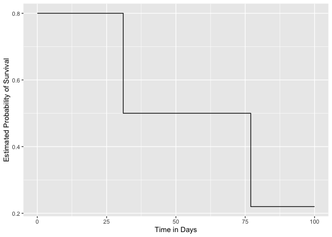
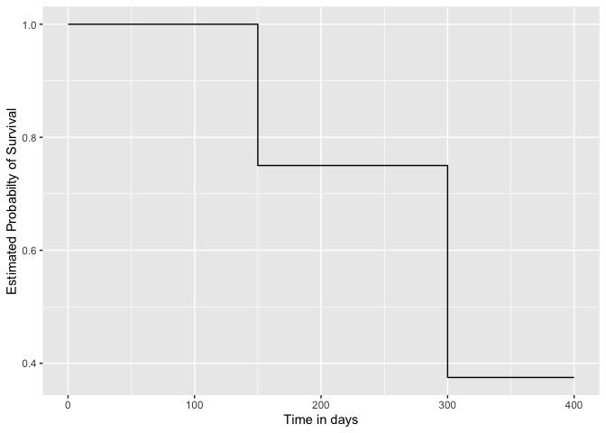
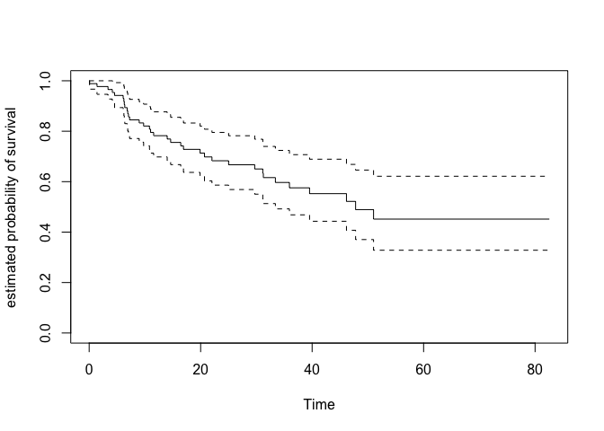
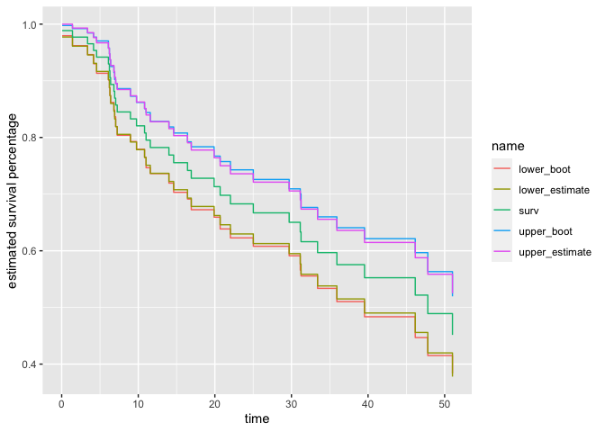
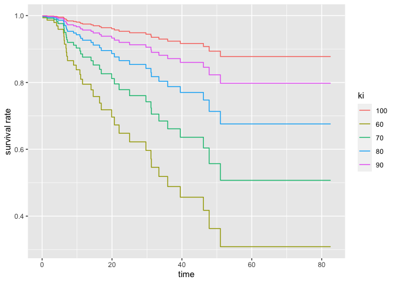
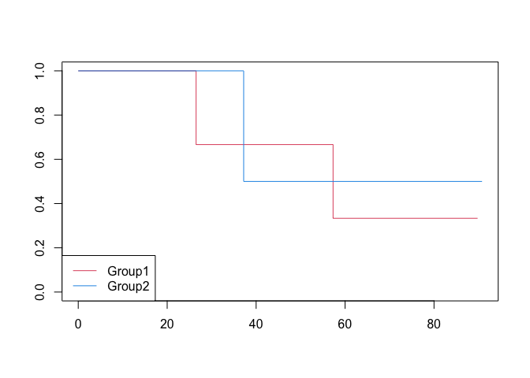

-   [Conceptual](#conceptual)
    -   [Question 1](#question-1)
    -   [Question 2](#question-2)
    -   [Question 3](#question-3)
    -   [Question 4](#question-4)
    -   [Question 5](#question-5)
    -   [Question 6](#question-6)
    -   [Question 7](#question-7)
    -   [Question 8](#question-8)
    -   [Question 9](#question-9)
-   [Applied](#applied)
    -   [Question 10](#question-10)
    -   [Question 11](#question-11)

    library(ggplot2)
    library(ISLR2)
    library(survival)
    library(boot)

## Conceptual

### Question 1

#### a

Independent, as phone numbers are independent of disease relapse.

#### b

Dependent, as the censoring is dependent on age. People who are censored
at 99 are more likely to have an event than people who are censored at a
younger age.

#### c

Dependent, as the censoring is dependent on sickness level. So people
who are censored earlier are more likely to have an event than people
who are censored later.

#### d

Dependent, as people who experience the event earlier on are more likely
to be censored before the event occurs.

#### e

Dependent, as women who experience the event earlier on are more likely
to be censored before the event occurs.

#### f

Dependent, as residents with longer number of years until education is
finished are more likely to be censored.

#### g

Since the censoring occurs to all patients after 5 years, the mechanism
is independent.

#### h

Since there is no difference in quality between the two plants, the
survival time of the components does not depend on whether the
components are censored at 5 years or 2 years. So the censoring
mechanism is independent.

#### i

Since there is a difference in quality between the two plants, the
survival time of the components will depend on when the censoring
occurs.

### Question 2

Participant 1:

1.  Not censored
2.  *c**i* is not known.
3.  *t**i* is equal to 1.2.
4.  *y**i* is always known; in this case it is equal to 1.2.
5.  *δ**i* is equal to 1.

Participant 2:

1.  Censored
2.  *c**i* is equal to 2.
3.  *t**i* is not known.
4.  *y**i* is always known; in this case it is equal to 2.
    e.*δ**i* is equal to 0.

Participant 3:

1.  Censored
2.  *c**i* is equal to 1.5.
3.  *t**i* is not known.
4.  *y**i* is always known; in this case it is equal to 1.5.
    e.*δ**i* is equal to 0.

Participant 4:

1.  Not censored
2.  *c**i* is not known.
3.  *t**i* is equal to 0.2.
4.  *y**i* is always known; in this case it is equal to 0.2.
5.  *δ**i* is equal to 1.

### Question 3

*K* = 2, *d*1 = 0.2, *d*2 = 1.2, *r*1 = 4, *q*1 = 1, *r*2 = 3, *q*2 = 1

### Question 4

  

    df <- data.frame(
      y = c(26.5, 37.2, 57.3, 90.8, 20.2, 89.8),
      delta = c(1, 1, 1, 0, 0, 0)
    )

    df <- df %>%
      dplyr::arrange(., y)

    n_obs <- nrow(df)

    estimated_survivals <- rep(0, n_obs)
    for (i in seq(n_obs)) {
      y <- df[i, "y"]
      delta <- df[i, "delta"]
      n_at_risk <- n_obs - i + 1
      if (identical(delta, 1)) {
        n_event <- 1
      } else {
        n_event <- 0
      }
      estimated_survivals[[i]] <- (n_at_risk - n_event) / n_at_risk
    }

    df$survival <- cumprod(estimated_survivals)

    print(df[df$y == 37.2, "survival"])

    ## [1] 0.6

$\hat{S}\_t = \begin{cases} 1 & t &lt; 26.5 \\ 0.8 & 26.5 \le t &lt; 37.2 \\ 0.6 & 37.2 \le t &lt; 57.3 \\ 0.4 & otherwise \end{cases}$

### Question 5

  

    df <- data.frame(
      x = c(0, 31, 77, 100),
      y = c(0.8, 0.5, 0.22, 0.22)
    )

    ggplot2::ggplot(data = df) +
      ggplot2::geom_step(ggplot2::aes(x = x, y = y)) +
      ggplot2::labs(x = "Time in Days", y = "Estimated Probability of Survival")

### Question 6

#### a

*δ*1 = 1, *δ*2 = 0, *δ*3 = 1, *δ*4 = 0, *K* = 2, *d*1 = 150, *d*2 = 300, *r*1 = 4, *r*2 = 2, *q*1 = 1, *q*2 = 1

#### b

  

    df <- data.frame(
      x = c(0, 150, 300, 400),
      y = c(1, 0.75, 0.75 * 0.5,  0.75 * 0.5)
    )

    ggplot2::ggplot(df) +
      ggplot2::geom_step(ggplot2::aes(x = x, y = y)) +
      ggplot2::labs(x = "Time in days", y = "Estimated Probabilty of Survival")

#### c

0.25 and 0.375

#### d

$\hat{S}\_t = \begin{cases} 1 & t &lt; 150 \\ 0.75 & 150 \le t &lt; 300 \\ 0.375 & otherwise \end{cases}$

### Question 7

#### a

This is the definition of a hypergeometric distribution.
$p(q\_{1k} = l) = \frac{{q\_k \choose l}{r\_k - q\_k \choose r\_{1k} - l}}{{r\_k \choose r\_{1k}}}$

#### b

$E(q\_{1k}) = r\_{1k} \cdot \frac{q\_k}{r\_k}$

$Var(q\_{1k}) = r\_{1k} \cdot \frac{q\_k}{r\_k} \frac{r\_k - q\_k}{r\_k} \frac{r\_k - r\_{1k}}{r\_k - 1} = r\_{1k} \cdot \frac{q\_k}{r\_k} \frac{r\_k - q\_k}{r\_k} \frac{r\_{2k}}{r\_k - 1}$

These expressions agree with the expressions in the text.

### Question 8

From 11.11,
$f(t) =\displaystyle\lim\_{\Delta t\to 0} \frac{Pr(t &lt; T \le t + \Delta t)}{\Delta t} = \displaystyle\lim\_{\Delta t\to 0} \frac{F(t + \Delta t) - F(t)}{\Delta t} = F'(t)$

Now $h(t) = \frac{f(t)}{S(t)}$

So $\int\_{0}^{t} h(x) dx = \int\_{0}^{t} \frac{f(x)}{S(x)} dx$

Now perform U substitution on RHS:
$\int\_{0}^{t} h(x) dx = \int\_{0}^{t} \frac{f(x)}{S(x)} dx = - \int\_{S(0)}^{S(t)} \frac{1}{u} du = -(log(S(t)) - log(S(0))) = -log(S(t))$

So *S*(*t*) = *e**x**p*(−∫0*t**h*(*x*)*d**x*)

### Question 9

#### a

An exponentially distributed variable has CDF 1 − *e*−*λ**t*.
The survival function, which is one minus the CDF, is therefore equal to
*e*−*λ**t*

#### b

$\displaystyle\prod\_{i}^{n} \lambda^{\delta\_i}\\exp(-\lambda t\_i)^{\delta\_i} exp(-\lambda t\_i)^{1-\delta\_i}= \displaystyle\prod\_{i}^{n} \lambda^{\delta\_i} exp(-\lambda t\_i)$

#### c

Take the log of this function and differntiate with respect to *λ*:

$LL = \displaystyle\sum\_{i}^{n} \delta\_i log(\lambda) -\lambda t\_i$

$LL' = \frac{1}{\lambda} \displaystyle\sum\_{i}^{n} \delta\_i - \displaystyle\sum\_{i}^{n} t\_i = 0$

$\lambda = \frac{\displaystyle\sum\_{i}^{n} \delta\_i}{\displaystyle\sum\_{i}^{n} t\_i}$

#### d

The expectation of exponentially distributed random variable is
$\frac{1}{\lambda}$, which is equal to
$\frac{\displaystyle\sum\_{i}^{n} t\_i}{\displaystyle\sum\_{i}^{n} \delta\_i}$

## Applied

### Question 10

#### a

  

    df_brain_cancer <- ISLR2::BrainCancer

    nrows <- nrow(df_brain_cancer)

    kaplan_meier_curve <- survival::survfit(survival::Surv(time, status) ~ 1, data = df_brain_cancer)
    plot(kaplan_meier_curve, xlab = "Time", ylab = "estimated probability of survival")

    boots <- 200
    boot_results <- vector("list")
    for (i in seq(boots)) {
      idx <- sample(nrows, nrows, replace = TRUE)
      bootstrap_sample <- df_brain_cancer[idx, ]
      curve <- survival::survfit(survival::Surv(time, status) ~ 1, data = bootstrap_sample)
      df <- data.frame(surv = curve$surv, time = curve$time) %>%
        setNames(., c(paste("surv", i, sep = "_"), "time"))
      boot_results[[i]] <- df
    }

    summary_kaplan_meier_curve <- summary(kaplan_meier_curve)

    full_results <- Reduce(function(df1, df2) dplyr::full_join(df1, df2, by = "time"), boot_results) %>%
      dplyr::arrange(., time) %>%
      dplyr::filter(., time %in% summary_kaplan_meier_curve$time) %>%
      dplyr::select(., -time)

    mat <- as.matrix(full_results)

    sds <- apply(mat, 1, sd, na.rm=T)

    df_for_plot <- data.frame(
      time = summary_kaplan_meier_curve$time,
      surv = summary_kaplan_meier_curve$surv
    )

    sds_list <- list(
      boot = sds,
      estimate = summary_kaplan_meier_curve$std.err
    )

    for (nm in names(sds_list)) {
      sds_ <- sds_list[[nm]]
      df_for_plot[paste("lower", nm, sep = "_")] <- df_for_plot$surv - sds_
      df_for_plot[paste("upper", nm, sep = "_")] <- df_for_plot$surv + sds_
    }

    df_for_plot <- tidyr::pivot_longer(df_for_plot, cols = -time)

    ggplot2::ggplot(data = df_for_plot) +
     ggplot2::geom_step(ggplot2::aes(x = time, y = value, color = name)) +
     ggplot2::labs(y = "estimated survival percentage")

They look very similar to one another.

#### c

  

    model <- survival::coxph(survival::Surv(time, status) ~ ., data = df_brain_cancer)

    summary(model)

    ## Call:
    ## survival::coxph(formula = survival::Surv(time, status) ~ ., data = df_brain_cancer)
    ## 
    ##   n= 87, number of events= 35 
    ##    (1 observation deleted due to missingness)
    ## 
    ##                        coef exp(coef) se(coef)      z Pr(>|z|)    
    ## sexMale             0.18375   1.20171  0.36036  0.510  0.61012    
    ## diagnosisLG glioma  0.91502   2.49683  0.63816  1.434  0.15161    
    ## diagnosisHG glioma  2.15457   8.62414  0.45052  4.782 1.73e-06 ***
    ## diagnosisOther      0.88570   2.42467  0.65787  1.346  0.17821    
    ## locSupratentorial   0.44119   1.55456  0.70367  0.627  0.53066    
    ## ki                 -0.05496   0.94653  0.01831 -3.001  0.00269 ** 
    ## gtv                 0.03429   1.03489  0.02233  1.536  0.12466    
    ## stereoSRT           0.17778   1.19456  0.60158  0.296  0.76760    
    ## ---
    ## Signif. codes:  0 '***' 0.001 '**' 0.01 '*' 0.05 '.' 0.1 ' ' 1
    ## 
    ##                    exp(coef) exp(-coef) lower .95 upper .95
    ## sexMale               1.2017     0.8321    0.5930    2.4352
    ## diagnosisLG glioma    2.4968     0.4005    0.7148    8.7215
    ## diagnosisHG glioma    8.6241     0.1160    3.5664   20.8546
    ## diagnosisOther        2.4247     0.4124    0.6678    8.8031
    ## locSupratentorial     1.5546     0.6433    0.3914    6.1741
    ## ki                    0.9465     1.0565    0.9132    0.9811
    ## gtv                   1.0349     0.9663    0.9906    1.0812
    ## stereoSRT             1.1946     0.8371    0.3674    3.8839
    ## 
    ## Concordance= 0.794  (se = 0.04 )
    ## Likelihood ratio test= 41.37  on 8 df,   p=2e-06
    ## Wald test            = 38.7  on 8 df,   p=6e-06
    ## Score (logrank) test = 46.59  on 8 df,   p=2e-07

    df_modal <- data.frame(
      diagnosis = rep("Meningioma", 5),
      sex = rep("Female", 5),
      loc = rep("Supratentorial", 5),
      ki = c(60, 70, 80, 90, 100),
      gtv = rep(mean(df_brain_cancer$gtv), 5),
      stereo = rep("SRT", 5)
    )

    preds <- survival::survfit(model, df_modal)
    preds_summary <- summary(preds)

    df_for_plot <- as.data.frame(preds_summary$surv) %>%
      setNames(., df_modal$ki)

    df_for_plot$time <- preds_summary$time
    last_row <-  df_for_plot[nrow(df_for_plot), ]
    last_row$time <- max(df_brain_cancer$time)

    df_for_plot <- rbind(df_for_plot, last_row)

    df_for_plot <- df_for_plot %>%
      tidyr::pivot_longer(., cols = -time)

    ggplot2::ggplot(df_for_plot) +
      ggplot2::geom_step(ggplot2::aes(x = time, y = value, color = name)) +
      labs(y = "survival rate", color = "ki")

### Question 11

#### a

  

    df <- data.frame(
      y = c(26.5, 37.2, 57.3, 90.8, 20.2, 89.8),
      delta = c(1, 1, 1, 0, 0, 0),
      x = c(0.1, 11, -0.3, 2.8, 1.8, 0.4)
    )
    df$covariate <- as.factor(ifelse(df$x < 2, "Group1", "Group2"))

    curve <- survival::survfit(Surv(y, delta) ~ covariate, data = df)
    plot(curve, col = c(2, 4))
    legend("bottomleft", legend = levels(df$covariate), col = c(2, 4), lty = 1)

    logrank_test <- survdiff(Surv(y, delta) ~ covariate, data = df)

    print(logrank_test$pvalue)

    ## [1] 0.7821768

    model <- survival::coxph(Surv(y, delta) ~ covariate, data = df)

    summary(model)$sctest[["pvalue"]]

    ## [1] 0.7821768

    print(summary(model))

    ## Call:
    ## survival::coxph(formula = Surv(y, delta) ~ covariate, data = df)
    ## 
    ##   n= 6, number of events= 3 
    ## 
    ##                    coef exp(coef) se(coef)      z Pr(>|z|)
    ## covariateGroup2 -0.3401    0.7117   1.2359 -0.275    0.783
    ## 
    ##                 exp(coef) exp(-coef) lower .95 upper .95
    ## covariateGroup2    0.7117      1.405   0.06314     8.022
    ## 
    ## Concordance= 0.556  (se = 0.169 )
    ## Likelihood ratio test= 0.08  on 1 df,   p=0.8
    ## Wald test            = 0.08  on 1 df,   p=0.8
    ## Score (logrank) test = 0.08  on 1 df,   p=0.8

Don’t see much of a difference here; the p-values are the same, as they
should be. People in group 2 have a hazard rate that is 0.7117 of the
hazard rate for people in group 1, no matter the value of time.
