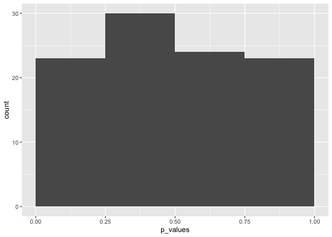

-   [Conceptual](#conceptual)
    -   [Question 1](#question-1)
    -   [Question 2](#question-2)
    -   [Question 3](#question-3)
    -   [Question 4](#question-4)
    -   [Question 5](#question-5)
    -   [Question 6](#question-6)
    -   [Question 7](#question-7)
    -   [Question 8](#question-8)

    library(ggplot2)
    library(ISLR2)
    library(survival)
    library(boot)

## Conceptual

### Question 1

#### a

Expectation is linear, and under the null hypothesis for a single
hypothesis test the probability of a type 1 Error is *α*. This is the
same as the expected number of type 1 errors for a single test, so to
get the expected number of errors for *m* tests we multiple by *m*. The
answers is thus *α**m*

#### b

The family wise error rate is defined as
*P*(*a**t* *l**e**a**s**t* *o**n**e* *t**y**p**e* 1 *e**r**r**o**r*) = 1 − *P*(0 *t**y**p**e* 1 *e**r**r**o**r**s*) = 1 − (1−*α*)*m*

#### c

let `A` denote the event that the first test does not result in a type 1
error, and `B` denote the event that the second test does not result in
a type 1 error.

Then,
1 − *P*(0 *t**y**p**e* 1 *e**r**r**o**r**s*) = 1 − *P*(*A*) ⋅ *P*(*B*|*A*) = 1 − (1−*α*) ⋅ *P*(*B*|*A*)

This is the same as the expression from part b, except for one term of
(1−*α*) changes to *P*(*B*|*A*). We do not know exactly what the value
of this probability is, but we do know that it is greater than *P*(*B*),
since the p values for test 1 and test 2 are positively correlated.
Therefore, we are subtracting a larger number from 1, and the family
wise error rate will be smaller than in the independent case.

#### d

We use the same logic as above, except now *P*(*B*|*A*) &lt; *P*(*B*).
Therfore we are subtracting a smaller number from 1, and the family wise
error rate will be larger than in the independent case.

### Question 2

#### a

Bernoulli with parameter *α*.

#### b

Binomial with parameters *p* = *α*, *n* = *m*

#### c

The standard deviation of this distribution is
$\sqrt{m\alpha(1 - \alpha)}$

### Question 3

$FWER = P(falsely\\reject\\at\\least\\one\\null\\hypothesis) = P(\displaystyle\cup\_{j=1}^{m} A\_j \le \displaystyle\sum\_{j=1}^{m} \alpha\_j$,
since
*P*(*A**j* ∪ *A**i* ≤ *P*(*A**j*) + *P*(*A**i*)

### Question 4

  

    p_values <- c(0.0011, 0.031, 0.017, 0.32, 0.11, 0.90, 0.07, 0.006, 0.004, 0.0009)

    print(which(p_values <= 0.05))

    ## [1]  1  2  3  8  9 10

    bonferroni_p <- p.adjust(p_values, method = "bonferroni")

    print(which(bonferroni_p <= 0.05))

    ## [1]  1  9 10

    holm_p <- p.adjust(p_values, method = "holm")

    print(which(holm_p <= 0.05))

    ## [1]  1  8  9 10

    qs <- p.adjust(p_values, method = "BH")

    for (q in c(.05, 0.2)) {
      print(which(qs <= q))
    }

    ## [1]  1  3  8  9 10
    ## [1]  1  2  3  5  7  8  9 10

    rejected <- qs[qs <= 0.2]

    print(0.2 * length(rejected))

    ## [1] 1.6

### Question 5

  

    p_values <- c(0.01, 0.2, 0.3, 0.4, 0.5)

    bonferroni_p <- p.adjust(p_values, method = "bonferroni")

    holm_p <- p.adjust(p_values, method = "holm")

    print(sum(bonferroni_p <= 0.1))

    ## [1] 1

    print(sum(holm_p <= 0.1))

    ## [1] 1

    p_values <- c(0.01, 0.025, 0.3, 0.4, 0.5)

    bonferroni_p <- p.adjust(p_values, method = "bonferroni")

    holm_p <- p.adjust(p_values, method = "holm")

    print(sum(bonferroni_p <= 0.1))

    ## [1] 1

    print(sum(holm_p <= 0.1))

    ## [1] 2

### Question 6

#### Panel 1

##### a

TP: 7 FP (Type 1 error): 0 TN: 2 FN (Type 2 error): 1

##### b

Same as a

##### c

0

##### d

0

##### e

We would have more false negatives (Type 11 errors ) and less true
positives.

#### Panel 2

##### a

TP: 7 FP (Type 1 error): 0 TN: 2 FN (Type 2 error): 1

##### b

TP: 8 FP (Type 1 error): 0 TN: 2 FN (Type 2 error): 0

##### c

0

##### d

0

##### e

We would have more false negatives (Type 11 errors ) and less true
positives. The false discovery rate would remain 0.

#### Panel 3

##### a

TP: 3 FP (Type 1 error): 0 TN: 2 FN (Type 2 error): 5

##### b

TP: 8 FP (Type 1 error): 0 TN: 2 FN (Type 2 error): 0

##### c

0

##### d

0

##### e

We would have more false negatives (Type 11 errors ) and less true
positives. The false disovery rate would remain 0.

### Question 7

    df_carseats <- ISLR2::Carseats %>%
      dplyr::select(., dplyr::where(is.numeric))

    numeric_vars <- setdiff(colnames(df_carseats), "Sales")

    p_values <- rep(0, length(numeric_vars)) %>%
      setNames(., numeric_vars)

    for (var in numeric_vars) {
      form <- as.formula(paste("Sales ~", var))
      p_values[[var]] <- coef(summary(lm(form, data = df_carseats)))[var, "Pr(>|t|)"]
    }

    print(names(p_values)[p_values <= 0.05])

    ## [1] "Income"      "Advertising" "Price"       "Age"

    print(names(p_values)[p.adjust(p_values, "bonferroni") <= 0.05])

    ## [1] "Income"      "Advertising" "Price"       "Age"

    print(names(p_values)[p.adjust(p_values, "holm") <= 0.05])

    ## [1] "Income"      "Advertising" "Price"       "Age"

    q_values <-
    print(names(p_values)[p.adjust(p_values, method = "BH") <= 0.2])

    ## [1] "Income"      "Advertising" "Price"       "Age"

We get the same results for everything.

### Question 8

  

    set.seed(1)
    n <- 20
    m <- 100
    X <- matrix(rnorm(n * m), n, m)

    df <- data.frame(p_values = apply(X, 2, function(col) t.test(col)$p.value))

    ggplot2::ggplot(data = df) +
      ggplot2::geom_histogram(ggplot2::aes(x = p_values), breaks = seq(0, 1, length = 5))

    print(sum(df$p_values <= 0.05))

    ## [1] 4

    df$p_values_bonferonni <- p.adjust(df$p_values, method = "bonferroni")

    print(sum(df$p_values_bonferonni <= 0.05))

    ## [1] 0

    df$p_values_holm <- p.adjust(df$p_values, method = "holm")

    print(sum(df$p_values_holm <= 0.05))

    ## [1] 0

    df$q_values <- p.adjust(df$p_values, method = "BH")

    print(sum(df$q_values <= 0.05))

    ## [1] 0

    means <- apply(X, 2, mean)

    ranked <- rank(means)
    best_idx <- which(ranked >= 90)

    X_best <- X[, best_idx]

    p_values <- apply(X_best, 2, function(col) t.test(col)$p.value)
    fwer_adjusted <- p.adjust(p_values, method = "holm")

    print(sum(fwer_adjusted <= 0.05))

    ## [1] 1

    fdr_adjusted <- p.adjust(p_values, method = "BH")

    print(sum(fdr_adjusted <= 0.05))

    ## [1] 1

We get one type 1 error if we cherry pick; we essentially are running
more tests than the methods assume, because we have picked the top 10
fund managers based on looking at the entire dataset.
