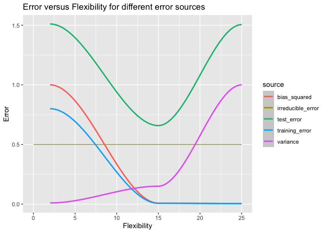

# ISLR Chapter 2 Exercises

-   [1 Conceptual](#conceptual)
    -   [1.1 Question 1](#question-1)
    -   [1.2 Question 2](#question-2)
    -   [1.3 Question 3](#question-3)
-   [2 Applied](#applied)

# 1 Conceptual

## 1.1 Question 1

### 1.1.1 a.

We would expect a flexible statistical learning method to perform better
than an inflexible method because the risk of overfitting is minimal
with a large sample size and small number of predictors. A flexible
method will thus have lower bias and negligibly higher variance than an
inflexible method.

### 1.1.2 b.

We would expect an inflexible statistical learning method to perform
better than a flexible method because the flexible method will be at
risk of overfitting with a small sample size and a large number of
predictors. The inflexible method will have higher bias but much lower
variance than the flexible method in this case.

### 1.1.3 c.

We would expect the flexible method to perform better here because it
will be able to learn the non-linear relationship between the predictors
and the response variable better than the inflexible method. The
flexible method will thus have much lower bias than the inflexible
method, offsetting the increase in variance.

### 1.1.4 d.

We would expect the inflexible method to perform better here because the
flexible method will likely model the large error terms rather than the
underlying true relationship between the response variable and the
predictors. The flexible method will have very high variance in this
case.

## 1.2 Question 2

### 1.2.1 a.

This is a regression problem, as CEO salary is a continuous variable. We
are most interested in inference here. `n` = 500, `p` = 3.

### 1.2.2 b.

This is a classification problem, as the response variable is binary. We
are most interested in prediction. `n` = 20, `p` = 13.

### 1.2.3 c.

This is a regression problem, as %change is a continuous variable. We
are most interested in prediction. `n` = 52 (52 weeks in a year), `p` =
3.

## 1.3 Question 3

    flexibility <- c(2, 15, 25)

    df_bias_squared <- data.frame(
      flexibility = flexibility,
      error = c(1, 0.008, 0.005)
    )
    df_bias_squared$source <- "bias_squared"

    df_variance <- data.frame(
      flexibility = flexibility,
      error = c(0.01, 0.15, 1)
    )
    df_variance$source <- "variance"

    df_training_error <- data.frame(
      flexibility = flexibility,
      error = df_bias_squared$error * 0.8
    )
    df_training_error$source <- "training_error"

    irreducible_error <- 0.5
    df_irreducible_error <- data.frame(
      flexibility = c(0, 25),
      error = rep(irreducible_error, 2)
    )
    df_irreducible_error$source <- "irreducible_error"

    df_total_error <- data.frame(
      flexibility = flexibility,
      error = df_bias_squared$error + df_variance$error + df_irreducible_error$error[[1]]
    )
    df_total_error$source <- "test_error"

    df_errors <- dplyr::bind_rows(
      df_bias_squared, df_variance, df_training_error, df_total_error
    )

    ggplot2::ggplot(df_errors) +
      ggplot2::geom_smooth(ggplot2::aes(x = flexibility, y = error, color = source)) +
      ggplot2::geom_line(data = df_irreducible_error, ggplot2::aes(x = flexibility, y = error, color = source)) +
      ggplot2::labs(x = "Flexibility", y = "Error", title = "Error versus Flexibility for different error sources")

Below we describe why each error source has the shape it does.

1.  Variance - very non-flexible models, i.e. a model that predicts the
    mean of the training dataset, would have close to zero variance; it
    would barely change from training dataset to training dataset. In
    contrast, a very flexible model would change significantly when
    trained across different datasets, as the flexibility would result
    in the model modeling the random error terms of each observation,
    which change from dataset to dataset. Thus the variance of the error
    term increases as the flexibility increases. At higher levels of
    flexibility the slope of the variance curve is higher than at lower
    levels of flexibility, reflecting the fact that increasing the
    flexibility when the flexibility is already quite low doesn’t
    increase the variance that much, but increasing the flexibility when
    the flexibility is already quite high increases the variance
    significantly.

2.  Bias squared - very non-flexible models, like the mean prediction
    model mentioned above, have extremely high bias because they are
    unable to capture the relationship between the predictors and the
    response variable. As the flexibility increases, the more flexible
    models are quickly able to capture these relationships, so the error
    from this term levels off relatively quickly.

3.  Irreducible error - this is constant, as it is unaffected by the
    model chosen and hence is independent of any property of the model,
    such as flexibility.

4.  Test error - this is the sum of the previous three error sources. It
    achieves a minimum at an intermediate level of flexibility, which is
    dependent on the dataset that is being modeled. It has a
    characteristic U shape, reflecting the leveling off of bias at
    higher levels of flexibility and the rapid increase in variance.

5.  Training error - this decreases monotonically as flexibility
    increases because more complex models approach the point of being
    able to predict the training response perfectly. For example, a
    linear model with number of predictors equal to number of
    observations will be able to perfectly predict the training dataset,
    provided the features are all linearly independent.

# 2 Applied

Load libraries.

    library(magrittr)
    library(dplyr)
    library(GGally)
    library(ggplot2)
    library(tidyr)
    library(MASS)
    library(ISLR)

Summarize data.

    df_college <- College

    summary(df_college)

    ##  Private        Apps           Accept          Enroll       Top10perc    
    ##  No :212   Min.   :   81   Min.   :   72   Min.   :  35   Min.   : 1.00  
    ##  Yes:565   1st Qu.:  776   1st Qu.:  604   1st Qu.: 242   1st Qu.:15.00  
    ##            Median : 1558   Median : 1110   Median : 434   Median :23.00  
    ##            Mean   : 3002   Mean   : 2019   Mean   : 780   Mean   :27.56  
    ##            3rd Qu.: 3624   3rd Qu.: 2424   3rd Qu.: 902   3rd Qu.:35.00  
    ##            Max.   :48094   Max.   :26330   Max.   :6392   Max.   :96.00  
    ##    Top25perc      F.Undergrad     P.Undergrad         Outstate    
    ##  Min.   :  9.0   Min.   :  139   Min.   :    1.0   Min.   : 2340  
    ##  1st Qu.: 41.0   1st Qu.:  992   1st Qu.:   95.0   1st Qu.: 7320  
    ##  Median : 54.0   Median : 1707   Median :  353.0   Median : 9990  
    ##  Mean   : 55.8   Mean   : 3700   Mean   :  855.3   Mean   :10441  
    ##  3rd Qu.: 69.0   3rd Qu.: 4005   3rd Qu.:  967.0   3rd Qu.:12925  
    ##  Max.   :100.0   Max.   :31643   Max.   :21836.0   Max.   :21700  
    ##    Room.Board       Books           Personal         PhD        
    ##  Min.   :1780   Min.   :  96.0   Min.   : 250   Min.   :  8.00  
    ##  1st Qu.:3597   1st Qu.: 470.0   1st Qu.: 850   1st Qu.: 62.00  
    ##  Median :4200   Median : 500.0   Median :1200   Median : 75.00  
    ##  Mean   :4358   Mean   : 549.4   Mean   :1341   Mean   : 72.66  
    ##  3rd Qu.:5050   3rd Qu.: 600.0   3rd Qu.:1700   3rd Qu.: 85.00  
    ##  Max.   :8124   Max.   :2340.0   Max.   :6800   Max.   :103.00  
    ##     Terminal       S.F.Ratio      perc.alumni        Expend     
    ##  Min.   : 24.0   Min.   : 2.50   Min.   : 0.00   Min.   : 3186  
    ##  1st Qu.: 71.0   1st Qu.:11.50   1st Qu.:13.00   1st Qu.: 6751  
    ##  Median : 82.0   Median :13.60   Median :21.00   Median : 8377  
    ##  Mean   : 79.7   Mean   :14.09   Mean   :22.74   Mean   : 9660  
    ##  3rd Qu.: 92.0   3rd Qu.:16.50   3rd Qu.:31.00   3rd Qu.:10830  
    ##  Max.   :100.0   Max.   :39.80   Max.   :64.00   Max.   :56233  
    ##    Grad.Rate     
    ##  Min.   : 10.00  
    ##  1st Qu.: 53.00  
    ##  Median : 65.00  
    ##  Mean   : 65.46  
    ##  3rd Qu.: 78.00  
    ##  Max.   :118.00
