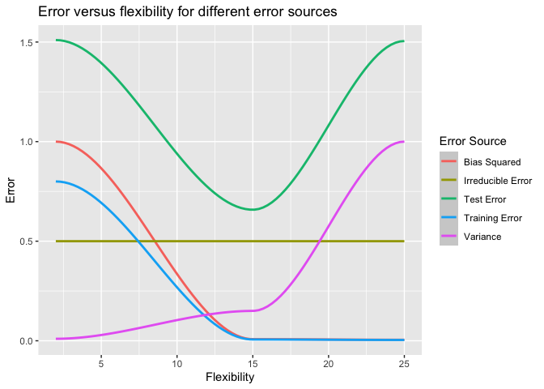
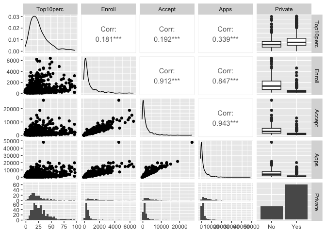
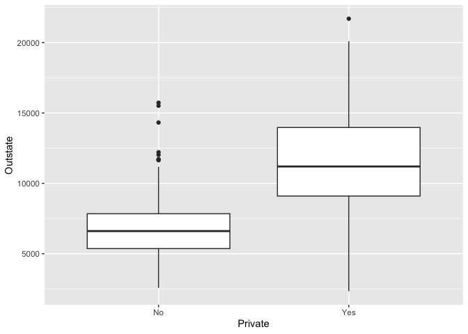
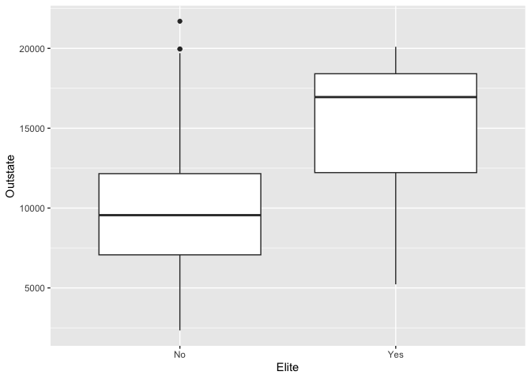
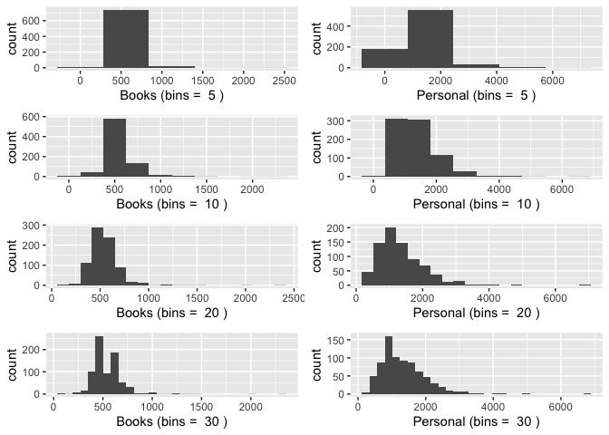
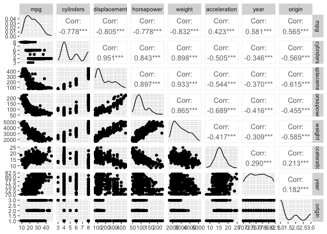
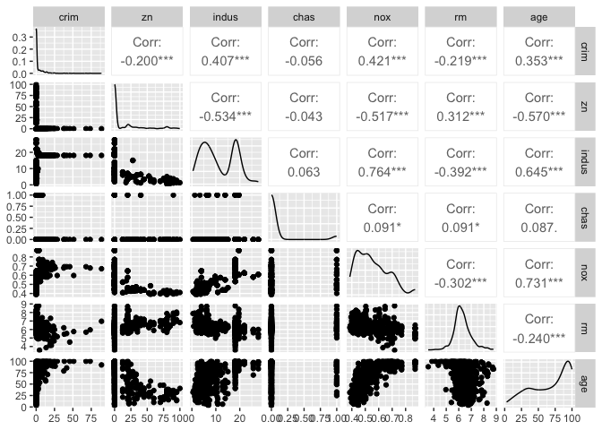

-   [Conceptual](#conceptual)
    -   [Question 1](#question-1)
    -   [Question 2](#question-2)
    -   [Question 3](#question-3)
    -   [Question 4](#question-4)
    -   [Question 5](#question-5)
    -   [Question 6](#question-6)
    -   [Question 7](#question-7)
-   [Applied](#applied)
    -   [Question 8](#question-8)
    -   [Question 9](#question-9)
    -   [Question 10](#question-10)

Load libraries.

    library(magrittr)
    library(dplyr)
    library(GGally)
    library(ggplot2)
    library(tidyr)
    library(MASS)
    library(ISLR)
    library(tools)
    library(gridExtra)

## Conceptual

### Question 1

#### a

We would expect a flexible statistical learning method to perform better
than an inflexible method because the risk of overfitting is minimal
with a large sample size and small number of predictors. A flexible
method will thus have lower bias and negligibly higher variance than an
inflexible method.

#### b

We would expect an inflexible statistical learning method to perform
better than a flexible method because the flexible method will be at
risk of overfitting with a small sample size and a large number of
predictors. The inflexible method will have higher bias but much lower
variance than the flexible method in this case.

#### c

We would expect the flexible method to perform better here because it
will be able to learn the non-linear relationship between the predictors
and the response variable better than the inflexible method. The
flexible method will thus have much lower bias than the inflexible
method, offsetting the increase in variance.

#### d

We would expect the inflexible method to perform better here because the
flexible method will likely model the large error terms rather than the
underlying true relationship between the response variable and the
predictors. The flexible method will have very high variance in this
case.

### Question 2

#### a

This is a regression problem, as CEO salary is a continuous variable. We
are most interested in inference here. `n` = 500, `p` = 3.

#### b

This is a classification problem, as the response variable is binary. We
are most interested in prediction. `n` = 20, `p` = 13.

#### c

This is a regression problem, as %change is a continuous variable. We
are most interested in prediction. `n` = 52 (52 weeks in a year), `p` =
3.

### Question 3

    # Converts labels to title case
    label_convert <- function(x) {
      tools::toTitleCase(gsub("_", " ", x))
    }

    flexibility <- c(2, 15, 25)
    irreducible_error <- 0.5
    training_error_proportion <- 0.8

    label_error_mapping <- list(
      bias_squared = c(1, 0.008, 0.005),
      variance = c(0.01, 0.15, 1),
      irreducible_error = rep(irreducible_error, 3)
    )
    label_error_mapping$training_error <- label_error_mapping$bias_squared *
      training_error_proportion
    label_error_mapping$test_error <- label_error_mapping$bias_squared +
      label_error_mapping$variance + label_error_mapping$irreducible_error

    dfs <- Map(
      function(nm, error, flexibility) {
        data.frame(label = nm, flexibility = flexibility, error = error)
      },
      names(label_error_mapping),
      label_error_mapping,
      flexibility = list(flexibility)
    )

    df <- dplyr::bind_rows(dfs)

    ggplot2::ggplot(df) +
      ggplot2::geom_smooth(
        ggplot2::aes(
          x = flexibility, y = error, color = label_convert(label)
        )
      ) +
      ggplot2::labs(
        x = "Flexibility", y = "Error",
        title = "Error versus flexibility for different error sources",
        color = "Error Source"
      )

Below we describe why each error source has the shape it does.

1.  Variance - very non-flexible models, i.e. a model that predicts the
    mean of the training dataset, would have close to zero variance; it
    would barely change from training dataset to training dataset. In
    contrast, a very flexible model would change significantly when
    trained across different datasets, as the flexibility would result
    in the model modeling the random error terms of each observation,
    which change from dataset to dataset. Thus the variance of the error
    term increases as the flexibility increases. At higher levels of
    flexibility the slope of the variance curve is higher than at lower
    levels of flexibility, reflecting the fact that increasing the
    flexibility when the flexibility is already quite low doesn’t
    increase the variance that much, but increasing the flexibility when
    the flexibility is already quite high increases the variance
    significantly.

2.  Bias squared - very non-flexible models, like the mean prediction
    model mentioned above, have extremely high bias because they are
    unable to capture the relationship between the predictors and the
    response variable. As the flexibility increases, the more flexible
    models are quickly able to capture these relationships, so the error
    from this term levels off relatively quickly.

3.  Irreducible error - this is constant, as it is unaffected by the
    model chosen and hence is independent of any property of the model,
    such as flexibility.

4.  Test error - this is the sum of the previous three error sources. It
    achieves a minimum at an intermediate level of flexibility, which is
    dependent on the dataset that is being modeled. It has a
    characteristic U shape, reflecting the leveling off of bias at
    higher levels of flexibility and the rapid increase in variance.

5.  Training error - this decreases monotonically as flexibility
    increases because more complex models approach the point of being
    able to predict the training response perfectly. For example, a
    linear model with number of predictors equal to number of
    observations will be able to perfectly predict the training dataset,
    provided the features are all linearly independent.

### Question 4

#### a

##### i

A credit card company might wish to predict the probability of a
customer defaulting on their card. The response would be whether or not
the customer defaulted on their card, and the predictors would be
variables indicating the customer’s previous credit history.

##### ii

A technology company might want to build a product that recognizes
handwritten characters. The response would be which character the
writing sample represents and the predictors would be the grayscale
value at each pixel of the sample.

##### iii

A company that sends out letter offers for their products might try to
determine which potential customers have the highest probability of
responding to their offer. The response would be whether or not a
customer responded, and the predictors could be the customer’s previous
purchasing habits.

#### b

##### i

A credit card company might want to predict the income of a customer
applying for a credit card, so as to compare it the customer’s reported
income and identify potential discrepancies. The response would be the
customer’s income, and the predictors could be variables indicating the
customer’s previous credit history.

##### ii

A supermarket chain might be interested in seeing how many customers
will buy a given product per day. The response would be the number of
purchases per day, and the predictors would be details about the
product, such as type of product, price, and placement in the store, as
well as day of the week.

##### iii

An agriculture company might be interested in predicting the yield of a
given crop. The response would be the yield of the crop, and the
predictors might be the genetic makeup of the crop, in addition to other
external factors like location of the crop and exposure to sunlight.

#### c

##### i

A marketing company might wish to segment customers based on previous
purchase habits, in order to tailor a marketing campaign to better serve
the needs of a given customer segment.

##### ii

A genomics lab might want to cluster tissue samples based on the genetic
makeup of each sample, in order to identify samples that are similar to
one another.

##### iii

A search engine company might want to cluster search results based on
the content of each result, to provide more relevant results when a user
searches for specific term.

### Question 5

A very flexible approach will likely have lower bias than a less
flexible approach, unless the relationship between the response and the
predictors is very simple. However, the very flexible approach will have
higher variance, which may or may not outweigh the decrease in bias
depending on the dataset at hand. [Question 1](#question-1) highlights
some cases when one approach might be preferred over the other; these
cases are repeated below.

A few cases when a very flexible approach might be preferred:

1.  The number of predictors is small, and the number of observations is
    large.
2.  The relationship between predictors and the response is very
    complex.

A few cases when a less flexible approach might be preferred:

1.  The number of predictors is large, and the number of observations is
    small.
2.  The relationship between predictors and the response is very simple.
3.  Interpretability is important: some less flexible approaches are
    easy to explain, such as generalized linear models.

### Question 6

A parametric approach assumes a specific form of the function that we
are estimating, prior to fitting the model with the data. Generalized
linear models are good examples of this. A non-parametric approach does
not assume a specific form of the function. A parametric approach is
generally less flexible and hence will have lower variance, at the
expense of higher bias (unless the chosen parametric form closely
mirrors the actual relationship between response and predictors). A
parametric approach is also easier to interpret in most cases. A
non-parametric approach will generally be more flexible and thus have
lower bias, but higher variance.

### Question 7

#### a

    mat <- matrix(c(0, 2, 0 , 0, -1, 1, 3, 0, 1, 1, 0, 1, 0, 0, 3, 2, 1, 1), 6, 3)
    y <- c("red", "red", "red", "green", "green", "red")

    distances <- apply(mat, 1, function(x) sum(x ^ 2))
    print(paste("The distances are:", paste(distances, collapse = ", ") , sep = " "))

    ## [1] "The distances are: 9, 4, 10, 5, 2, 3"

#### b

    k_1_pred <- y[which.min(distances)]

    print(paste0("Prediction with one nearest neighbors is ", k_1_pred, "."))

    ## [1] "Prediction with one nearest neighbors is green."

#### c

    k_3_preds <- y[order(distances)[1:3]]
    k_3_preds_table <- table(k_3_preds)
    k_3_pred <- names(k_3_preds_table)[which.max(k_3_preds_table)]

    print(paste0("Prediction with three nearest neighbors is ", k_3_pred, "."))

    ## [1] "Prediction with three nearest neighbors is red."

#### d

If the Bayes decision boundary is highly non-linear, we would expect the
best value of K to be small, as this would allow for highly non-linear
decision boundaries. For example, with k = 1, the decision boundaries
would be surfaces around each data point.

## Applied

### Question 8

#### a

  

    df_college <- College

#### b

  

    summary(df_college)

    ##  Private        Apps           Accept          Enroll       Top10perc    
    ##  No :212   Min.   :   81   Min.   :   72   Min.   :  35   Min.   : 1.00  
    ##  Yes:565   1st Qu.:  776   1st Qu.:  604   1st Qu.: 242   1st Qu.:15.00  
    ##            Median : 1558   Median : 1110   Median : 434   Median :23.00  
    ##            Mean   : 3002   Mean   : 2019   Mean   : 780   Mean   :27.56  
    ##            3rd Qu.: 3624   3rd Qu.: 2424   3rd Qu.: 902   3rd Qu.:35.00  
    ##            Max.   :48094   Max.   :26330   Max.   :6392   Max.   :96.00  
    ##    Top25perc      F.Undergrad     P.Undergrad         Outstate    
    ##  Min.   :  9.0   Min.   :  139   Min.   :    1.0   Min.   : 2340  
    ##  1st Qu.: 41.0   1st Qu.:  992   1st Qu.:   95.0   1st Qu.: 7320  
    ##  Median : 54.0   Median : 1707   Median :  353.0   Median : 9990  
    ##  Mean   : 55.8   Mean   : 3700   Mean   :  855.3   Mean   :10441  
    ##  3rd Qu.: 69.0   3rd Qu.: 4005   3rd Qu.:  967.0   3rd Qu.:12925  
    ##  Max.   :100.0   Max.   :31643   Max.   :21836.0   Max.   :21700  
    ##    Room.Board       Books           Personal         PhD        
    ##  Min.   :1780   Min.   :  96.0   Min.   : 250   Min.   :  8.00  
    ##  1st Qu.:3597   1st Qu.: 470.0   1st Qu.: 850   1st Qu.: 62.00  
    ##  Median :4200   Median : 500.0   Median :1200   Median : 75.00  
    ##  Mean   :4358   Mean   : 549.4   Mean   :1341   Mean   : 72.66  
    ##  3rd Qu.:5050   3rd Qu.: 600.0   3rd Qu.:1700   3rd Qu.: 85.00  
    ##  Max.   :8124   Max.   :2340.0   Max.   :6800   Max.   :103.00  
    ##     Terminal       S.F.Ratio      perc.alumni        Expend     
    ##  Min.   : 24.0   Min.   : 2.50   Min.   : 0.00   Min.   : 3186  
    ##  1st Qu.: 71.0   1st Qu.:11.50   1st Qu.:13.00   1st Qu.: 6751  
    ##  Median : 82.0   Median :13.60   Median :21.00   Median : 8377  
    ##  Mean   : 79.7   Mean   :14.09   Mean   :22.74   Mean   : 9660  
    ##  3rd Qu.: 92.0   3rd Qu.:16.50   3rd Qu.:31.00   3rd Qu.:10830  
    ##  Max.   :100.0   Max.   :39.80   Max.   :64.00   Max.   :56233  
    ##    Grad.Rate     
    ##  Min.   : 10.00  
    ##  1st Qu.: 53.00  
    ##  Median : 65.00  
    ##  Mean   : 65.46  
    ##  3rd Qu.: 78.00  
    ##  Max.   :118.00

#### c

##### i

  

    summary(df_college)

    ##  Private        Apps           Accept          Enroll       Top10perc    
    ##  No :212   Min.   :   81   Min.   :   72   Min.   :  35   Min.   : 1.00  
    ##  Yes:565   1st Qu.:  776   1st Qu.:  604   1st Qu.: 242   1st Qu.:15.00  
    ##            Median : 1558   Median : 1110   Median : 434   Median :23.00  
    ##            Mean   : 3002   Mean   : 2019   Mean   : 780   Mean   :27.56  
    ##            3rd Qu.: 3624   3rd Qu.: 2424   3rd Qu.: 902   3rd Qu.:35.00  
    ##            Max.   :48094   Max.   :26330   Max.   :6392   Max.   :96.00  
    ##    Top25perc      F.Undergrad     P.Undergrad         Outstate    
    ##  Min.   :  9.0   Min.   :  139   Min.   :    1.0   Min.   : 2340  
    ##  1st Qu.: 41.0   1st Qu.:  992   1st Qu.:   95.0   1st Qu.: 7320  
    ##  Median : 54.0   Median : 1707   Median :  353.0   Median : 9990  
    ##  Mean   : 55.8   Mean   : 3700   Mean   :  855.3   Mean   :10441  
    ##  3rd Qu.: 69.0   3rd Qu.: 4005   3rd Qu.:  967.0   3rd Qu.:12925  
    ##  Max.   :100.0   Max.   :31643   Max.   :21836.0   Max.   :21700  
    ##    Room.Board       Books           Personal         PhD        
    ##  Min.   :1780   Min.   :  96.0   Min.   : 250   Min.   :  8.00  
    ##  1st Qu.:3597   1st Qu.: 470.0   1st Qu.: 850   1st Qu.: 62.00  
    ##  Median :4200   Median : 500.0   Median :1200   Median : 75.00  
    ##  Mean   :4358   Mean   : 549.4   Mean   :1341   Mean   : 72.66  
    ##  3rd Qu.:5050   3rd Qu.: 600.0   3rd Qu.:1700   3rd Qu.: 85.00  
    ##  Max.   :8124   Max.   :2340.0   Max.   :6800   Max.   :103.00  
    ##     Terminal       S.F.Ratio      perc.alumni        Expend     
    ##  Min.   : 24.0   Min.   : 2.50   Min.   : 0.00   Min.   : 3186  
    ##  1st Qu.: 71.0   1st Qu.:11.50   1st Qu.:13.00   1st Qu.: 6751  
    ##  Median : 82.0   Median :13.60   Median :21.00   Median : 8377  
    ##  Mean   : 79.7   Mean   :14.09   Mean   :22.74   Mean   : 9660  
    ##  3rd Qu.: 92.0   3rd Qu.:16.50   3rd Qu.:31.00   3rd Qu.:10830  
    ##  Max.   :100.0   Max.   :39.80   Max.   :64.00   Max.   :56233  
    ##    Grad.Rate     
    ##  Min.   : 10.00  
    ##  1st Qu.: 53.00  
    ##  Median : 65.00  
    ##  Mean   : 65.46  
    ##  3rd Qu.: 78.00  
    ##  Max.   :118.00

##### ii

I chose 5 columns as the plot takes too long to render

    GGally::ggpairs(data = df_college, columns = 5:1)

##### iii

  

    ggplot2::ggplot(data = df_college) +
      ggplot2::geom_boxplot(ggplot2::aes(x = Private, y = Outstate))

##### iv

  

    df_college$Elite <- ifelse(df_college$Top10perc >50, "Yes", "No")

    ggplot2::ggplot(data = df_college) +
      ggplot2::geom_boxplot(ggplot2::aes(x = Elite, y = Outstate))

##### v

  

    vars <- c("Books", "Personal")
    bins <- c(5, 10, 20, 30)

    plots <- vector("list", length = length(vars) * length(bins))
    counter <- 1
    for (bin in bins) {
      for (var in vars) {
        plots[[counter]] <- ggplot2::ggplot(data = df_college) +
          ggplot2::geom_histogram(ggplot2::aes(.data[[var]]), bins = bin) +
          ggplot2::labs(x = paste(var, "(bins = ", bin, ")"))
        counter <- counter + 1
      }
    }

    do.call(gridExtra::grid.arrange, c(plots, nrow = 4, ncol = 2))

##### vi

From some of the previous questions, we see that private schools
generally have higher outstate tuition than public schools, and elite
schools tend to have higher outstate tuition as well.

### Question 9

#### a

  

    df_auto <- Auto

    print(lapply(df_auto, class))

    ## $mpg
    ## [1] "numeric"
    ## 
    ## $cylinders
    ## [1] "numeric"
    ## 
    ## $displacement
    ## [1] "numeric"
    ## 
    ## $horsepower
    ## [1] "numeric"
    ## 
    ## $weight
    ## [1] "numeric"
    ## 
    ## $acceleration
    ## [1] "numeric"
    ## 
    ## $year
    ## [1] "numeric"
    ## 
    ## $origin
    ## [1] "numeric"
    ## 
    ## $name
    ## [1] "factor"

#### b

  

#### c

  

    summarize_numeric <- function(df) {

      summary_functions <- list(mean = mean, sd = sd, min = min, max = max)

      df <- df %>%
        dplyr::summarize(., dplyr::across(tidyselect::where(is.numeric), summary_functions))

      first_summary_function <- paste0("_", names(summary_functions)[[1]])
      vars <- colnames(df)
      vars <- vars[grepl(first_summary_function, vars)]
      vars <- gsub(first_summary_function, "", vars)

      df_cleaned <- data.frame(variable = vars)

      for (summary_function in names(summary_functions)) {
        df_sub <- df[, grepl(paste0(".*", summary_function, ".*"), colnames(df))]
        df_cleaned[[summary_function]] <- unname(unlist(df_sub))
      }

      df_cleaned

    }

    df_summary <- summarize_numeric(df_auto)

    print(df_summary)

    ##       variable        mean          sd  min    max
    ## 1          mpg   23.445918   7.8050075    9   46.6
    ## 2    cylinders    5.471939   1.7057832    3    8.0
    ## 3 displacement  194.411990 104.6440039   68  455.0
    ## 4   horsepower  104.469388  38.4911599   46  230.0
    ## 5       weight 2977.584184 849.4025600 1613 5140.0
    ## 6 acceleration   15.541327   2.7588641    8   24.8
    ## 7         year   75.979592   3.6837365   70   82.0
    ## 8       origin    1.576531   0.8055182    1    3.0

#### d

  

    df_sub_auto <- df_auto[-(10:85), ]

    df_sub_summary <- summarize_numeric(df_sub_auto)

    print(df_sub_summary)

    ##       variable        mean         sd    min    max
    ## 1          mpg   24.404430   7.867283   11.0   46.6
    ## 2    cylinders    5.373418   1.654179    3.0    8.0
    ## 3 displacement  187.240506  99.678367   68.0  455.0
    ## 4   horsepower  100.721519  35.708853   46.0  230.0
    ## 5       weight 2935.971519 811.300208 1649.0 4997.0
    ## 6 acceleration   15.726899   2.693721    8.5   24.8
    ## 7         year   77.145570   3.106217   70.0   82.0
    ## 8       origin    1.601266   0.819910    1.0    3.0

#### e

  

    columns_to_plot <- setdiff(colnames(df_auto), "name")
    GGally::ggpairs(df_auto, columns = columns_to_plot)

#### f

Based on the correlations in the above plots, there are substantial
linear relationships between `mpg` and all of the other variables.
Looking at the scatter plots, though, we see some non-linear
relationships, so a model that has the ability to extract a non-linear
relationship might perform best. `weight` in particular has the highest
absolute value of correlation.

### Question 10

#### a

  

    df_boston <- MASS::Boston
    print(paste("Number of rows in dataset:", nrow(df_boston), sep = " "))

    ## [1] "Number of rows in dataset: 506"

    print(paste("Number of columns in dataset:", ncol(df_boston), sep = " "))

    ## [1] "Number of columns in dataset: 14"

Each row represents a town around Boston, and each column represents a
measurement on that town.

#### b

  

    GGally::ggpairs(df_boston, 1:7)

#### c

`crim` and `nox` are positively correlated, as are `crim` and `indus`.

#### d

  

    vars <- c("crim", "ptratio", "tax")
    n <- 5
    for (var in vars) {
      highest_rates <- df_boston$crim %>%
        sort(.) %>%
        tail(., 5)
      print(paste(n, "highest values for variable", var, "are", paste(highest_rates, collapse = ", ")))
    }

    ## [1] "5 highest values for variable crim are 45.7461, 51.1358, 67.9208, 73.5341, 88.9762"
    ## [1] "5 highest values for variable ptratio are 45.7461, 51.1358, 67.9208, 73.5341, 88.9762"
    ## [1] "5 highest values for variable tax are 45.7461, 51.1358, 67.9208, 73.5341, 88.9762"

    df_summary <- summarize_numeric(df_boston)

    print(df_summary)

    ##    variable         mean          sd       min      max
    ## 1      crim   3.61352356   8.6015451   0.00632  88.9762
    ## 2        zn  11.36363636  23.3224530   0.00000 100.0000
    ## 3     indus  11.13677866   6.8603529   0.46000  27.7400
    ## 4      chas   0.06916996   0.2539940   0.00000   1.0000
    ## 5       nox   0.55469506   0.1158777   0.38500   0.8710
    ## 6        rm   6.28463439   0.7026171   3.56100   8.7800
    ## 7       age  68.57490119  28.1488614   2.90000 100.0000
    ## 8       dis   3.79504269   2.1057101   1.12960  12.1265
    ## 9       rad   9.54940711   8.7072594   1.00000  24.0000
    ## 10      tax 408.23715415 168.5371161 187.00000 711.0000
    ## 11  ptratio  18.45553360   2.1649455  12.60000  22.0000
    ## 12    black 356.67403162  91.2948644   0.32000 396.9000
    ## 13    lstat  12.65306324   7.1410615   1.73000  37.9700
    ## 14     medv  22.53280632   9.1971041   5.00000  50.0000

#### e

  

    n_charles_river <- sum(df_boston$chas)

    print(paste("Number of towns bounding the Charles river:", n_charles_river))

    ## [1] "Number of towns bounding the Charles river: 35"

#### f

  

    med_ptratio <- median(df_boston$ptratio)

    print(paste("Median pupil-teacher ratio:", med_ptratio))

    ## [1] "Median pupil-teacher ratio: 19.05"

#### g

  

    min_idx <- which.min(df_boston$medv)
    print(paste("ID of town with lowest median value of owner occupied homes:", min_idx))

    ## [1] "ID of town with lowest median value of owner occupied homes: 399"

    min_town <- df_boston[min_idx, ]

    quantiles <- Map(
      function(nm, val, df) {
        mean(df[[nm]] <= val)
      },
      names(min_town),
      min_town,
      list(df_boston)
    )

    print(quantiles)

    ## $crim
    ## [1] 0.9881423
    ## 
    ## $zn
    ## [1] 0.7351779
    ## 
    ## $indus
    ## [1] 0.8873518
    ## 
    ## $chas
    ## [1] 0.93083
    ## 
    ## $nox
    ## [1] 0.8577075
    ## 
    ## $rm
    ## [1] 0.0770751
    ## 
    ## $age
    ## [1] 1
    ## 
    ## $dis
    ## [1] 0.05731225
    ## 
    ## $rad
    ## [1] 1
    ## 
    ## $tax
    ## [1] 0.9901186
    ## 
    ## $ptratio
    ## [1] 0.8893281
    ## 
    ## $black
    ## [1] 1
    ## 
    ## $lstat
    ## [1] 0.9782609
    ## 
    ## $medv
    ## [1] 0.003952569

We see that the town with the lowest median value of owner occupied
homes has extreme values for the other predictors as well.

#### h

  

    vals <- c(7, 8)
    for (val in vals) {
      sum_greater <- sum(df_boston$rm > val)
      if (identical(val, 8)) {
        df_large_houses <- df_boston %>%
          dplyr::filter(., rm > 8)
      }
      print(paste("Number of towns that average more than", val, "rooms per dwelling:", sum_greater))
    }

    ## [1] "Number of towns that average more than 7 rooms per dwelling: 64"
    ## [1] "Number of towns that average more than 8 rooms per dwelling: 13"

    medv_large_houses <- mean(df_large_houses$medv)
    quantile_medv <- mean(df_boston$medv <= medv_large_houses)

    print(paste("Quantile of mean medv for large house towns:", quantile_medv))

    ## [1] "Quantile of mean medv for large house towns: 0.954545454545455"
