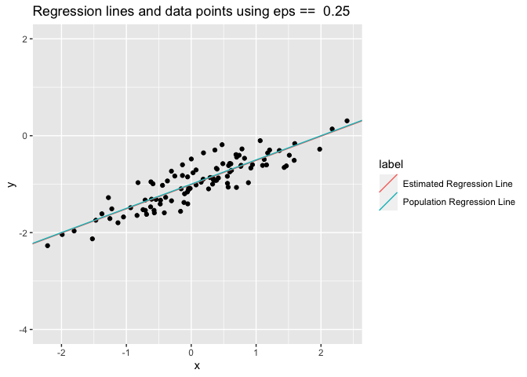

-   [Conceptual](#conceptual)
    -   [Question 1](#question-1)
    -   [Question 2](#question-2)
    -   [Question 3](#question-3)
    -   [Question 4](#question-4)
    -   [Question 5](#question-5)
    -   [Question 6](#question-6)
    -   [Question 7](#question-7)
-   [Applied](#applied)
    -   [Question 8](#question-8)
    -   [Question 9](#question-9)
    -   [Question 10](#question-10)
    -   [Question 11](#question-11)
    -   [Question 12](#question-12)
    -   [Question 13](#question-13)
    -   [Question 14](#question-14)
    -   [Question 15](#question-15)

    library(MASS)
    library(ggplot2)
    library(GGally)
    library(dplyr)
    library(gridExtra)
    library(ISLR)
    library(ggfortify)

## Conceptual

### Question 1

The null hypothesis for rows 2-4 is that there is no linear relationship
between the media type in the leftmost column and sales. The null
hypothesis for the first row (the intercept) is that the mean response
is 0 when all media spending is 0. In terms of coefficients, for each
row *i*, indexed starting at 0, the null hypothesis is that
*β**i* = 0.

### Question 2

The KNN regression method uses the average response of the `k`
neighboring points closest to a test point as the prediction for that
point. The KNN classification method first computes the conditional
probability that a test point is of each class by computing the fraction
of the `k` neighboring points that belong to that class, and then
assigns the test point to the class with the maximum conditional
probability.

### Question 3

#### a

Answer iii) is correct. The main effect of gender increases female
salary relative to male salary by `35,000`, but the interaction effect
decreases female salary by `10,000` per point of `GPA`. So if a female
had a `GPA` of `4.0`, on average they would have a salary that differs
from a male by 35, 000 +  − 10, 000 ⋅ 4 =  − 5, 000, provided that the
female and male both had the same `IQ` and `GPA`. Since this is a
negative number, so we conclude that on average males earn more provided
that the GPA is high enough.

#### b

50 + 20 ⋅ 4 + 0.07 ⋅ 110 + 35 + 0.01 ⋅ 4 ⋅ 110 − 10 ⋅ 4 ⋅ 1 = 137.1, in
thousands of dollars.

#### c

This is false. The t value and the corresponding p-value for the
interaction term needs to be examined, rather than the coefficient value
itself. In general, the coefficient value will depend on the scaling of
the variable rather than the significance of the term.

### Question 4

#### a

The training `RSS` will never increase as more variables are added to
the model. This includes transformations of existing variables. So we
would expect the cubic regression to have a lower training `RSS`.

#### b

Given that the true relationship is linear, the cubic model will not
result in a reduction of bias but will increase variance. So we would
expect the linear regression to have a lower test error.

#### c

See part a) above.

#### d

Given that we don’t know how far from linear the true relationship is,
it is unclear how much bias will be reduced by using the cubic
regression. So we can’t tell which method would have lower test `RSS`.

### Question 5

$\frac{\displaystyle\sum\_{i=1}^{n} x\_iy\_i}{\displaystyle\sum\_{j=1}^{n} x\_j^2} = \displaystyle\sum\_{i=1}^{n} \frac{x\_i}{\displaystyle\sum\_{j=1}^{n} x\_j^2} y\_i$.

So
$\alpha\_i = \displaystyle\frac{x\_i}{\displaystyle\sum\_{j=1}^{n} x\_j^2}$

### Question 6

*ŷ* = *β*0 + *β*1*x* = *ȳ* − *β*1*x̄* + *β*1*x* = *ȳ* + *β*1(*x*−*x̄*)

This equality holds when *ŷ* = *ȳ* and *x* = *x̄*.

### Question 7

$\hat{\beta\_1} = \frac{\displaystyle\sum\_{i=1}^{n}(x\_i - \bar{x})(y\_i - \bar{y})}{\displaystyle\sum\_{i=1}^{n}(x\_i - \bar{x})^2} = \frac{Cov(X,Y)}{Var(X)} = \frac{Cor(X,Y)SD(Y)}{SD(X)}$

Now
$R^2 = \frac{\displaystyle\sum\_{i=1}^{n}(\hat{y\_i} - \bar{y})^2}{\displaystyle\sum\_{i=1}^{n}(y\_i - \bar{y})^2} = \displaystyle\frac{\displaystyle\sum\_{i=1}^{n}(\bar{y} + \beta\_1(x\_i - \bar{x}) - \bar{y})^2}{SD(Y)^2} = \displaystyle\frac{\displaystyle\sum\_{i=1}^{n}(\beta\_1(x\_i - \bar{x}))^2}{SD(Y)^2} = \beta\_1^2\displaystyle\frac{\displaystyle\sum\_{i=1}^{n}(x\_i - \bar{x})^2}{SD(Y)^2} = \\ \frac{Cor(X,Y)^2SD(Y)^2}{SD(X)^2} \cdot \frac{SD(X)^2}{SD(Y)^2} = Cor(X,Y)^2$

## Applied

### Question 8

#### a

  

    df_auto <- Auto
    simple_linear_regression_model <- lm(mpg ~ horsepower, data = df_auto)

    print(summary(simple_linear_regression_model))

    ## 
    ## Call:
    ## lm(formula = mpg ~ horsepower, data = df_auto)
    ## 
    ## Residuals:
    ##      Min       1Q   Median       3Q      Max 
    ## -13.5710  -3.2592  -0.3435   2.7630  16.9240 
    ## 
    ## Coefficients:
    ##              Estimate Std. Error t value Pr(>|t|)    
    ## (Intercept) 39.935861   0.717499   55.66   <2e-16 ***
    ## horsepower  -0.157845   0.006446  -24.49   <2e-16 ***
    ## ---
    ## Signif. codes:  0 '***' 0.001 '**' 0.01 '*' 0.05 '.' 0.1 ' ' 1
    ## 
    ## Residual standard error: 4.906 on 390 degrees of freedom
    ## Multiple R-squared:  0.6059, Adjusted R-squared:  0.6049 
    ## F-statistic: 599.7 on 1 and 390 DF,  p-value: < 2.2e-16

##### i

Since this is simple linear regression, the t-statistic and the
F-statistic are testing the same thing: is there a relationship between
the predictor and the response? Since the p-value associated with these
statistics is tiny, we reject the null hypothesis that there is no
linear association between `mpg` and `horsepower`.

##### ii

This model has an *R*2 of 0.61, indicating that 61% of the
variance in the training data is explained by the model. The estimate of
the standard error is `4.9` units, relative to the mean value of `23.4`,
giving a relative error of roughly 20%.

##### iii

Looking at the sign of the coefficient, the relationship is negative.

##### iv

  

    dfs_interval <- lapply(
      c("confidence", "prediction"),
      function(interval, model) {
        df <- data.frame(predict(model, data.frame(horsepower = 98), interval = interval))
        df$interval <- interval

        df
      },
      model = simple_linear_regression_model
    )

    df_interval <- dplyr::bind_rows(dfs_interval)
    rownames(df_interval) <- NULL

    print(df_interval)

    ##        fit      lwr      upr   interval
    ## 1 24.46708 23.97308 24.96108 confidence
    ## 2 24.46708 14.80940 34.12476 prediction

##### v

  

    coefs <- coef(simple_linear_regression_model)
    df_auto %>%
      ggplot2::ggplot(.) +
      ggplot2::geom_point(ggplot2::aes(x = horsepower, y = mpg)) +
      ggplot2::geom_abline(slope = coefs[[2]], intercept = coefs[[1]])

##### vi

  

    ggplot2::autoplot(simple_linear_regression_model)

From this plot we notice a few things:

1.  Evidence of non-linearity of data - The residuals vs fitted value
    plot shows evidence of a non-linear relationship, as there is a
    noticeable pattern to the residuals. You can also see this in the
    normal QQ plot.

2.  No evidence of correlation of error terms - Since each measurement
    is independent of the other measurements in this data set, this is
    not a surprise.

3.  Evidence of non-constant variance of error terms - The spread of the
    residuals is greater at higher values of the fitted values, which is
    related to point 1 above. You can also see this in the normal QQ
    plot.

4.  Leverage - Looking at the standardized residuals vs leverage plot,
    there are a number of points with high leverage, but most of them
    have small residuals, i.e. are not outliers. The exceptions are
    observations `117` and two points which lie right on top of each
    other, all of which have high leverage and could also be considered
    borderline outliers (the combination of which gives a high value of
    Cook’s distance).

5.  Outliers - There are a few points with standardized residuals with
    magnitude greater than 2, but most of them have low leverage and
    thus do not affect the slope of the linear regression line greatly.
    As mentioned above, points `191` and `117` are exceptions.

### Question 9

#### a

  

    GGally::ggpairs(df_auto %>% dplyr::select(., -name))

#### b

The correlations can be seen in the above plot.

#### c

  

    multiple_linear_regression_model <- lm(mpg ~ . - name, data = df_auto)

    print(summary(multiple_linear_regression_model))

    ## 
    ## Call:
    ## lm(formula = mpg ~ . - name, data = df_auto)
    ## 
    ## Residuals:
    ##     Min      1Q  Median      3Q     Max 
    ## -9.5903 -2.1565 -0.1169  1.8690 13.0604 
    ## 
    ## Coefficients:
    ##                Estimate Std. Error t value Pr(>|t|)    
    ## (Intercept)  -17.218435   4.644294  -3.707  0.00024 ***
    ## cylinders     -0.493376   0.323282  -1.526  0.12780    
    ## displacement   0.019896   0.007515   2.647  0.00844 ** 
    ## horsepower    -0.016951   0.013787  -1.230  0.21963    
    ## weight        -0.006474   0.000652  -9.929  < 2e-16 ***
    ## acceleration   0.080576   0.098845   0.815  0.41548    
    ## year           0.750773   0.050973  14.729  < 2e-16 ***
    ## origin         1.426141   0.278136   5.127 4.67e-07 ***
    ## ---
    ## Signif. codes:  0 '***' 0.001 '**' 0.01 '*' 0.05 '.' 0.1 ' ' 1
    ## 
    ## Residual standard error: 3.328 on 384 degrees of freedom
    ## Multiple R-squared:  0.8215, Adjusted R-squared:  0.8182 
    ## F-statistic: 252.4 on 7 and 384 DF,  p-value: < 2.2e-16

##### i

The tiny p-value associated with the F-statistic indicates that not all
of the coefficients are equal to 0, i.e. there is a relationship between
at least one of the predictors and `mpg`.

##### ii

Looking at the p-values, `displacement`, `weight`, `year`, and `origin`
all appear to have a statistically significant relationship with `mpg`.

##### iii

The coefficient for the `year` variable is positive, indicating that
`mpg` has been increasing over time.

#### d

  

    ggplot2::autoplot(multiple_linear_regression_model)

1.  Evidence of non-linearity of data - The residuals vs fitted value
    plot shows evidence of a non-linear relationship, as in the case of
    the earlier simple linear regression. The non-linearity is not as
    severe as in the single variable case, however.

2.  No evidence of correlation of error terms - Same as single variable
    case.

3.  Evidence of non-constant variance of error terms - The spread of the
    residuals is greater at higher values of the fitted values, which is
    related to point 1 above. You can also see this in the normal QQ
    plot.

4.  Leverage - Looking at the standardized residuals vs leverage plot,
    there is one point (point 14) with very high leverage and also a
    relatively large residual.

5.  Outliers -there are a few points with standardized residuals with
    magnitude greater than 2, but most of them have low leverage and
    thus do not affect the slope of the linear regression line greatly.
    Point 14 is a borderline outlier and has high leverage.

#### e

  

    interaction_model <- lm(mpg ~ . -name + acceleration:weight + displacement:horsepower, data = df_auto)

    print(summary(interaction_model))

    ## 
    ## Call:
    ## lm(formula = mpg ~ . - name + acceleration:weight + displacement:horsepower, 
    ##     data = df_auto)
    ## 
    ## Residuals:
    ##     Min      1Q  Median      3Q     Max 
    ## -8.5578 -1.5848 -0.0741  1.4277 12.6105 
    ## 
    ## Coefficients:
    ##                           Estimate Std. Error t value Pr(>|t|)    
    ## (Intercept)             -6.803e+00  7.107e+00  -0.957  0.33906    
    ## cylinders                6.154e-01  3.040e-01   2.025  0.04361 *  
    ## displacement            -7.132e-02  1.166e-02  -6.115 2.39e-09 ***
    ## horsepower              -1.896e-01  2.245e-02  -8.447 6.35e-16 ***
    ## weight                  -1.797e-03  1.685e-03  -1.067  0.28687    
    ## acceleration             3.607e-02  3.010e-01   0.120  0.90468    
    ## year                     7.433e-01  4.509e-02  16.487  < 2e-16 ***
    ## origin                   6.776e-01  2.531e-01   2.677  0.00774 ** 
    ## weight:acceleration     -8.668e-05  9.986e-05  -0.868  0.38595    
    ## displacement:horsepower  4.901e-04  6.165e-05   7.950 2.12e-14 ***
    ## ---
    ## Signif. codes:  0 '***' 0.001 '**' 0.01 '*' 0.05 '.' 0.1 ' ' 1
    ## 
    ## Residual standard error: 2.913 on 382 degrees of freedom
    ## Multiple R-squared:  0.8639, Adjusted R-squared:  0.8607 
    ## F-statistic: 269.4 on 9 and 382 DF,  p-value: < 2.2e-16

The `displacement-horsepower` interaction term is significant.

#### f

  

    polynomial_model <- lm(mpg ~ poly(horsepower, 2), data = df_auto)

    print(summary(polynomial_model))

    ## 
    ## Call:
    ## lm(formula = mpg ~ poly(horsepower, 2), data = df_auto)
    ## 
    ## Residuals:
    ##      Min       1Q   Median       3Q      Max 
    ## -14.7135  -2.5943  -0.0859   2.2868  15.8961 
    ## 
    ## Coefficients:
    ##                       Estimate Std. Error t value Pr(>|t|)    
    ## (Intercept)            23.4459     0.2209  106.13   <2e-16 ***
    ## poly(horsepower, 2)1 -120.1377     4.3739  -27.47   <2e-16 ***
    ## poly(horsepower, 2)2   44.0895     4.3739   10.08   <2e-16 ***
    ## ---
    ## Signif. codes:  0 '***' 0.001 '**' 0.01 '*' 0.05 '.' 0.1 ' ' 1
    ## 
    ## Residual standard error: 4.374 on 389 degrees of freedom
    ## Multiple R-squared:  0.6876, Adjusted R-squared:  0.686 
    ## F-statistic:   428 on 2 and 389 DF,  p-value: < 2.2e-16

    sqrt_model <- lm(mpg ~ I(sqrt(horsepower)), data = df_auto)

    print(summary(sqrt_model))

    ## 
    ## Call:
    ## lm(formula = mpg ~ I(sqrt(horsepower)), data = df_auto)
    ## 
    ## Residuals:
    ##      Min       1Q   Median       3Q      Max 
    ## -13.9768  -3.2239  -0.2252   2.6881  16.1411 
    ## 
    ## Coefficients:
    ##                     Estimate Std. Error t value Pr(>|t|)    
    ## (Intercept)           58.705      1.349   43.52   <2e-16 ***
    ## I(sqrt(horsepower))   -3.503      0.132  -26.54   <2e-16 ***
    ## ---
    ## Signif. codes:  0 '***' 0.001 '**' 0.01 '*' 0.05 '.' 0.1 ' ' 1
    ## 
    ## Residual standard error: 4.665 on 390 degrees of freedom
    ## Multiple R-squared:  0.6437, Adjusted R-squared:  0.6428 
    ## F-statistic: 704.6 on 1 and 390 DF,  p-value: < 2.2e-16

In the polynomial\_model, both the linear and quadratic term are
statistically significant. The overall fit of the model is superior to
the simple linear model, at least using adjusted R-squared. The square
root term is also significant in the square root model, although this
model does not perform as well as the quadratic model using adjusted
R-squared.

### Question 10

#### a

  

    df_carseats <- Carseats
    model <- lm(Sales ~ Price + Urban + US, data = df_carseats)
    print(summary(model))

    ## 
    ## Call:
    ## lm(formula = Sales ~ Price + Urban + US, data = df_carseats)
    ## 
    ## Residuals:
    ##     Min      1Q  Median      3Q     Max 
    ## -6.9206 -1.6220 -0.0564  1.5786  7.0581 
    ## 
    ## Coefficients:
    ##              Estimate Std. Error t value Pr(>|t|)    
    ## (Intercept) 13.043469   0.651012  20.036  < 2e-16 ***
    ## Price       -0.054459   0.005242 -10.389  < 2e-16 ***
    ## UrbanYes    -0.021916   0.271650  -0.081    0.936    
    ## USYes        1.200573   0.259042   4.635 4.86e-06 ***
    ## ---
    ## Signif. codes:  0 '***' 0.001 '**' 0.01 '*' 0.05 '.' 0.1 ' ' 1
    ## 
    ## Residual standard error: 2.472 on 396 degrees of freedom
    ## Multiple R-squared:  0.2393, Adjusted R-squared:  0.2335 
    ## F-statistic: 41.52 on 3 and 396 DF,  p-value: < 2.2e-16

#### b

1.  Price - for a 1 unit change in price, sales go down on average by
    -0.05 units.
2.  Urban - sales in urban populations are on average lower by -0.02
    units, although this effect is non-significant.
3.  US - sales in the US are on average 1.2 units higher than sales
    outside the US.

#### c

*ŷ* = 13.043469 − 0.054459 ⋅ *P**r**i**c**e* − 0.021916 ⋅ **1***U**r**b**a**n* =  = *Y**e**s* + 1.200573 ⋅ **1***U**S* =  = *Y**e**s*

#### d

  

    model <- lm(Sales ~ Price + US, data = df_carseats)

    print(summary(model))

    ## 
    ## Call:
    ## lm(formula = Sales ~ Price + US, data = df_carseats)
    ## 
    ## Residuals:
    ##     Min      1Q  Median      3Q     Max 
    ## -6.9269 -1.6286 -0.0574  1.5766  7.0515 
    ## 
    ## Coefficients:
    ##             Estimate Std. Error t value Pr(>|t|)    
    ## (Intercept) 13.03079    0.63098  20.652  < 2e-16 ***
    ## Price       -0.05448    0.00523 -10.416  < 2e-16 ***
    ## USYes        1.19964    0.25846   4.641 4.71e-06 ***
    ## ---
    ## Signif. codes:  0 '***' 0.001 '**' 0.01 '*' 0.05 '.' 0.1 ' ' 1
    ## 
    ## Residual standard error: 2.469 on 397 degrees of freedom
    ## Multiple R-squared:  0.2393, Adjusted R-squared:  0.2354 
    ## F-statistic: 62.43 on 2 and 397 DF,  p-value: < 2.2e-16

This model, created by removing the insignificant `Urban` variable from
the first model, has the same *R*2 up to 4 decimal places,
higher adjusted R squared, and lower residual standard error, compared
to the first model. We thus would favor this model, as it likely would
perform better out of sample and is simpler.

#### e

  

    print(confint(model))

    ##                   2.5 %      97.5 %
    ## (Intercept) 11.79032020 14.27126531
    ## Price       -0.06475984 -0.04419543
    ## USYes        0.69151957  1.70776632

#### f

  

    ggplot2::autoplot(model)

The residual vs fitted plot looks good; no evidence of homoscedasticity
or non-linear relationships. The QQ plot indicates that the residuals
are approximately normally distributed. In terms of leverage, there is
one very high leverage point but it does not have a large residual so
its influence on the least squares plane is minimal. There are a few
points with studentized residuals close to 3 in absolute values,
indicating outliers, but they have low leverage so are unlikeley to
influence the least squares plane.

### Question 11

#### a

  

    set.seed(1)
    df <- data.frame(x = rnorm(100))
    df$y <- 2 * df$x + rnorm(100)

    model <- lm(y ~ 0 + x, data = df)

    print(summary(model))

    ## 
    ## Call:
    ## lm(formula = y ~ 0 + x, data = df)
    ## 
    ## Residuals:
    ##     Min      1Q  Median      3Q     Max 
    ## -1.9154 -0.6472 -0.1771  0.5056  2.3109 
    ## 
    ## Coefficients:
    ##   Estimate Std. Error t value Pr(>|t|)    
    ## x   1.9939     0.1065   18.73   <2e-16 ***
    ## ---
    ## Signif. codes:  0 '***' 0.001 '**' 0.01 '*' 0.05 '.' 0.1 ' ' 1
    ## 
    ## Residual standard error: 0.9586 on 99 degrees of freedom
    ## Multiple R-squared:  0.7798, Adjusted R-squared:  0.7776 
    ## F-statistic: 350.7 on 1 and 99 DF,  p-value: < 2.2e-16

The estimate is close to the true value of *β*.

#### b, c

  

    model <- lm(x ~ 0 + y, data = df)

    print(summary(model))

    ## 
    ## Call:
    ## lm(formula = x ~ 0 + y, data = df)
    ## 
    ## Residuals:
    ##     Min      1Q  Median      3Q     Max 
    ## -0.8699 -0.2368  0.1030  0.2858  0.8938 
    ## 
    ## Coefficients:
    ##   Estimate Std. Error t value Pr(>|t|)    
    ## y  0.39111    0.02089   18.73   <2e-16 ***
    ## ---
    ## Signif. codes:  0 '***' 0.001 '**' 0.01 '*' 0.05 '.' 0.1 ' ' 1
    ## 
    ## Residual standard error: 0.4246 on 99 degrees of freedom
    ## Multiple R-squared:  0.7798, Adjusted R-squared:  0.7776 
    ## F-statistic: 350.7 on 1 and 99 DF,  p-value: < 2.2e-16

The same t-value is obtained in both cases.

#### d

For notational convenience, let
$num = \displaystyle\sum\_{i=1}^{n} y\_ix\_i$ and
$denum = \displaystyle\sum\_{i=1}^{n} x\_i^2$

Then

$t = \frac{\hat{\beta}}{SE(\hat{\beta})} = \frac{num}{denum} / \frac{\displaystyle\sum\_{i=1}^{n} (y\_i - x\_i\hat{\beta})^2}{(n - 1)denum} = \frac{num}{denum} / \sqrt{\frac{\displaystyle\sum\_{i=1}^{n} (y\_i - x\_i\frac{num}{denum})^2}{(n - 1)denum}} = \frac{num}{denum} / \sqrt{\frac{\displaystyle\sum\_{i=1}^{n} y\_i^2 - 2y\_ix\_i\frac{num}{denum} + x\_i^2\frac{num^2}{denum^2}}{(n - 1)denum}} = \sqrt{(n - 1)}num / \sqrt{\displaystyle\sum\_{i=1}^{n} (y\_i^2denum - 2y\_ix\_inum) + num^2} = \sqrt{(n - 1)} \displaystyle\sum\_{i=1}^{n} y\_ix\_i/ \sqrt{\displaystyle\sum\_{i=1}^{n} y\_i^2\displaystyle\sum\_{i=1}^{n} x\_i^2 - (\displaystyle\sum\_{i=1}^{n} y\_ix\_i )^2}$

#### e

*x**i* and *y**i* are symmetric in the above
equation, so the result will be the same whether we regress y on x or x
on y.

#### f

  

    y_on_x <- lm(y ~ x, data = df)
    x_on_y <- lm(x ~ y, data = df)

    print(summary(y_on_x)$coefficients[2, "t value"])

    ## [1] 18.5556

    print(summary(x_on_y)$coefficients[2, "t value"])

    ## [1] 18.5556

We see that the t values are the same in this case as well.

### Question 12

#### a

When
$\displaystyle\sum\_{i=1}^{n} y\_i^2 = \displaystyle\sum\_{i=1}^{n} x\_i^2$,
the coefficient estimates will be the same.

#### b, c

  

    set.seed(1)

    df <- data.frame(x = rnorm(100))
    df$y1 <- df$x + 1
    df$y2 <- sample(df$x)

    base_vars <- c("x", "y")
    for (index in seq(2)) {
      for (pair in list(base_vars, rev(base_vars))) {
        pair[pair == "y"] <- paste0("y", index)
        formula_string <- paste(pair[[1]], "~", pair[[2]], "+ 0")
        model <- lm(as.formula(formula_string), data = df)
        print(paste0("Regression for ", pair[[1]], " on ", pair[[2]], ": "))
        print(coef(model)[[1]])
      }
    }

    ## [1] "Regression for x on y1: "
    ## [1] 0.4532991
    ## [1] "Regression for y1 on x: "
    ## [1] 1.134337
    ## [1] "Regression for x on y2: "
    ## [1] -0.07767695
    ## [1] "Regression for y2 on x: "
    ## [1] -0.07767695

We see that when the magnitude of the `x`, `y` vectors are the same, the
coefficient estimates are the same whether we regress `y` on `x` or `x`
on `y`.

### Question 13

We will answer all questions in one code block here.  

    generate_data <- function(sd_eps) {
      set.seed(1)

      df <- data.frame(x = rnorm(100), eps = rnorm(100, sd = sd_eps))
      df$y <- -1 + 0.5*df$x + df$eps

      df
    }

    fit_model_and_plot <- function(df, sd_eps) {
      model <- lm(y ~ x, data = df)
      model_poly <- lm(y ~ poly(x, 2), data = df)
      quadratic_p_value <- summary(model_poly)$coefficients[3, 4]

      print(paste("Confidence interval for estimates using eps =", sd_eps, ":"))
      print(confint(model))
      print(paste("p-value for quadratic term using eps =", sd_eps, ":", quadratic_p_value, sep = " "))

      estimated_values <- coef(model)
      true_values <- c(-1, 0.5)

      df_coefficients <- data.frame(
        intercept = c(estimated_values[[1]], true_values[[1]]),
        slope = c(estimated_values[[2]], true_values[[2]]),
        label = c("Estimated Regression Line", "Population Regression Line")
      )

      ggplot2::ggplot(df) +
        ggplot2::geom_point(ggplot2::aes(x = x, y = y)) +
        ggplot2::geom_abline(ggplot2::aes(intercept = intercept, slope = slope, color = label), data = df_coefficients) +
        ggplot2::labs(title = paste("Regression lines and data points using eps == ", sd_eps, sep = " ")) +
        ggplot2::lims(y = c(-4, 2))
    }

    generate_data_fit_model_plot <- function(sd_eps) {
      df <- generate_data(sd_eps)
      fit_model_and_plot(df, sd_eps)
    }

    plots <- lapply(c(0.01, 0.25, 1), generate_data_fit_model_plot)

    ## [1] "Confidence interval for estimates using eps = 0.01 :"
    ##                  2.5 %     97.5 %
    ## (Intercept) -1.0023016 -0.9984522
    ## x            0.4978516  0.5021272
    ## [1] "p-value for quadratic term using eps = 0.01 : 0.163827501425193"
    ## [1] "Confidence interval for estimates using eps = 0.25 :"
    ##                  2.5 %     97.5 %
    ## (Intercept) -1.0575402 -0.9613061
    ## x            0.4462897  0.5531801
    ## [1] "p-value for quadratic term using eps = 0.25 : 0.163827501425203"
    ## [1] "Confidence interval for estimates using eps = 1 :"
    ##                  2.5 %     97.5 %
    ## (Intercept) -1.2301607 -0.8452245
    ## x            0.2851588  0.7127204
    ## [1] "p-value for quadratic term using eps = 1 : 0.163827501425204"

    for (plot in plots) {
      print(plot)
    }

The length of `y` is 100. *β*0 is -1, and *β*1 is
0.5. This does not change as we vary the error term. As the error term
variance increases, the estimated regression line diverges from the true
regression line and the confidence intervals around the coefficients
becomes larger. The polynomial term is never significant regardless of
the value of the error term variance.

### Question 14

#### a

  

    set.seed(1)

    df <- data.frame(x1 = runif(100))
    df$x2 <- 0.5  * df$x1 + rnorm(100) / 10
    df$y <- 2 + 2 * df$x1 + 0.3 * df$x2 + rnorm(100)

The linear model is
*y* = 2 + 2*x*1 + 0.3*x*2 + *ϵ*. The population
regression coefficients are
*β*0 = 2, *β*1 = 2, *β*2 = 0.3

#### b

  

    GGally::ggpairs(df, columns = c("x1", "x2"))

From the above plots we see the correlation is 0.818.

#### c

  

    model <- lm(y ~ ., data = df)

    print(summary(model))

    ## 
    ## Call:
    ## lm(formula = y ~ ., data = df)
    ## 
    ## Residuals:
    ##     Min      1Q  Median      3Q     Max 
    ## -2.8311 -0.7273 -0.0537  0.6338  2.3359 
    ## 
    ## Coefficients:
    ##             Estimate Std. Error t value Pr(>|t|)    
    ## (Intercept)   2.1305     0.2319   9.188 7.61e-15 ***
    ## x1            1.4396     0.7212   1.996   0.0487 *  
    ## x2            1.0097     1.1337   0.891   0.3754    
    ## ---
    ## Signif. codes:  0 '***' 0.001 '**' 0.01 '*' 0.05 '.' 0.1 ' ' 1
    ## 
    ## Residual standard error: 1.056 on 97 degrees of freedom
    ## Multiple R-squared:  0.2088, Adjusted R-squared:  0.1925 
    ## F-statistic:  12.8 on 2 and 97 DF,  p-value: 1.164e-05

We can reject the null hypothesis *H*0 : *β*1 = 0,
but not the null hypothesis *H*0 : *β*2 = 0.

#### d

  

    model <- lm(y ~ x1, data = df)

    print(summary(model))

    ## 
    ## Call:
    ## lm(formula = y ~ x1, data = df)
    ## 
    ## Residuals:
    ##      Min       1Q   Median       3Q      Max 
    ## -2.89495 -0.66874 -0.07785  0.59221  2.45560 
    ## 
    ## Coefficients:
    ##             Estimate Std. Error t value Pr(>|t|)    
    ## (Intercept)   2.1124     0.2307   9.155 8.27e-15 ***
    ## x1            1.9759     0.3963   4.986 2.66e-06 ***
    ## ---
    ## Signif. codes:  0 '***' 0.001 '**' 0.01 '*' 0.05 '.' 0.1 ' ' 1
    ## 
    ## Residual standard error: 1.055 on 98 degrees of freedom
    ## Multiple R-squared:  0.2024, Adjusted R-squared:  0.1942 
    ## F-statistic: 24.86 on 1 and 98 DF,  p-value: 2.661e-06

Again, we can reject the null hypothesis
*H*0 : *β*1 = 0. The p-value is lower in the
univariate case.

#### e

  

    model <- lm(y ~ x2, data = df)

    print(summary(model))

    ## 
    ## Call:
    ## lm(formula = y ~ x2, data = df)
    ## 
    ## Residuals:
    ##      Min       1Q   Median       3Q      Max 
    ## -2.62687 -0.75156 -0.03598  0.72383  2.44890 
    ## 
    ## Coefficients:
    ##             Estimate Std. Error t value Pr(>|t|)    
    ## (Intercept)   2.3899     0.1949   12.26  < 2e-16 ***
    ## x2            2.8996     0.6330    4.58 1.37e-05 ***
    ## ---
    ## Signif. codes:  0 '***' 0.001 '**' 0.01 '*' 0.05 '.' 0.1 ' ' 1
    ## 
    ## Residual standard error: 1.072 on 98 degrees of freedom
    ## Multiple R-squared:  0.1763, Adjusted R-squared:  0.1679 
    ## F-statistic: 20.98 on 1 and 98 DF,  p-value: 1.366e-05

This time we can reject the null hypothesis
*H*0 : *β*2 = 0.

#### f

These results do not contradict one another; becuause of the high
correlation between the two variables, the variance of the estimates
when they are both included in the model is quite high. In other words,
there are many possible pairs of estimates that fit the data about
equally well, so we can’t be very certain that a given estimate is close
to the true population value.

#### g

  

    df <- rbind(df, list(x1 = 0.1, x2 = 0.8, y = 6))

    model_both <- lm(y ~ ., data = df)

    print(summary(model_both))

    ## 
    ## Call:
    ## lm(formula = y ~ ., data = df)
    ## 
    ## Residuals:
    ##      Min       1Q   Median       3Q      Max 
    ## -2.73348 -0.69318 -0.05263  0.66385  2.30619 
    ## 
    ## Coefficients:
    ##             Estimate Std. Error t value Pr(>|t|)    
    ## (Intercept)   2.2267     0.2314   9.624 7.91e-16 ***
    ## x1            0.5394     0.5922   0.911  0.36458    
    ## x2            2.5146     0.8977   2.801  0.00614 ** 
    ## ---
    ## Signif. codes:  0 '***' 0.001 '**' 0.01 '*' 0.05 '.' 0.1 ' ' 1
    ## 
    ## Residual standard error: 1.075 on 98 degrees of freedom
    ## Multiple R-squared:  0.2188, Adjusted R-squared:  0.2029 
    ## F-statistic: 13.72 on 2 and 98 DF,  p-value: 5.564e-06

    ggplot2::autoplot(model_both)

    model_x1 <- lm(y ~ x1, data = df)

    print(summary(model_x1))

    ## 
    ## Call:
    ## lm(formula = y ~ x1, data = df)
    ## 
    ## Residuals:
    ##     Min      1Q  Median      3Q     Max 
    ## -2.8897 -0.6556 -0.0909  0.5682  3.5665 
    ## 
    ## Coefficients:
    ##             Estimate Std. Error t value Pr(>|t|)    
    ## (Intercept)   2.2569     0.2390   9.445 1.78e-15 ***
    ## x1            1.7657     0.4124   4.282 4.29e-05 ***
    ## ---
    ## Signif. codes:  0 '***' 0.001 '**' 0.01 '*' 0.05 '.' 0.1 ' ' 1
    ## 
    ## Residual standard error: 1.111 on 99 degrees of freedom
    ## Multiple R-squared:  0.1562, Adjusted R-squared:  0.1477 
    ## F-statistic: 18.33 on 1 and 99 DF,  p-value: 4.295e-05

    ggplot2::autoplot(model_x1)

    model_x2 <- lm(y ~ x2, data = df)

    print(summary(model_x2))

    ## 
    ## Call:
    ## lm(formula = y ~ x2, data = df)
    ## 
    ## Residuals:
    ##      Min       1Q   Median       3Q      Max 
    ## -2.64729 -0.71021 -0.06899  0.72699  2.38074 
    ## 
    ## Coefficients:
    ##             Estimate Std. Error t value Pr(>|t|)    
    ## (Intercept)   2.3451     0.1912  12.264  < 2e-16 ***
    ## x2            3.1190     0.6040   5.164 1.25e-06 ***
    ## ---
    ## Signif. codes:  0 '***' 0.001 '**' 0.01 '*' 0.05 '.' 0.1 ' ' 1
    ## 
    ## Residual standard error: 1.074 on 99 degrees of freedom
    ## Multiple R-squared:  0.2122, Adjusted R-squared:  0.2042 
    ## F-statistic: 26.66 on 1 and 99 DF,  p-value: 1.253e-06

The statistically significant term changes from `x1` to `x2` in the
model including both terms. This point has high leverage in all 3
models, and is the highest leverage point in models 1 and 3. In model 2,
it could be considered an outlier given the high value of the
standardized residual.

### Question 15

#### a

  

    response <- "crim"
    predictors <- setdiff(colnames(df_boston), response)

    univariate_coefficients <- rep(0, length(predictors)) %>%
      setNames(., predictors)
    for (predictor in predictors) {
      formula_string <- paste(response, "~", predictor, sep = " ")
      model <- lm(as.formula(formula_string), df_boston)
      univariate_coefficients[[predictor]] <- coef(model)[predictor]
      print(summary(model))
    }

    ## 
    ## Call:
    ## lm(formula = as.formula(formula_string), data = df_boston)
    ## 
    ## Residuals:
    ##    Min     1Q Median     3Q    Max 
    ## -4.429 -4.222 -2.620  1.250 84.523 
    ## 
    ## Coefficients:
    ##             Estimate Std. Error t value Pr(>|t|)    
    ## (Intercept)  4.45369    0.41722  10.675  < 2e-16 ***
    ## zn          -0.07393    0.01609  -4.594 5.51e-06 ***
    ## ---
    ## Signif. codes:  0 '***' 0.001 '**' 0.01 '*' 0.05 '.' 0.1 ' ' 1
    ## 
    ## Residual standard error: 8.435 on 504 degrees of freedom
    ## Multiple R-squared:  0.04019,    Adjusted R-squared:  0.03828 
    ## F-statistic:  21.1 on 1 and 504 DF,  p-value: 5.506e-06
    ## 
    ## 
    ## Call:
    ## lm(formula = as.formula(formula_string), data = df_boston)
    ## 
    ## Residuals:
    ##     Min      1Q  Median      3Q     Max 
    ## -11.972  -2.698  -0.736   0.712  81.813 
    ## 
    ## Coefficients:
    ##             Estimate Std. Error t value Pr(>|t|)    
    ## (Intercept) -2.06374    0.66723  -3.093  0.00209 ** 
    ## indus        0.50978    0.05102   9.991  < 2e-16 ***
    ## ---
    ## Signif. codes:  0 '***' 0.001 '**' 0.01 '*' 0.05 '.' 0.1 ' ' 1
    ## 
    ## Residual standard error: 7.866 on 504 degrees of freedom
    ## Multiple R-squared:  0.1653, Adjusted R-squared:  0.1637 
    ## F-statistic: 99.82 on 1 and 504 DF,  p-value: < 2.2e-16
    ## 
    ## 
    ## Call:
    ## lm(formula = as.formula(formula_string), data = df_boston)
    ## 
    ## Residuals:
    ##    Min     1Q Median     3Q    Max 
    ## -3.738 -3.661 -3.435  0.018 85.232 
    ## 
    ## Coefficients:
    ##             Estimate Std. Error t value Pr(>|t|)    
    ## (Intercept)   3.7444     0.3961   9.453   <2e-16 ***
    ## chas         -1.8928     1.5061  -1.257    0.209    
    ## ---
    ## Signif. codes:  0 '***' 0.001 '**' 0.01 '*' 0.05 '.' 0.1 ' ' 1
    ## 
    ## Residual standard error: 8.597 on 504 degrees of freedom
    ## Multiple R-squared:  0.003124,   Adjusted R-squared:  0.001146 
    ## F-statistic: 1.579 on 1 and 504 DF,  p-value: 0.2094
    ## 
    ## 
    ## Call:
    ## lm(formula = as.formula(formula_string), data = df_boston)
    ## 
    ## Residuals:
    ##     Min      1Q  Median      3Q     Max 
    ## -12.371  -2.738  -0.974   0.559  81.728 
    ## 
    ## Coefficients:
    ##             Estimate Std. Error t value Pr(>|t|)    
    ## (Intercept)  -13.720      1.699  -8.073 5.08e-15 ***
    ## nox           31.249      2.999  10.419  < 2e-16 ***
    ## ---
    ## Signif. codes:  0 '***' 0.001 '**' 0.01 '*' 0.05 '.' 0.1 ' ' 1
    ## 
    ## Residual standard error: 7.81 on 504 degrees of freedom
    ## Multiple R-squared:  0.1772, Adjusted R-squared:  0.1756 
    ## F-statistic: 108.6 on 1 and 504 DF,  p-value: < 2.2e-16
    ## 
    ## 
    ## Call:
    ## lm(formula = as.formula(formula_string), data = df_boston)
    ## 
    ## Residuals:
    ##    Min     1Q Median     3Q    Max 
    ## -6.604 -3.952 -2.654  0.989 87.197 
    ## 
    ## Coefficients:
    ##             Estimate Std. Error t value Pr(>|t|)    
    ## (Intercept)   20.482      3.365   6.088 2.27e-09 ***
    ## rm            -2.684      0.532  -5.045 6.35e-07 ***
    ## ---
    ## Signif. codes:  0 '***' 0.001 '**' 0.01 '*' 0.05 '.' 0.1 ' ' 1
    ## 
    ## Residual standard error: 8.401 on 504 degrees of freedom
    ## Multiple R-squared:  0.04807,    Adjusted R-squared:  0.04618 
    ## F-statistic: 25.45 on 1 and 504 DF,  p-value: 6.347e-07
    ## 
    ## 
    ## Call:
    ## lm(formula = as.formula(formula_string), data = df_boston)
    ## 
    ## Residuals:
    ##    Min     1Q Median     3Q    Max 
    ## -6.789 -4.257 -1.230  1.527 82.849 
    ## 
    ## Coefficients:
    ##             Estimate Std. Error t value Pr(>|t|)    
    ## (Intercept) -3.77791    0.94398  -4.002 7.22e-05 ***
    ## age          0.10779    0.01274   8.463 2.85e-16 ***
    ## ---
    ## Signif. codes:  0 '***' 0.001 '**' 0.01 '*' 0.05 '.' 0.1 ' ' 1
    ## 
    ## Residual standard error: 8.057 on 504 degrees of freedom
    ## Multiple R-squared:  0.1244, Adjusted R-squared:  0.1227 
    ## F-statistic: 71.62 on 1 and 504 DF,  p-value: 2.855e-16
    ## 
    ## 
    ## Call:
    ## lm(formula = as.formula(formula_string), data = df_boston)
    ## 
    ## Residuals:
    ##    Min     1Q Median     3Q    Max 
    ## -6.708 -4.134 -1.527  1.516 81.674 
    ## 
    ## Coefficients:
    ##             Estimate Std. Error t value Pr(>|t|)    
    ## (Intercept)   9.4993     0.7304  13.006   <2e-16 ***
    ## dis          -1.5509     0.1683  -9.213   <2e-16 ***
    ## ---
    ## Signif. codes:  0 '***' 0.001 '**' 0.01 '*' 0.05 '.' 0.1 ' ' 1
    ## 
    ## Residual standard error: 7.965 on 504 degrees of freedom
    ## Multiple R-squared:  0.1441, Adjusted R-squared:  0.1425 
    ## F-statistic: 84.89 on 1 and 504 DF,  p-value: < 2.2e-16
    ## 
    ## 
    ## Call:
    ## lm(formula = as.formula(formula_string), data = df_boston)
    ## 
    ## Residuals:
    ##     Min      1Q  Median      3Q     Max 
    ## -10.164  -1.381  -0.141   0.660  76.433 
    ## 
    ## Coefficients:
    ##             Estimate Std. Error t value Pr(>|t|)    
    ## (Intercept) -2.28716    0.44348  -5.157 3.61e-07 ***
    ## rad          0.61791    0.03433  17.998  < 2e-16 ***
    ## ---
    ## Signif. codes:  0 '***' 0.001 '**' 0.01 '*' 0.05 '.' 0.1 ' ' 1
    ## 
    ## Residual standard error: 6.718 on 504 degrees of freedom
    ## Multiple R-squared:  0.3913, Adjusted R-squared:   0.39 
    ## F-statistic: 323.9 on 1 and 504 DF,  p-value: < 2.2e-16
    ## 
    ## 
    ## Call:
    ## lm(formula = as.formula(formula_string), data = df_boston)
    ## 
    ## Residuals:
    ##     Min      1Q  Median      3Q     Max 
    ## -12.513  -2.738  -0.194   1.065  77.696 
    ## 
    ## Coefficients:
    ##              Estimate Std. Error t value Pr(>|t|)    
    ## (Intercept) -8.528369   0.815809  -10.45   <2e-16 ***
    ## tax          0.029742   0.001847   16.10   <2e-16 ***
    ## ---
    ## Signif. codes:  0 '***' 0.001 '**' 0.01 '*' 0.05 '.' 0.1 ' ' 1
    ## 
    ## Residual standard error: 6.997 on 504 degrees of freedom
    ## Multiple R-squared:  0.3396, Adjusted R-squared:  0.3383 
    ## F-statistic: 259.2 on 1 and 504 DF,  p-value: < 2.2e-16
    ## 
    ## 
    ## Call:
    ## lm(formula = as.formula(formula_string), data = df_boston)
    ## 
    ## Residuals:
    ##    Min     1Q Median     3Q    Max 
    ## -7.654 -3.985 -1.912  1.825 83.353 
    ## 
    ## Coefficients:
    ##             Estimate Std. Error t value Pr(>|t|)    
    ## (Intercept) -17.6469     3.1473  -5.607 3.40e-08 ***
    ## ptratio       1.1520     0.1694   6.801 2.94e-11 ***
    ## ---
    ## Signif. codes:  0 '***' 0.001 '**' 0.01 '*' 0.05 '.' 0.1 ' ' 1
    ## 
    ## Residual standard error: 8.24 on 504 degrees of freedom
    ## Multiple R-squared:  0.08407,    Adjusted R-squared:  0.08225 
    ## F-statistic: 46.26 on 1 and 504 DF,  p-value: 2.943e-11
    ## 
    ## 
    ## Call:
    ## lm(formula = as.formula(formula_string), data = df_boston)
    ## 
    ## Residuals:
    ##     Min      1Q  Median      3Q     Max 
    ## -13.756  -2.299  -2.095  -1.296  86.822 
    ## 
    ## Coefficients:
    ##              Estimate Std. Error t value Pr(>|t|)    
    ## (Intercept) 16.553529   1.425903  11.609   <2e-16 ***
    ## black       -0.036280   0.003873  -9.367   <2e-16 ***
    ## ---
    ## Signif. codes:  0 '***' 0.001 '**' 0.01 '*' 0.05 '.' 0.1 ' ' 1
    ## 
    ## Residual standard error: 7.946 on 504 degrees of freedom
    ## Multiple R-squared:  0.1483, Adjusted R-squared:  0.1466 
    ## F-statistic: 87.74 on 1 and 504 DF,  p-value: < 2.2e-16
    ## 
    ## 
    ## Call:
    ## lm(formula = as.formula(formula_string), data = df_boston)
    ## 
    ## Residuals:
    ##     Min      1Q  Median      3Q     Max 
    ## -13.925  -2.822  -0.664   1.079  82.862 
    ## 
    ## Coefficients:
    ##             Estimate Std. Error t value Pr(>|t|)    
    ## (Intercept) -3.33054    0.69376  -4.801 2.09e-06 ***
    ## lstat        0.54880    0.04776  11.491  < 2e-16 ***
    ## ---
    ## Signif. codes:  0 '***' 0.001 '**' 0.01 '*' 0.05 '.' 0.1 ' ' 1
    ## 
    ## Residual standard error: 7.664 on 504 degrees of freedom
    ## Multiple R-squared:  0.2076, Adjusted R-squared:  0.206 
    ## F-statistic:   132 on 1 and 504 DF,  p-value: < 2.2e-16
    ## 
    ## 
    ## Call:
    ## lm(formula = as.formula(formula_string), data = df_boston)
    ## 
    ## Residuals:
    ##    Min     1Q Median     3Q    Max 
    ## -9.071 -4.022 -2.343  1.298 80.957 
    ## 
    ## Coefficients:
    ##             Estimate Std. Error t value Pr(>|t|)    
    ## (Intercept) 11.79654    0.93419   12.63   <2e-16 ***
    ## medv        -0.36316    0.03839   -9.46   <2e-16 ***
    ## ---
    ## Signif. codes:  0 '***' 0.001 '**' 0.01 '*' 0.05 '.' 0.1 ' ' 1
    ## 
    ## Residual standard error: 7.934 on 504 degrees of freedom
    ## Multiple R-squared:  0.1508, Adjusted R-squared:  0.1491 
    ## F-statistic: 89.49 on 1 and 504 DF,  p-value: < 2.2e-16

We see that everything except for `chas` is statistically significant in
the univariate models.

#### b

  

    model <- lm(crim ~ ., data = df_boston)

    print(summary(model))

    ## 
    ## Call:
    ## lm(formula = crim ~ ., data = df_boston)
    ## 
    ## Residuals:
    ##    Min     1Q Median     3Q    Max 
    ## -9.924 -2.120 -0.353  1.019 75.051 
    ## 
    ## Coefficients:
    ##               Estimate Std. Error t value Pr(>|t|)    
    ## (Intercept)  17.033228   7.234903   2.354 0.018949 *  
    ## zn            0.044855   0.018734   2.394 0.017025 *  
    ## indus        -0.063855   0.083407  -0.766 0.444294    
    ## chas         -0.749134   1.180147  -0.635 0.525867    
    ## nox         -10.313535   5.275536  -1.955 0.051152 .  
    ## rm            0.430131   0.612830   0.702 0.483089    
    ## age           0.001452   0.017925   0.081 0.935488    
    ## dis          -0.987176   0.281817  -3.503 0.000502 ***
    ## rad           0.588209   0.088049   6.680 6.46e-11 ***
    ## tax          -0.003780   0.005156  -0.733 0.463793    
    ## ptratio      -0.271081   0.186450  -1.454 0.146611    
    ## black        -0.007538   0.003673  -2.052 0.040702 *  
    ## lstat         0.126211   0.075725   1.667 0.096208 .  
    ## medv         -0.198887   0.060516  -3.287 0.001087 ** 
    ## ---
    ## Signif. codes:  0 '***' 0.001 '**' 0.01 '*' 0.05 '.' 0.1 ' ' 1
    ## 
    ## Residual standard error: 6.439 on 492 degrees of freedom
    ## Multiple R-squared:  0.454,  Adjusted R-squared:  0.4396 
    ## F-statistic: 31.47 on 13 and 492 DF,  p-value: < 2.2e-16

    multivariate_coefficients <- coef(model)[predictors]

`zn`, `dis`, `rad`, `black`, and `medv` are statistically significant.

#### c

  

    df_coefficients <- data.frame(
      univariate = univariate_coefficients,
      multivariate = multivariate_coefficients,
      variable = names(univariate_coefficients)
    )

    ggplot2::ggplot(df_coefficients) +
      ggplot2::geom_point(ggplot2::aes(x = multivariate, y = univariate, color = variable))

`nox` has a very different value between the univariate and multivariate
analyses.

#### d

  

    for (predictor in setdiff(predictors, "chas")) {
      poly_formula_string <- paste0(response, " ~ poly(", predictor, ", 3)")
      linear_formula_string <- paste(response, "~", predictor, sep = " ")
      model_poly <- lm(as.formula(poly_formula_string), data = df_boston)
      model_linear <- lm(as.formula(linear_formula_string), data = df_boston)

      print(anova(model_linear, model_poly))
    }

    ## Analysis of Variance Table
    ## 
    ## Model 1: crim ~ zn
    ## Model 2: crim ~ poly(zn, 3)
    ##   Res.Df   RSS Df Sum of Sq      F   Pr(>F)   
    ## 1    504 35862                                
    ## 2    502 35187  2    674.56 4.8118 0.008512 **
    ## ---
    ## Signif. codes:  0 '***' 0.001 '**' 0.01 '*' 0.05 '.' 0.1 ' ' 1
    ## Analysis of Variance Table
    ## 
    ## Model 1: crim ~ indus
    ## Model 2: crim ~ poly(indus, 3)
    ##   Res.Df   RSS Df Sum of Sq      F    Pr(>F)    
    ## 1    504 31187                                  
    ## 2    502 27662  2    3525.1 31.987 8.409e-14 ***
    ## ---
    ## Signif. codes:  0 '***' 0.001 '**' 0.01 '*' 0.05 '.' 0.1 ' ' 1
    ## Analysis of Variance Table
    ## 
    ## Model 1: crim ~ nox
    ## Model 2: crim ~ poly(nox, 3)
    ##   Res.Df   RSS Df Sum of Sq      F    Pr(>F)    
    ## 1    504 30742                                  
    ## 2    502 26267  2    4474.6 42.758 < 2.2e-16 ***
    ## ---
    ## Signif. codes:  0 '***' 0.001 '**' 0.01 '*' 0.05 '.' 0.1 ' ' 1
    ## Analysis of Variance Table
    ## 
    ## Model 1: crim ~ rm
    ## Model 2: crim ~ poly(rm, 3)
    ##   Res.Df   RSS Df Sum of Sq      F   Pr(>F)   
    ## 1    504 35567                                
    ## 2    502 34831  2    736.69 5.3088 0.005229 **
    ## ---
    ## Signif. codes:  0 '***' 0.001 '**' 0.01 '*' 0.05 '.' 0.1 ' ' 1
    ## Analysis of Variance Table
    ## 
    ## Model 1: crim ~ age
    ## Model 2: crim ~ poly(age, 3)
    ##   Res.Df   RSS Df Sum of Sq     F    Pr(>F)    
    ## 1    504 32714                                 
    ## 2    502 30853  2      1861 15.14 4.125e-07 ***
    ## ---
    ## Signif. codes:  0 '***' 0.001 '**' 0.01 '*' 0.05 '.' 0.1 ' ' 1
    ## Analysis of Variance Table
    ## 
    ## Model 1: crim ~ dis
    ## Model 2: crim ~ poly(dis, 3)
    ##   Res.Df   RSS Df Sum of Sq     F    Pr(>F)    
    ## 1    504 31977                                 
    ## 2    502 26983  2    4994.5 46.46 < 2.2e-16 ***
    ## ---
    ## Signif. codes:  0 '***' 0.001 '**' 0.01 '*' 0.05 '.' 0.1 ' ' 1
    ## Analysis of Variance Table
    ## 
    ## Model 1: crim ~ rad
    ## Model 2: crim ~ poly(rad, 3)
    ##   Res.Df   RSS Df Sum of Sq      F  Pr(>F)  
    ## 1    504 22745                              
    ## 2    502 22417  2    328.06 3.6733 0.02608 *
    ## ---
    ## Signif. codes:  0 '***' 0.001 '**' 0.01 '*' 0.05 '.' 0.1 ' ' 1
    ## Analysis of Variance Table
    ## 
    ## Model 1: crim ~ tax
    ## Model 2: crim ~ poly(tax, 3)
    ##   Res.Df   RSS Df Sum of Sq     F    Pr(>F)    
    ## 1    504 24674                                 
    ## 2    502 23581  2    1093.5 11.64 1.144e-05 ***
    ## ---
    ## Signif. codes:  0 '***' 0.001 '**' 0.01 '*' 0.05 '.' 0.1 ' ' 1
    ## Analysis of Variance Table
    ## 
    ## Model 1: crim ~ ptratio
    ## Model 2: crim ~ poly(ptratio, 3)
    ##   Res.Df   RSS Df Sum of Sq      F    Pr(>F)    
    ## 1    504 34222                                  
    ## 2    502 33112  2    1110.2 8.4155 0.0002542 ***
    ## ---
    ## Signif. codes:  0 '***' 0.001 '**' 0.01 '*' 0.05 '.' 0.1 ' ' 1
    ## Analysis of Variance Table
    ## 
    ## Model 1: crim ~ black
    ## Model 2: crim ~ poly(black, 3)
    ##   Res.Df   RSS Df Sum of Sq      F Pr(>F)
    ## 1    504 31823                           
    ## 2    502 31765  2    58.495 0.4622 0.6302
    ## Analysis of Variance Table
    ## 
    ## Model 1: crim ~ lstat
    ## Model 2: crim ~ poly(lstat, 3)
    ##   Res.Df   RSS Df Sum of Sq     F  Pr(>F)  
    ## 1    504 29607                             
    ## 2    502 29221  2    386.39 3.319 0.03698 *
    ## ---
    ## Signif. codes:  0 '***' 0.001 '**' 0.01 '*' 0.05 '.' 0.1 ' ' 1
    ## Analysis of Variance Table
    ## 
    ## Model 1: crim ~ medv
    ## Model 2: crim ~ poly(medv, 3)
    ##   Res.Df   RSS Df Sum of Sq      F    Pr(>F)    
    ## 1    504 31730                                  
    ## 2    502 21663  2     10066 116.63 < 2.2e-16 ***
    ## ---
    ## Signif. codes:  0 '***' 0.001 '**' 0.01 '*' 0.05 '.' 0.1 ' ' 1

Looking at the anova tables, we see evidence of non-linear relationships
for every variable except for `black`. `chas` was excluded because there
are only two unique values (dummy variable).
