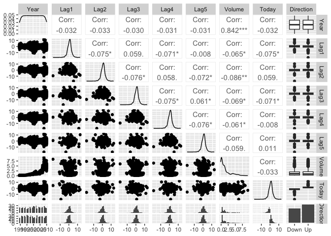
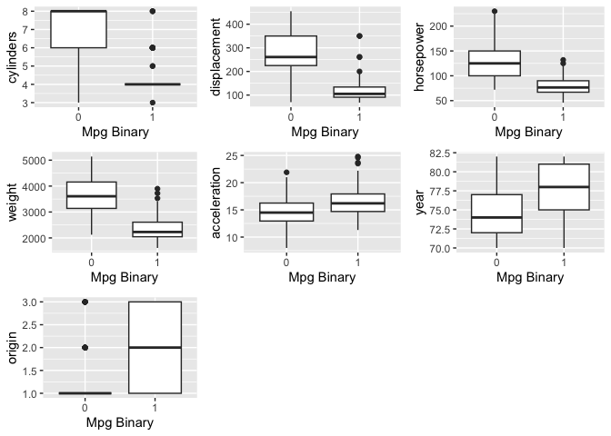
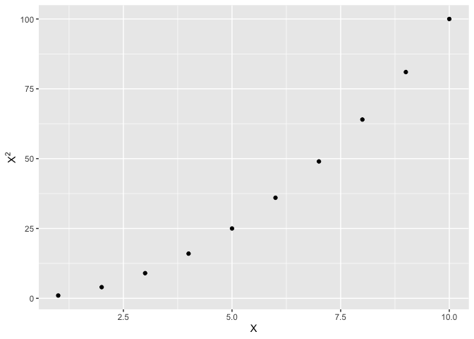
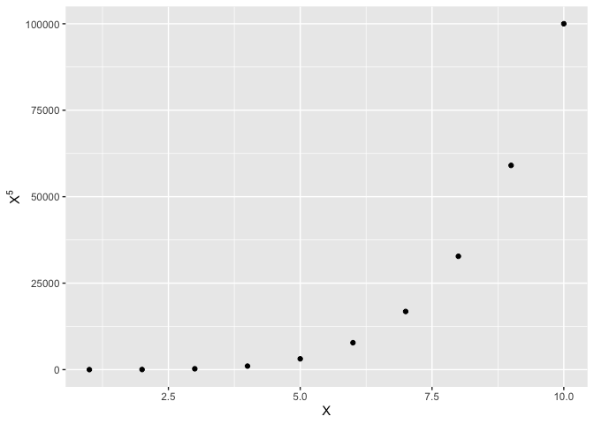

-   [Conceptual](#conceptual)
    -   [Question 1](#question-1)
    -   [Question 2](#question-2)
    -   [Question 3](#question-3)
    -   [Question 4](#question-4)
    -   [Question 5](#question-5)
    -   [Question 6](#question-6)
    -   [Question 7](#question-7)
    -   [Question 8](#question-8)
    -   [Question 9](#question-9)
-   [Applied](#applied)
    -   [Question 10](#question-10)
    -   [Question 11](#question-11)
    -   [Question 12](#question-12)
    -   [Question 13](#question-13)

    library(ISLR)
    library(ggplot2)
    library(GGally)
    library(MASS)
    library(class)
    library(gridExtra)
    library(magrittr)
    library(dplyr)

## Conceptual

### Question 1

$p(X) = \frac{e^{\beta\_0 + \beta\_1X}}{1 + e^{\beta\_0 + \beta\_1X}} = \frac{1}{1 + e^{-(\beta\_0 + \beta\_1X)}}$

$1 - p(X) = 1 - \frac{1}{1 + e^{-(\beta\_0 + \beta\_1X)}} = \frac{1 + e^{-(\beta\_0 + \beta\_1X)}}{1 + e^{-(\beta\_0 + \beta\_1X)}} - \frac{1}{1 + e^{-(\beta\_0 + \beta\_1X)}} = \frac{e^{-(\beta\_0 + \beta\_1X)}}{1 + e^{-(\beta\_0 + \beta\_1X)}}$

$\frac{p(X)}{ 1 - p(X)} = \frac{1}{1 + e^{-(\beta\_0 + \beta\_1X)}} / \frac{e^{-(\beta\_0 + \beta\_1X)}}{1 + e^{-(\beta\_0 + \beta\_1X)}} = e^{\beta\_0 + \beta\_1X}$

### Question 2

$p\_k(x) = \frac{\pi\_k\frac{1}{\sqrt{2\pi}\sigma}e^{-\frac{(x - \mu\_k)^2}{2\sigma^2}}}{\displaystyle\sum\_{l=1}^{K} \pi\_k\frac{1}{\sqrt{2\pi}\sigma}e^{-\frac{(x - \mu\_k)^2}{2\sigma^2}}}$

The denominator will be the same for each value of `k`, so we can
discard it. The argmax of a term is the same as the argmax of the log of
that term, so we take the log of the numerator:

$log(numerator\\of\\p\_k(X)) = log(\pi\_k) + log(1) - log(\sqrt{2\pi}\sigma) - \frac{(x - \mu\_k)^2}{2\sigma^2} = log(\pi\_k) + log(1) - log(\sqrt{2\pi}\sigma) - \frac{x^2 - 2\mu\_kx + \mu\_k^2}{2\sigma^2}$

The terms that don’t involve `k` will be constant across the categories,
so we can remove them. This gives us

$log(\pi\_k) - \frac{\mu\_kx}{\sigma^2} - \frac{\mu\_k^2}{2\sigma^2}$;
the class that has the largest value of this will have the largest
posterior probability.

### Question 3

$p\_k(x) = \frac{\pi\_k\frac{1}{\sqrt{2\pi}\sigma\_k}e^{-\frac{(x - \mu\_k)^2}{2\sigma\_k^2}}}{\displaystyle\sum\_{l=1}^{K} \pi\_k\frac{1}{\sqrt{2\pi}\sigma\_k}e^{-\frac{(x - \mu\_k)^2}{2\sigma\_k^2}}}$

Similar to question 2, we discard the denominator and take the log:

$log(\pi\_k) + log(1) - log(\sqrt{2\pi}\sigma\_k) - \frac{x^2 - 2\mu\_kx + \mu\_k^2}{2\sigma\_k^2}$

Again we remove terms that don’t depend on `k` and get

$log(\pi\_k) - - log(\sqrt{2\pi}\sigma\_k) - \frac{x^2}{2\sigma\_k^2} + \frac{\mu\_kx}{\sigma^2} - \frac{\mu\_k^2}{2\sigma^2}$;
the class that has the largest value of this will have the largest
posterior probability. This discriminant is a quadratic function of `x`,
meaning the decision boundary is non-linear.

### Question 4

#### a

We would expect 10% of the available observations to be used in the
prediction.

#### b

Assuming that `x1` and `x2` are independent, we would expect 10% of 10%
of available observations to be used in the prediction, or 1%.

#### c

Assuming the feature are independent, we would expect the fraction of
available observations used to be

    print(.1 ^ 100)

    ## [1] 1e-100

#### d

From a-c we see that the fraction of available observations that falls
within our 10% box decreases exponentially; in particular for part c,
unless the dataset is massive, is is very unlikely any observations will
be in the 10% box.

#### e

We solve the equation 0.1 = *l**e**n**g**t**h**p*, which
gives $length = 0.1^{\frac{1}{p}} = 10^\frac{-1}{p}$

    for (p in c(1, 2, 100)) {
      print(paste("Required length for p =", p, "is", 10 ^ (-1 / p)))
    }

    ## [1] "Required length for p = 1 is 0.1"
    ## [1] "Required length for p = 2 is 0.316227766016838"
    ## [1] "Required length for p = 100 is 0.977237220955811"

### Question 5

#### a

Even though the decision boundary is linear, QDA will likely have a
lower train error rate because it is more flexible and will be able to
fit to the noise in the training data. On the test set, however, LDA
will likely perform better because QDA will have learned a non-linear
relationship from the training data (overfitting).

#### b

For training error, see part a); the relative training error of QDA to
LDA will likely be even lower in this case since the true relationship
is non-linear. On the test set, we would also expect QDA to perform
better since it can learn a non-linear relationship, which better
reflects the underlying data generating process.

#### c

As the sample size increases, we would expect the test prediction of QDA
to increase relative to LDA because a larger sample size means QDA will
be less likely to overfit. The exact shape of test error curve as a
function of the sample size would be dependent on the degree of
non-linearity in the Bayes decision boundary.

#### d

This is false. The increased flexibility of the QDA method could lead to
overfitting and worse test performance, depending on the ratio of the
number of observations to the number of predictors.

### Question 6

Let

$y\_i = \begin{cases} 1 & student\\receives\\A \\ 0 & student\\does\\\\not\\recieve\\A \end{cases}$

Then $p(y = 1|x) = \frac{1}{1 + e^{-(-6 + 0.05x\_1 + 1x\_2)}}$

    print(1 / (1 + exp(-(-6 + 0.05 * 40 + 3.5))))

    ## [1] 0.3775407

$0.5 = \frac{1}{1 + e^{-(-6 + 0.05x\_1 + 3.5)}}$

0.5 + 0.5*e*−(−6+0.05*x*1+3.5) = 1

0.5*e*−(−6+0.05*x*1+3.5) = 0.5

*e*−(−6+0.05*x*1+3.5) = 1

 − (−6+0.05*x*1+3.5) = 0

 − 6 + 0.05*x*1 + 3.5 = 0

*x*1 = 50

### Question 7

We use Bayes theorem.
$p(dividend = 1|X=x) = \frac{p(X=x|dividend = 1) p(dividend = 1)}{\displaystyle\sum\_{i=0}^{1} p(X=x|dividend = i)} = \frac{\frac{p(dividend = 1)}{\sqrt{2\pi}\sigma}e^{\frac{-(x - \mu\_1)^2}{2\sigma^2}}}{\displaystyle\sum\_{i=0}^{1} \frac{p(dividend = i)}{\sqrt{2\pi}\sigma}e^{\frac{-(x - \mu\_i)^2}{2\sigma^2}}}$

    u_1 <- 10
    u_0 <- 0
    sigma <- 6
    p_dividend <- 0.8

    p <- exp(-(4 - u_1)^2 / (2 * sigma ^ 2)) * p_dividend /
    (exp(-(4 - u_1)^2 / (2 * sigma ^ 2)) * 0.8 + exp(-(4 - u_0) ^ 2 / (2 * sigma ^ 2)) * (1 - p_dividend))

    print(p)

    ## [1] 0.7518525

### Question 8

Since k for the k nearest neighbors algorithim is 1, the error rate on
the training dataset is 0%. Since the average error across train and
test for this algorithm is 18%, this means that the test error was 36%,
which is higher than the test error for the logistic regression model.
Therefore we should use the logistic regression model.

### Question 9

#### a

$\frac{p}{1 - p} = 0.37$

*p* = 0.37 − 0.37*p*

1.37*p* = 0.37

*p* = 0.27

#### b

$\frac{0.16}{1 - 0.16} = 0.19$

## Applied

### Question 10

#### a

  

    df_weekly <- Weekly

    GGally::ggpairs(df_weekly)

Volume and year have a very high correlation.

#### b

  

    predictors <- c(paste0("Lag", seq(5)), "Volume")
    formula_string <- paste("Direction ~", paste(predictors, collapse = " + "), sep = " ")

    model <- glm(as.formula(formula_string), data = df_weekly, family = "binomial")

    print(summary(model))

    ## 
    ## Call:
    ## glm(formula = as.formula(formula_string), family = "binomial", 
    ##     data = df_weekly)
    ## 
    ## Coefficients:
    ##             Estimate Std. Error z value Pr(>|z|)   
    ## (Intercept)  0.26686    0.08593   3.106   0.0019 **
    ## Lag1        -0.04127    0.02641  -1.563   0.1181   
    ## Lag2         0.05844    0.02686   2.175   0.0296 * 
    ## Lag3        -0.01606    0.02666  -0.602   0.5469   
    ## Lag4        -0.02779    0.02646  -1.050   0.2937   
    ## Lag5        -0.01447    0.02638  -0.549   0.5833   
    ## Volume      -0.02274    0.03690  -0.616   0.5377   
    ## ---
    ## Signif. codes:  0 '***' 0.001 '**' 0.01 '*' 0.05 '.' 0.1 ' ' 1
    ## 
    ## (Dispersion parameter for binomial family taken to be 1)
    ## 
    ##     Null deviance: 1496.2  on 1088  degrees of freedom
    ## Residual deviance: 1486.4  on 1082  degrees of freedom
    ## AIC: 1500.4
    ## 
    ## Number of Fisher Scoring iterations: 4

Lag 2 is significant.

#### c

  

    output_accuracy_and_confusion_matrix <- function(preds, truth) {

      preds <- ifelse(preds >= 0.5, "Up", "Down")

      print(table(preds, truth, dnn = c("Predicted", "Actual")))

      overall_accuracy <- mean(preds == truth)

      print(paste("Overall accuracy:", overall_accuracy))

    }

    preds <- predict(model, type = "response")

    output_accuracy_and_confusion_matrix(preds, df_weekly$Direction)

    ##          Actual
    ## Predicted Down  Up
    ##      Down   54  48
    ##      Up    430 557
    ## [1] "Overall accuracy: 0.561065197428834"

From the confusion matrix we see that on days where the market was `up`,
the model predicted correctly that the market would be up in most cases.
This corresponds to a high `True Positive Rate`. However, on days where
the market was `down`, the model mostly predicted that the market would
be `up`. This corresponds to a high `False Positive Rate`.

#### d

  

    df_train <- df_weekly[df_weekly$Year <= 2008, ]
    df_test <- df_weekly[df_weekly$Year > 2008, ]

    model <- glm(Direction ~ Lag2, data = df_train, family = "binomial")

    preds <- predict(model, df_test, type = "response")

    output_accuracy_and_confusion_matrix(preds, df_test$Direction)

    ##          Actual
    ## Predicted Down Up
    ##      Down    9  5
    ##      Up     34 56
    ## [1] "Overall accuracy: 0.625"

#### e

  

    model <- MASS::lda(Direction ~ Lag2, data = df_train)

    preds <- predict(model, df_test)$posterior[, "Up"]

    output_accuracy_and_confusion_matrix(preds, df_test$Direction)

    ##          Actual
    ## Predicted Down Up
    ##      Down    9  5
    ##      Up     34 56
    ## [1] "Overall accuracy: 0.625"

#### f

  

    model <- MASS::qda(Direction ~ Lag2, data = df_train)

    preds <- predict(model, df_test)$posterior[, "Up"]

    output_accuracy_and_confusion_matrix(preds, df_test$Direction)

    ##          Actual
    ## Predicted Down Up
    ##        Up   43 61
    ## [1] "Overall accuracy: 0.586538461538462"

Note that QDA predicts `Up` for every day.

#### g

  

    set.seed(1)
    preds <- class::knn(as.matrix(df_train$Lag2), as.matrix(df_test$Lag2), cl = df_train$Direction, prob = TRUE)
    prob_preds <- attr(preds, "prob")
    preds <- ifelse(preds == 'Up', 1 - prob_preds, prob_preds)

    output_accuracy_and_confusion_matrix(preds, df_test$Direction)

    ##          Actual
    ## Predicted Down Up
    ##      Down   22 31
    ##      Up     21 30
    ## [1] "Overall accuracy: 0.5"

#### h

LDA and logistic regression have the same error rate.

#### i

I will experiment with transformations of Lag2.  

    logistic_regression <- function(...) {
      glm(..., family = "binomial")
    }

    models <- list(logistic_regression = logistic_regression, lda = MASS::lda, qda = MASS::qda)
    accuracies <- vector("list", length = length(vars) * length(models))
    counter <- 1
    for (model_name in names(models)) {
      for (poly_degree in seq(3)) {
        model <- models[[model_name]](Direction ~ poly(Lag2, poly_degree), data = df_train)  
        if (identical(model_name, "logistic_regression")) {
          preds <- predict(model, df_test, type = "response")
        } else {
          preds <- predict(model, df_test)$posterior[, "Up"]
        }
        preds <- ifelse(preds >= 0.5, "Up", "Down")
        accuracy <- mean(preds == df_test$Direction)
        accuracies[[counter]] <- list(model = model_name, degree = poly_degree, accuracy = accuracy)
        counter <- counter + 1
      }
    }

    ks <- c(1, 2, 3, 5, 8, 12)
    accuracies_knn <- vector("list", length = length(vars) * length(ks))
    counter <- 1
    for (k in ks) {
      for (poly_degree in seq(3)) {
        preds <- class::knn(
          poly(df_train$Lag2, poly_degree), poly(df_test$Lag2, poly_degree),
          cl = df_train$Direction, k = k
        )
        accuracy <- mean(preds == df_test$Direction)
        accuracies_knn[[counter]] <- list(model = "knn", degree = poly_degree, k = k, accuracy = accuracy)
        counter <- counter + 1
      }
    }

    accuracies <- c(accuracies, accuracies_knn)
    accuracy_values <- sapply(accuracies, function(lst) lst$accuracy)

    max_accuracy <- max(accuracy_values)

    best_model_idxs <- which(accuracy_values == max_accuracy)
    print(accuracies[best_model_idxs])

    ## [[1]]
    ## [[1]]$model
    ## [1] "knn"
    ## 
    ## [[1]]$degree
    ## [1] 1
    ## 
    ## [[1]]$k
    ## [1] 8
    ## 
    ## [[1]]$accuracy
    ## [1] 0.6730769

K nearest neighbors with 8 neighbors and the raw value of `Lag 2`
performed the best.

### Question 11

#### a

  

    df_auto$mpg_binary <- ifelse(df_auto$mpg >= median(df_auto$mpg), 1, 0)
    predictors <- setdiff(colnames(df_auto), c("mpg", "mpg_binary", "name"))

    plots <- lapply(
      predictors, function(predictor) {
        ggplot2::ggplot(df_auto) +
          ggplot2::geom_boxplot(ggplot2::aes(x = as.factor(mpg_binary), y = .data[[predictor]])) +
          ggplot2::labs(x = "Mpg Binary")
      }
    )

    do.call(gridExtra::grid.arrange, plots)

All predictors except for acceleration seem to differ substantially
across our binary cut.

#### b

  

    set.seed(1)
    nrows <- nrow(df_auto)
    train_idx <- sample(nrows, nrows %/% 2)

    df_auto_for_model <- df_auto %>%
      dplyr::select(., -name, -acceleration, -mpg)
    df_train <- df_auto_for_model[train_idx, ]
    df_test <- df_auto_for_model[-train_idx, ]

#### c-g

  

    models <- list(logistic_regression = logistic_regression, lda = MASS::lda, qda = MASS::qda)
    error_rates <- rep(0, length(models)) %>%
      setNames(., names(models))

    for (model_name in names(models)) {
      model <- models[[model_name]](mpg_binary ~ ., data = df_train)
      if (identical(model_name, "logistic_regression")) {
        preds <- predict(model, df_test, type = "response")
      } else {
        preds <- predict(model, df_test)$posterior[, "1"]
      }

      preds <- ifelse(preds >= 0.5, 1, 0)
      error_rates[[model_name]] <- mean(preds != df_test$mpg_binary)

    }

    ks <- c(1, 2, 3, 5, 8, 12, 100)
    knn_error_rates <- rep(0, length(ks)) %>%
      setNames(., ks)
    predictors <- setdiff(colnames(df_train), "mpg_binary")

    for (k in ks) {
      preds <- class::knn(
        as.matrix(df_train[, predictors]), as.matrix(df_test[, predictors]),
        cl = df_train$mpg_binary, k = k, prob = TRUE
      )
      # We return the predicted probability in case we want to change the threshold;
      # the default return value is just the predicted class label.
      pred_probs <- attr(preds, "prob")
      preds <- ifelse(preds == 1, pred_probs, 1 - pred_probs)
      preds <- ifelse(preds >= 0.5, 1, 0)
      knn_error_rates[[as.character(k)]] <- mean(preds != df_test$mpg_binary)
    }

    names(knn_error_rates) <- paste0("knn_", names(knn_error_rates))
    min_error <- min(knn_error_rates)
    best_ks <- names(knn_error_rates)[knn_error_rates == min_error]

    print(paste("Best value(s) of k:", paste(best_ks, collapse = ", ")))

    ## [1] "Best value(s) of k: knn_3, knn_8, knn_12"

    error_rates <- c(error_rates, knn_error_rates)

    print(error_rates)

    ## logistic_regression                 lda                 qda               knn_1 
    ##          0.09183673          0.11734694          0.12244898          0.17346939 
    ##               knn_2               knn_3               knn_5               knn_8 
    ##          0.13775510          0.12244898          0.12755102          0.12244898 
    ##              knn_12             knn_100 
    ##          0.12244898          0.13775510

Logistic regression performs the best on this dataset.

### Question 12

#### a-f

  

    power <- function() {
      print(2 ^ 3)
    }

    power_2 <- function(x, a) {
      print(x ^ a)
    }

    power()

    ## [1] 8

    power_2(3, 8)

    ## [1] 6561

    power_2(10, 3)

    ## [1] 1000

    power_2(8, 17)

    ## [1] 2.2518e+15

    power_2(131, 3)

    ## [1] 2248091

    power_3 <- function(x, a) {
      x ^ a
    }

    x <- seq(10)
    df <- data.frame(x = x, y = power_3(x, 2))

    ggplot2::ggplot(data = df) +
      ggplot2::geom_point(ggplot2::aes(x = x, y = y)) +
      ggplot2::labs(x = "X", y = bquote(X^2))

    plot_power <- function(x, a) {
      df <- data.frame(x = x, y = x ^ a)
      ggplot2::ggplot(data = df) +
        ggplot2::geom_point(ggplot2::aes(x = x, y = y)) +
        ggplot2::labs(x = "X", y = bquote(X^.(a)))
    }

    plot_power(1:10, 5)

### Question 13

Note that `chas` is a dummy variable, so it technically doesn’t fit into
the LDA model framework. Here we use it anyway.

    df_boston_for_model <- df_boston
    df_boston_for_model$crim_binary <- ifelse(
      df_boston_for_model$crim >= median(df_boston_for_model$crim), 1, 0)
    df_boston_for_model <- df_boston_for_model %>%
      dplyr::select(., -crim)

    nrows <- nrow(df_boston_for_model)
    train_idx <- sample(nrows, nrows %/% 2)

    df_train <- df_boston_for_model[train_idx, ]
    df_test <- df_boston_for_model[-train_idx, ]

    models <- list(logistic_regression = logistic_regression, lda = MASS::lda)
    error_rates <- rep(0, length(models)) %>%
      setNames(., names(models))

    for (model_name in names(models)) {
      model <- models[[model_name]](crim_binary ~ ., data = df_train)
      if (identical(model_name, "logistic_regression")) {
        preds <- predict(model, df_test, type = "response")
      } else {
        preds <- predict(model, df_test)$posterior[, "1"]
      }
      preds <- ifelse(preds >= 0.5, 1, 0)
      error_rates[[model_name]] <- mean(preds != df_test$crim_binary)
    }

    ks <- c(1, 2, 3, 5, 8, 12, 100)
    knn_error_rates <- rep(0, length(ks)) %>%
      setNames(., ks)
    predictors <- setdiff(colnames(df_train), "mpg_binary")
    x_train <- as.matrix(df_train[, predictors])
    x_test <- as.matrix(df_test[, predictors])

    for (k in ks) {
      preds <- class::knn(x_train, x_test, cl = df_train$crim_binary, k = k, prob = TRUE)
      preds_prob <- attr(preds, "prob")
      preds <- ifelse(preds == 1, preds_prob, 1 - preds_prob)
      preds <- ifelse(preds >= 0.5, 1, 0)

      knn_error_rates[[as.character(k)]] <- mean(preds != df_test$crim_binary)

    }

    error_rates <- c(error_rates, knn_error_rates)

    print(error_rates)

    ## logistic_regression                 lda                   1                   2 
    ##          0.11462451          0.18181818          0.10671937          0.15810277 
    ##                   3                   5                   8                  12 
    ##          0.10671937          0.09486166          0.13043478          0.14229249 
    ##                 100 
    ##          0.27667984

`knn` with 3 nearest neighbors performs the best on the test set.
