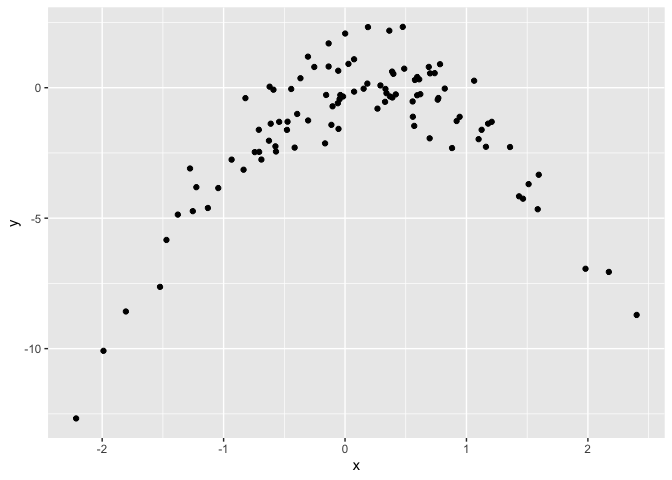

-   [Conceptual](#conceptual)
    -   [Question 1](#question-1)
    -   [Question 2](#question-2)
    -   [Question 3](#question-3)
-   [Applied](#applied)
    -   [Question 5](#question-5)
    -   [Question 6](#question-6)
    -   [Question 7](#question-7)
    -   [Question 8](#question-8)
    -   [Question 9](#question-9)

    library(ISLR)
    library(ggplot2)
    library(boot)

## Conceptual

### Question 1

*V**a**r*(*α**X*+(1−*α*)*Y*) = *α*2*V**a**r*(*X*) + (1−*α*)2*V**a**r*(*Y*) + *α*(1−*α*)*C**o**v*(*X*,*Y*)

Differentiate with respect to *α* and set equal to 0:

2*α**V**a**r*(*X*) − 2(1−*α*)*V**a**r*(*Y*) + 2(−*α*+1−*α*)*C**o**v*(*X*,*Y*) = 2*α**V**a**r*(*X*) − 2(1−*α*)*V**a**r*(*Y*) + 2(1−2*α*)*C**o**v*(*X*,*Y*) = 2*α**V**a**r*(*X*) − 2*V**a**r*(*Y*) + 2*α**V**a**r*(*Y*) + 2*C**o**v*(*X*,*Y*) − 4*α**C**o**v*(*X*,*Y*) = 0

*α*(*V**a**r*(*X*)+*V**a**r*(*Y*)−2*C**o**v*(*X*,*Y*)) − *V**a**r*(*Y*) + *C**o**v*(*X*,*Y*) = 0

$\alpha = \frac{Var(Y)- Cov(X, Y)}{Var(X) + Var(Y) - 2Cov(X,Y)}$

### Question 2

#### a

$1 - \frac{1}{n}$

#### b

$1 - \frac{1}{n}$

#### c

The probability that the bootstrap sample is not in the sample is the
multiplication of the probabilities that a given bootstrap observation
is not the `jth` observation. This probability is

$(1 - \frac{1}{n})^n$

#### d-f

    print(1 - (1 - 1/5) ^ 5)

    ## [1] 0.67232

    print(1 - (1- 1/100) ^ 100)

    ## [1] 0.6339677

    print(1 - (1- 1/10000) ^ 10000)

    ## [1] 0.632139

As the number of observations increases, the probability converges to
$\lim\_{n\to\infty} 1 - (1 - \frac{1}{n})^n = 1 - \frac{1}{e}$

#### g

  

    df <- data.frame(n = seq(100000))
    df$p <- 1 - (1 - 1/df$n) ^ df$n

    ggplot2::ggplot(data = df) +
      ggplot2::geom_point(ggplot2::aes(x = n, y = p))

We see the line approaching the horizontal asymptote that corresponds to
the limit above.

#### h

  

    n_samples <- 100000
    results <- rep(0, n_samples)

    samples <- sapply(
      seq(100000), function(idx) {
        any(sample(100, replace = TRUE) == 4)
      }
    )

    print(mean(samples))

    ## [1] 0.63423

### Question 3

#### a

K-fold cross validation proceeds as follows. First, the dataset is
randomly split into K distinct subsets whose union is the entire
dataset. Each subset, or `fold` should have the same number of
observations (in the case where the dataset size is not divisible by K,
some folds will have one more observation than other folds.) Then for
each fold, we take the union of the other folds and train a model using
those folds. That model is then used to predict on the fold in question
to generate an error estimate. Finally, the error estimates from each
fold are averaged for a final error estimate.

#### b

##### i

K-fold cross validation has lower bias compared to the validation set
approach, as it uses more of the data for each model and hence will tend
to underestimate the error less. It also has lower variance than the
validation set approach, as the validation set approach uses only half
the data and hence will be quite variable across different datasets.

##### ii

K-fold cross validation has lower variance than LOOCV because the models
are less correlated with one another, as each model in LOOCV is trained
on the same dataset as each other model with the exception of one
observation. When averaging many correlated quantities, the variance of
the mean is higher than if they were independent. In K-fold
cross-validation, less observations are shared between models, so this
variance effect is not as large. K-fold cross-validation will have
higher bias than LOOCV though, since each model is trained on a smaller
portion of the data than in LOOCV.

#### iii

If we have already performed cross-validation and K is large, we could
use each of the models we trained to predict on the test point and
record the standard deviation of these predictions. Alternatively, we
could create a larger number of bootstrap samples from the training set
and build a model on each of those, and then use the to predict on the
test point. Again we could record the standard deviation of those
predictions.

## Applied

### Question 5

#### a

  

    df_default <- Default
    model_full <- glm(default ~ income + balance, data = df_default, family = "binomial")

    print(summary(model_full))

    ## 
    ## Call:
    ## glm(formula = default ~ income + balance, family = "binomial", 
    ##     data = df_default)
    ## 
    ## Coefficients:
    ##               Estimate Std. Error z value Pr(>|z|)    
    ## (Intercept) -1.154e+01  4.348e-01 -26.545  < 2e-16 ***
    ## income       2.081e-05  4.985e-06   4.174 2.99e-05 ***
    ## balance      5.647e-03  2.274e-04  24.836  < 2e-16 ***
    ## ---
    ## Signif. codes:  0 '***' 0.001 '**' 0.01 '*' 0.05 '.' 0.1 ' ' 1
    ## 
    ## (Dispersion parameter for binomial family taken to be 1)
    ## 
    ##     Null deviance: 2920.6  on 9999  degrees of freedom
    ## Residual deviance: 1579.0  on 9997  degrees of freedom
    ## AIC: 1585
    ## 
    ## Number of Fisher Scoring iterations: 8

#### b - d

  

    create_train_test_split <- function(df, seed) {
      set.seed(seed)
      nrows <- nrow(df)
      train_idx <- sample(nrows, nrows %/% 2)

      df_train <- df[train_idx, ]
      df_test <- df[-train_idx, ]

      list(df_train = df_train, df_test = df_test)
    }

    build_model_and_validate <- function(df_train, df_test, vars) {

      form <- as.formula(paste("default ~", paste(vars, collapse = " + ")))
      model <- glm(form, data = df_train, family = "binomial")

      preds <- predict(model, df_test, type = "response")
      preds <- ifelse(preds >= 0.5, "Yes", "No")

      mean(preds == df_test$default)
    }

    run_analysis <- function(df, seed, vars) {
      df_list <- create_train_test_split(df, seed)
      do.call(build_model_and_validate, c(df_list, list(vars = vars)))
    }

    seeds <- seq(3)
    var_list <- list(c("income", "balance"), c("income", "balance", "student")) %>%
      setNames(., lapply(., paste, collapse = "_"))

    mean_accuracies <- vector("list", length(var_list)) %>%
      setNames(., names(var_list))

    for (nm in names(var_list)) {
      mean_accuracies[[nm]] <- sapply(seeds, run_analysis, df = df_default, vars = var_list[[nm]])
    }

    print(mean_accuracies)

    ## $income_balance
    ## [1] 0.9746 0.9762 0.9736
    ## 
    ## $income_balance_student
    ## [1] 0.9740 0.9754 0.9728

    print(sapply(mean_accuracies, mean))

    ##         income_balance income_balance_student 
    ##              0.9748000              0.9740667

The test set error depends on the splitting of the data, which is
determined by the seed. There is no evidence that including student as a
covariate improves the model.

### Question 6

#### a - d

  

    print(summary(glm(default ~ income + balance, data = df_default, family = "binomial"))$coefficients)

    ##                  Estimate   Std. Error    z value      Pr(>|z|)
    ## (Intercept) -1.154047e+01 4.347564e-01 -26.544680 2.958355e-155
    ## income       2.080898e-05 4.985167e-06   4.174178  2.990638e-05
    ## balance      5.647103e-03 2.273731e-04  24.836280 3.638120e-136

    run_logistic_regression <- function(df, index) {
      df <- df[index, ]
      coef(glm(default ~ income + balance, data = df, family = "binomial"))
    }

    set.seed(1)
    print(boot::boot(df_default, run_logistic_regression, R = 50))

    ## 
    ## ORDINARY NONPARAMETRIC BOOTSTRAP
    ## 
    ## 
    ## Call:
    ## boot::boot(data = df_default, statistic = run_logistic_regression, 
    ##     R = 50)
    ## 
    ## 
    ## Bootstrap Statistics :
    ##          original        bias     std. error
    ## t1* -1.154047e+01 -5.661486e-02 4.847786e-01
    ## t2*  2.080898e-05 -7.436578e-08 4.456965e-06
    ## t3*  5.647103e-03  1.854126e-05 2.639029e-04

The standard errors from the bootstrap are similar to the theoretical
standard errors.

### Question 7

#### a - e

  

    df_weekly <- ISLR::Weekly

    # Using the boot library
    accuracy_cost <- function(y_true, y_pred) {
      y_pred <- ifelse(y_pred >= 0.5, 1, 0)
      mean(y_pred == y_true)
    }

    model <- glm(Direction ~ Lag1 + Lag2, data = df_weekly, family = "binomial")
    loocv_estimate <- boot::cv.glm(data = df_weekly, glmfit = model, cost = accuracy_cost)

    print(paste("LOOCV estimate from boot library:", loocv_estimate$delta[[1]]))

    ## [1] "LOOCV estimate from boot library: 0.550045913682276"

    # Manually
    predictions <- sapply(
      seq(nrow(df_weekly)),
      function(idx, df) {
        df_train <- df[-idx, ]
        df_test <- df[idx, ]

        model <- glm(Direction ~ Lag1 + Lag2, data = df_train, family = "binomial")

        predict(model, df_test, type = "response")
      },
      df = df_weekly
    )

    binary_y_true <- ifelse(df_weekly$Direction == "Up", 1, 0)
    loocv_estimate <- accuracy_cost(binary_y_true, predictions)

    print(paste("Manual LOOCV estimate:", loocv_estimate))

    ## [1] "Manual LOOCV estimate: 0.550045913682277"

### Question 8

#### a

  

    set.seed(1)

    df <- data.frame(x = rnorm(100))
    df$y <- df$x - 2 * df$x ^ 2 + rnorm(100)

    print(paste("n:", nrow(df)))

    ## [1] "n: 100"

    print(paste("p:", ncol(df)))

    ## [1] "p: 2"

*y* = *x* − 2*x*2 + *ϵ*

#### b

  

    ggplot2::ggplot(data = df) +
      ggplot2::geom_point(ggplot2::aes(x = x, y = y))

We see a quadratic relationship.

#### c

Note that I am using orthogonal polynomials here.  

    seeds <- seq(3)
    poly_degrees <- seq(4)

    results <- vector("list", length = length(seeds)) %>%
      setNames(seeds)
    for (seed in seeds) {
      set.seed(seed)
      results[[seed]] <- sapply(
          poly_degrees,
          function(degree, df, seed) {
            model <- glm(y ~ poly(x, degree), data = df)
            # Only need to print this once, since the results are the same across seeds.
            if (identical(seed, 1)) {
              print(summary(model))
            }
            boot::cv.glm(df, model)$delta[[1]]
          },
          df = df,
          seed = seed
      )
    }

The results are the same regardless of seed because there is no
randomness in LOOCV. The best MSE results from using a polynomial of
degree 2. Degrees greater than 2 are not statistically significant,
agreeing with the LOOCV results.

### Question 9

#### a

  

    df_boston <- Boston
    mean_medv <- mean(df_boston$medv)
    print(paste("Sample mean of medv:", mean_medv))

    ## [1] "Sample mean of medv: 22.5328063241107"

#### b

From theory we know that the sample mean is normally distributed with
mean equal to the true mean of the population, and variance equal to the
variance of the population divided by the number of observations that
comprise the mean.  

    print(paste("Estimated sd of sample mean of medv:", sd(df_boston$medv) / sqrt(nrow(df_boston))))

    ## [1] "Estimated sd of sample mean of medv: 0.408861147497535"

#### c

  

    calculate_mean <- function(medv, index) {
      mean(medv[index])
    }

    set.seed(1)
    sd_boot_estimate <- boot::boot(df_boston$medv, calculate_mean, 1000)
    sd_boot_estimate <- sd(sd_boot_estimate$t)
    print(paste("Standard deviation of mean using bootstrap:", sd_boot_estimate))

    ## [1] "Standard deviation of mean using bootstrap: 0.410662153886544"

We get a similar estimate of the standard error.

#### d

    quantile_t <- qt(.975, nrow(df_boston) - 1)
    print(
      paste(
        "Confidence interval for mean of medv using bootstrap:",
        paste(mean_medv + c(-quantile_t, quantile_t) * sd_boot_estimate, collapse = " - ")
      )
    )

    ## [1] "Confidence interval for mean of medv using bootstrap: 21.7259896266039 - 23.3396230216174"

    t_test <- t.test(df_boston$medv)
    print(paste("Confidence interval for mean of medv using t.test:", paste(t_test$conf.int, collapse = " - ")))

    ## [1] "Confidence interval for mean of medv using t.test: 21.7295280145786 - 23.3360846336428"

#### e

    median_medv <- median(df_boston$medv)
    print(paste("Sample median of medv:", median_medv))

    ## [1] "Sample median of medv: 21.2"

#### f

    calculate_median <- function(medv, index) {
      median(medv[index])
    }

    set.seed(1)
    sd_boot_estimate <- boot::boot(df_boston$medv, calculate_median, R = 1000)
    sd_boot_estimate <- sd(sd_boot_estimate$t)

    print(paste("SD of boot estimate for median:", sd_boot_estimate))

    ## [1] "SD of boot estimate for median: 0.377807538352579"

#### g

    percentile_10_medv <- quantile(df_boston$medv, 0.1)
    print(paste("Sample 10th percentile of medv:", percentile_10_medv))

    ## [1] "Sample 10th percentile of medv: 12.75"

#### g

    calculate_10th_percentile <- function(medv, index) {
      quantile(medv[index], 0.1)
    }

    set.seed(1)
    sd_boot_estimate <- boot::boot(df_boston$medv, calculate_10th_percentile, R = 1000)
    sd_boot_estimate <- sd(sd_boot_estimate$t)

    print(paste("SD of boot estimate for 10th percentile:", sd_boot_estimate))

    ## [1] "SD of boot estimate for 10th percentile: 0.476752643498789"
