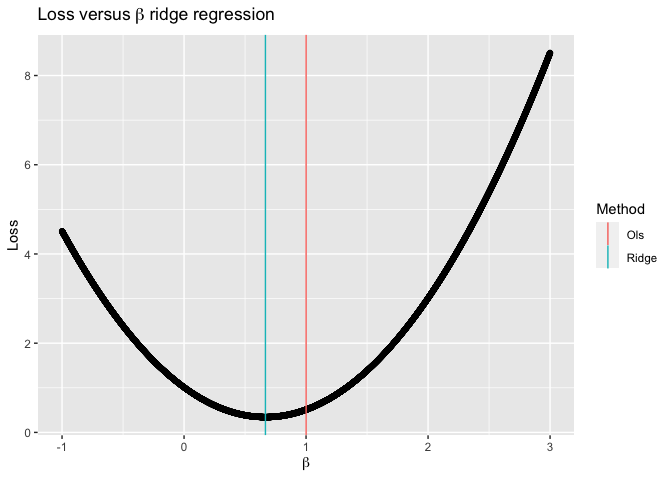
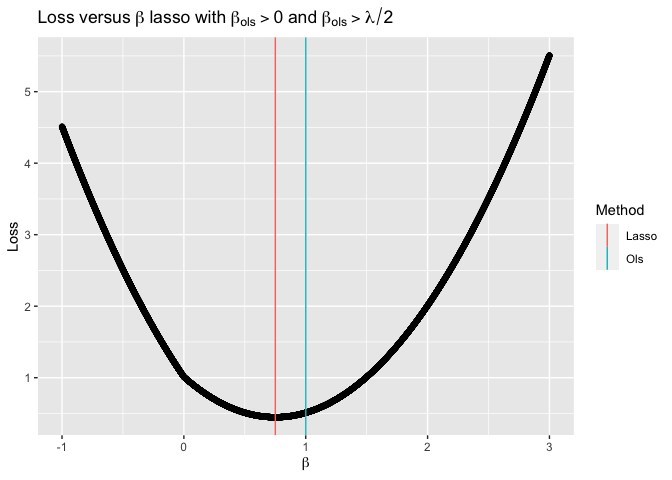
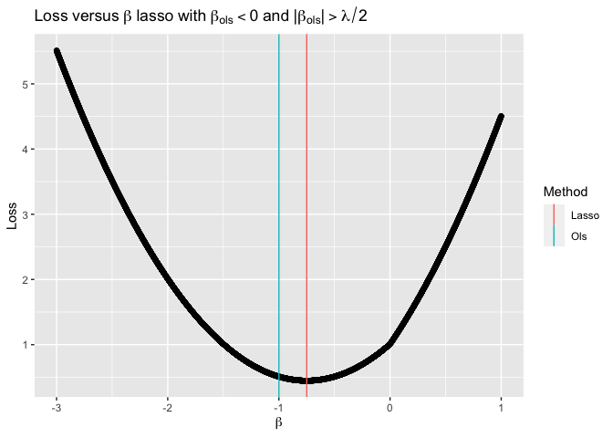
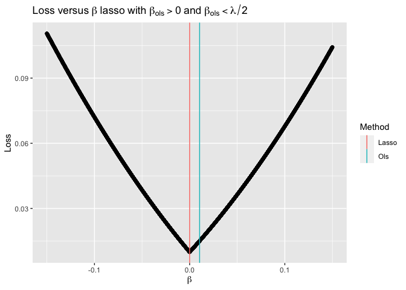
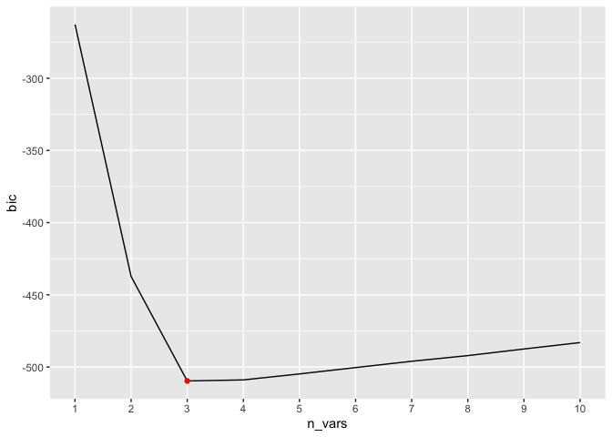
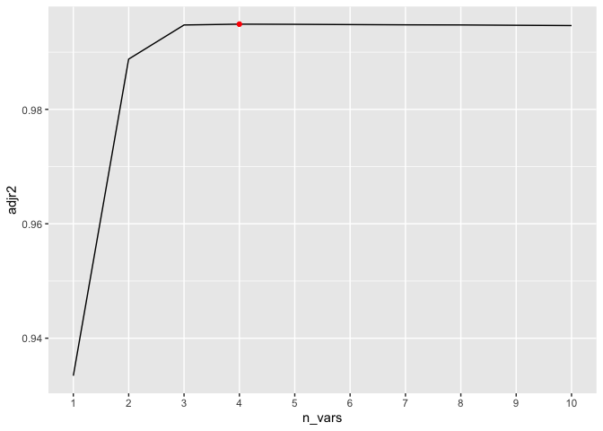
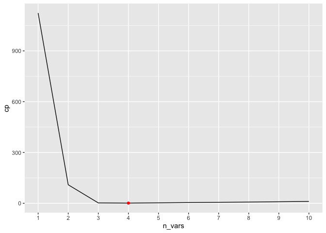
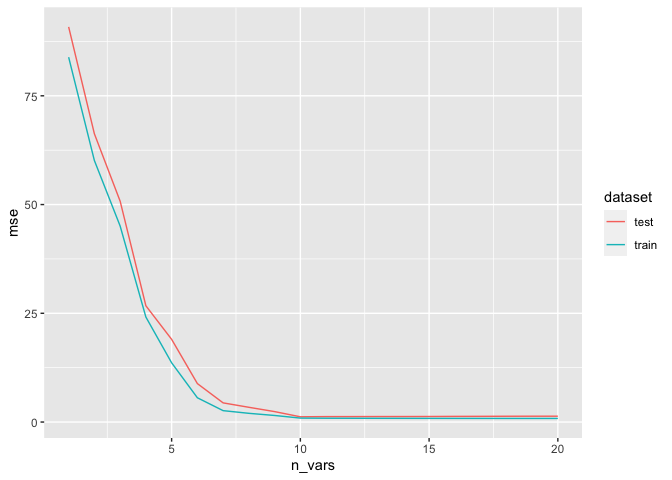
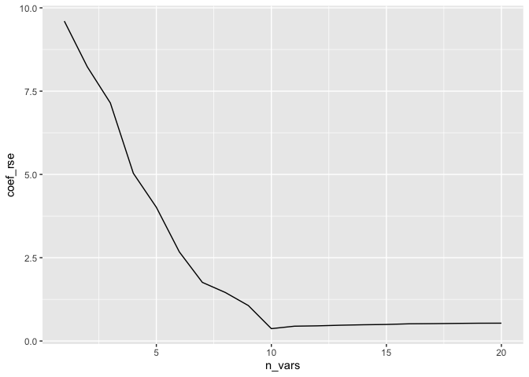

-   [Conceptual](#conceptual)
    -   [Question 1](#question-1)
    -   [Question 2](#question-2)
    -   [Question 3](#question-3)
    -   [Question 4](#question-4)
    -   [Question 5](#question-5)
    -   [Question 6](#question-6)
    -   [Question 7](#question-7)
-   [Applied](#applied)
    -   [Question 8](#question-8)
    -   [Question 9](#question-9)
    -   [Question 10](#question-10)
    -   [Question 11](#question-11)

    library(ISLR)
    library(tools)
    library(ggplot2)
    library(leaps)
    library(glmnet)
    library(pls)
    library(dplyr)
    library(R6)

## Conceptual

### Question 1

#### a

Best subset will have the smallest training RSS, as for a given number
of variables in the model, the models considered by forward / backward
stepwise selection will be a subset of the models chosen by best subset
selection. Best subset therefore looks at every model that forward /
backward stepwise selection looks at, in addition to other models not
examined by the other two procedures. Since it is possible that some of
these other models have lower training RSS, the model chosen by best
subset will have RSS equal to or lower than the models chosen by
forward/backward stepwise selection.

#### b

This is impossible to answer; best subset might have picked a model that
is overfit to the data, since it has more candidate models to choose
from, in which case the other two methods would have better test RSS, or
it might have picked a model that actually describes the
response-predictor relationship better than the other two methods, in
which case it would have better test RSS than the other methods.

#### c

##### i

True

##### ii

True

##### iii

False

##### iv

False

##### v

False

### Question 2

#### a

`iii` is correct because lasso gives biased estimates of the regression
coefficients, but they have lower variance than the OLS estimates.
Depending on the balances of these two competing factors, the prediction
accuracy could be worse or better.

#### b

`iii`, for the same reasons as a.

#### c

`ii` as non-linear methods are more flexible and hence have lower bias
but higher variance.

### Question 3

#### a

`iv`. The training error will always decrease because as we increase
`s`, we decrease the effect of the inequality constraint so that the
minimization of the sum of squared errors dominates the objective
function. As `s` approaches `infinity`, there is no inequality
constraint, so the objective purely minimizes the sum of squared errors,
which is the RSS.

#### b

`ii`. The test error will initially decrease, as the decrease in bias
will outweigh the increase in variance. As we continue to increase `s`,
however, the increase in variance will outweigh the decrease in bias and
the test error will start to increase.

#### c

`iii`. Variance always increases as model flexibility increases, so
increasing `s` will always increase variance.

#### d

`iv`. Bias always decreases as model flexibility increases, so
increasing `s` will always decrease bias.

#### e

`v`. The irreducible error is constant, as this is a property of the
test point rather than the trained model.

### Question 4

#### a

`iii`. The training error will always increase because as we increase
*λ*, we increase the effect of the inequality constraint so that the
minimization of the sum of squared errors plays less of a role in the
objective function. As *λ* approaches `infinity`, all the coefficients
except the intercept approach 0, and assuming the predictors have been
centered to have mean 0 the train RSS will simply be the scaled variance
of the target variable, (*ȳ*−*y**i*)2

#### b

`ii`. The test error will initially decrease, as the decrease in
variance will outweigh the increase in bias. As we continue to increase
*λ*, however, the increase in bias will outweigh the decrease in
variance and the test error will start to increase.

#### c

`iv`. Variance always decreases as model flexibility decreases, so
increasing *λ* will always decrease variance.

#### d

`iii`. Bias always increases as model flexibility decreases, so
increasing *λ* will always increase bias.

#### e

`v`. The irreducible error is constant, as this is a property of the
test point rather than the trained model.

### Question 5

#### a

$\displaystyle\min\_{\beta\_1,\beta\_2} \displaystyle\sum\_{i=1}^{2}(\beta\_1x\_{i1} + \beta\_2x\_{i2} - y\_i)^2 + \displaystyle\sum\_{j=1}^{2}\beta\_j^2$

#### b

Differentiate with respect to *β*1 and set equal to zero to
solve for beta:

$2\displaystyle\sum\_{i=1}^{2}x\_{i1}(\beta\_1x\_{i1} + \beta\_2x\_{i2} - y\_i) + 2\lambda\beta\_1 = 0$

$\displaystyle\sum\_{i=1}^{2}(x\_{i1}^2\beta\_1 + x\_{i1}^2\beta\_2 - y\_i) + \lambda\beta\_1 = 0$

$\displaystyle\sum\_{i=1}^{2}x\_{i1}^2\beta\_1 + \lambda\beta\_1 = \displaystyle\sum\_{i=1}^{2}-x\_{i1}^2\beta\_2 + y\_ix\_i$

$\beta\_1 = \frac{\displaystyle\sum\_{i=1}^{2}-x\_{i1}^2\beta\_2 + y\_ix\_i}{\lambda + \displaystyle\sum\_{i=1}^{2}x\_{i1}^2}$

Similarly we find that

$\beta\_2 = \frac{\displaystyle\sum\_{i=1}^{2}-x\_{i1}^2\beta\_1 + y\_ix\_i}{\lambda + \displaystyle\sum\_{i=1}^{2}x\_{i1}^2}$

We can rewrite this as

1.  *β*1 = *C* + *D**β*2

2.  *β*2 = *C* + *D**β*1

Substituting 1 into 2, we get

*β*2 = *C* + *D*(*C*+*D**β*2)

*β*2 = *C* + *D**C* + *D*2*β*2

*β*2(1−*D*2) = *C* + *D**C*

And as long as *D*2 ≠ 1, or *λ* &gt; 0, we can solve for
*β*2 uniquely: $\beta\_2 = \frac{C + DC}{1 - D^2}$.

We can go through the same exercise with *β*1 and arrive at
the same answer. Therefore *β*1 = *β*2

#### c

$\displaystyle\min\_{\beta\_1,\beta\_2} \displaystyle\sum\_{i=1}^{2}(\beta\_1x\_{i1} + \beta\_2x\_{i2} - y\_i)^2 + \lambda\displaystyle\sum\_{j=1}^{2}|\beta\_j|$

#### d

This part is easier if we rewrite the above in its alternative
formulation,

$\displaystyle\min\_{\beta\_1,\beta\_2} \displaystyle\sum\_{i=1}^{2}(\beta\_1x\_{i1} + \beta\_2x\_{i2} - y\_i)^2\\\\s.t.\\\displaystyle\sum\_{j=1}^{2}|\beta\_j| \le t$

The level curves of the function we are minimizing are given by

(*β*1*x*11+*β*2*x*11−*y*1)2 + (*β*1*x*21+*β*2*x*21−*y*2)2 = *C*

2(*β*1*x*11+*β*2*x*11−*y*1)2 = *C*

$(\beta\_1 + \beta\_2)x\_{11} - y\_1 = \displaystyle\pm \sqrt{\frac{C}{2}}$

$\beta\_1 + \beta\_2 = \frac{\displaystyle\pm \sqrt{\frac{C}{2}} + y\_1}{x\_{11}}$

Which implies that the level curves are lines in the
*β*1, *β*2 space. If *λ* is non-zero, this implies
that the inequality constraint is binding, or that the inequality is in
fact an equality. This means that the solution must lie on one of the
edges of the diamond represented by
$\displaystyle\sum\_{j=1}^{2}|\beta\_j| \le t$. Since these edges are
also straight lines, they touch one of the level curves at infinitely
many points.

### Question 6

First I will derive a more general form of the ridge regression
estimates when the design matrix is orthogonal. I assume that the
predictors have been centered to have mean 0 as well, so that the
estimate for *β*0 is equal to *ŷ* for the OLS estimates,
ridge estimates, and lass estimates. The vector *β* that follows is then
the vector of coefficients with the first element removed.

**Least squares loss function:**

min*β*(*y*−*X**β*)*T*(*y*−*X**β*)

min*β*(*y**T*−*β**T**X**T*)(*y*−*X**β*)

min*β**y**T**y* − *y**T**X**β* − *β**T**X**T**y* + *β**T**X**T**X**β*

min*β**y**T**y* − 2*β**T**X**T**y* + *β**T**X**T**X**β*

Differentiate with respect to *β* and set equal to zero:

 − 2*X**T**y* + 2*X**T**X**β* = 0

*β* = (*X**T**X*)−1*X**T**y*

Since X is an orthogonal matrix, *X**T**X* = *I* and
(*X**T**X*)−1 = *I*

Then *β* = *X**T**y*

**Ridge regression loss function:**

min*β*(*y*−*X**β*)*T*(*y*−*X**β*) + *λ**β**T**β*

min*β*(*y**T*−*β**T**X**T*)(*y*−*X**β*) + *λ**β**T**β*

min*β**y**T**y* − *y**T**X**β* − *β**T**X**T**y* + *β**T**X**T**X**β* + *λ**β**T**β*

min*β**y**T**y* − 2*β**T**X**T**y* + *β**T**X**T**X**β* + *λ**β**T**β*

Differentiate with respect to *β* and set equal to zero:

 − 2*X**T**y* + 2*X**T**X**β* + 2*λ**β* = 0

*β* = (*X**T**X*+*λ**I*)−1*X**T**y*

Since X is an orthogonal matrix,
*X**T**X* + *λ**I* = (1+*λ*)*I* and
$(X^TX + \lambda I)^{-1} = \frac{1}{1 + \lambda}I$

Then
$\beta = \frac{X^Ty}{1 + \lambda} = \frac{\beta\_{OLS}}{1 + \lambda}$

**Lasso loss function :**

min*β*(*y*−*X**β*)*T*(*y*−*X**β*) + *λ*||*β*||1

min*β*(*y**T*−*β**T**X**T*)(*y*−*X**β*) + *λ*||*β*||1

min*β**y**T**y* − *y**T**X**β* − *β**T**X**T**y* + *β**T**X**T**X**β* + *λ*||*β*||1

min*β**y**T**y* − 2*β**T**X**T**y* + *β**T**X**T**X**β* + *λ*||*β*||1

min*β**y**T**y* − 2*β**T**X**T**y* + *β**T**β* + *λ*||*β*||1

min*β**y**T**y* − 2*β**T**β**o**l**s* + *β**T**β* + *λ*||*β*||1

Take an element `i` of the gradient and set equal to 0. We refer to the
coefficient corresponding to this as *β* now, which is a scalar rather
than a vector.

There are two cases:

1.  *β**o**l**s* ≥ 0, in which case *β* ≥ 0 so as to minimize
    the loss function.

    Then  − 2*β**o**l**s* + 2*β* + *λ* = 0

    $\beta = \beta\_{ols} - \frac{\lambda}{2}$

    Since we assumed that *β* ≥ 0, we take only the positive part of
    this equation:

    $\beta = (\beta\_{ols} - \frac{\lambda}{2})^+$

    $\beta = (sign(\beta\_{ols})|\beta\_{ols}| - \frac{\lambda}{2})^+$

2.  *β**o**l**s* ≤ 0, in which case *β* ≤ 0 so as to minimize
    the loss function.

    Then  − 2*β**o**l**s* + 2*β* − *λ* = 0

    $\beta = \beta\_{ols} + \frac{\lambda}{2}$

    Since we assumed that *β* ≤ 0, we take only the negative part of
    this equation:

    $\beta = (\beta\_{ols} + \frac{\lambda}{2})^-$

    $\beta = sign(|\beta\_{ols})(|\beta\_{ols}| - \frac{\lambda}{2})^+$

We get the same equation for *β* in both cases.

I answer this using the general form of the ridge regression / lasso
estimates in the case of a centered variable with magnitude 1.

#### a

  

    generate_response <- function(df, population_coefficient) {
      df$y <- 10 + population_coefficient * df$x + df$eps
      df
    }

    compare_theoretical_to_simulation <- function(df, betas, method = c("ridge", "lasso")) {

      lambda <- 0.5

      ols_model <- lm(y ~ x, data = df)
      ols_coef <- coef(ols_model)[[2]]

      method <- match.arg(method)
      regularizer <- switch(
        method,
        ridge = function(beta) beta ^ 2,
        lasso = function(beta) abs(beta)
      )

      scaling_factor <- switch(
        method,
        ridge = function(lambda, beta_ols) beta_ols / (1 + lambda),
        lasso = function(lambda, beta_ols) {
          if (abs(beta_ols) >= lambda / 2) {
            sign(beta_ols) * (abs(beta_ols) - lambda / 2)
          } else {
            0
          }
        }
      )

      loss <- sapply(
        betas,
        function(beta, df, lambda, regularizer) {
          sum((df$y - mean(df$y) - beta * df$x) ^ 2) + lambda * regularizer(beta)
        },
        df = df,
        lambda = lambda,
        regularizer = regularizer
      )

      df_loss <- data.frame(beta = betas, loss = loss)
      df_vertical_lines <- data.frame(
        estimates = c(ols_coef, scaling_factor(lambda, ols_coef)),
        method = c("ols", method)
      )

      plot_results(df_loss, df_vertical_lines)

    }

    plot_results <- function(df_loss, df_vertical_lines) {
      ggplot2::ggplot(data = df_loss) +
        ggplot2::geom_point(ggplot2::aes(x = beta, y = loss)) +
        ggplot2::geom_vline(
          data = df_vertical_lines,
          ggplot2::aes(xintercept = estimates,
            color = tools::toTitleCase(method))
          ) +
        ggplot2::labs(x = expression(beta), y = "Loss", color = "Method")
    }

    nrows <- 10000

    set.seed(1)
    df <- data.frame(x = rnorm(nrows), eps = rnorm(nrows, sd = 0.001))
    df$x <- df$x / sqrt(sum(df$x^2))
    df <- generate_response(df, population_coefficient = 1)

    betas <- seq(-1, 3, length = 10000)

    plot_ridge <- compare_theoretical_to_simulation(df, betas, method = "ridge")
    plot_ridge <- plot_ridge +
      ggplot2::ggtitle(expression(Loss~versus~beta~ridge~regression))

    plot_ridge

We see that the theoretical value of *β**r**i**d**g**e*
aligns well with the minimum of the loss in the simulation.

#### b

We will consider three cases here:

1.  *β**o**l**s* &lt; 0 and
    $\beta\_{ols} &lt; -\frac{\lambda}{2} 0$
2.  *β**o**l**s* &gt; 0 and
    $\beta\_{ols} &gt; \frac{\lambda}{2} 0$
3.  *β**o**l**s* &gt; 0 and
    $\beta\_{ols} &lt; \frac{\lambda}{2} 0$

<!-- -->

    param_list <- list(
      lasso_1 = list(
        betas = seq(-1, 3, length = 10000),
        population_coefficient = 1,
        title = expression(Loss~versus~beta~lasso~with~beta[ols]>0~and~beta[ols]>lambda/2)
      ),
      lasso_2 = list(
        betas = seq(-3, 1, length = 10000),
        population_coefficient = -1,
        title = expression(Loss~versus~beta~lasso~with~beta[ols]<0~and~paste("|", beta[ols], "|")>lambda/2)
      ),
      lasso_3 = list(
        betas = seq(-0.15, 0.15, length = 10000),
        population_coefficient = 0.01,
        title = expression(Loss~versus~beta~lasso~with~beta[ols]>0~and~beta[ols]<lambda/2)
      )
    )

    for (params in param_list) {
      df_lasso <- generate_response(df, params$population_coefficient)
      plot <- compare_theoretical_to_simulation(df_lasso, params$beta, method = "lasso")
      plot <- plot + ggplot2::labs(title = params$title)
      print(plot)
    }

### Question 7

#### a

Let
*y**i* = *β*0 + *β**T**x**i* + *ϵ**i*,
where *β* is the vector of coefficients without the intercept.

$p(y | X) = \displaystyle\prod\_{i = 1}^{n} \frac{1}{\sqrt(2\pi \sigma^2)} exp^{\frac{-(y\_i - \beta\_0 - \beta^Tx\_i)^2}{2\sigma^2}}$

#### b

$p(\beta | X) = \frac{\displaystyle\prod\_{i = 1}^{n} \frac{1}{\sqrt(2\pi \sigma^2)} exp^{\frac{-(y\_i - \beta\_0 - \beta^Tx\_i)^2}{2\sigma^2}} \displaystyle\prod\_{j = 1}^{p}\frac{1}{2b}exp^{-\frac{|\beta\_p|}{b}}}{p(X)}$

#### c

To find the mode of this posterior distribution, we maximize with
respect to *β*. Since the `argmax` of a function is equal to the
`argmax` of the log of the function, we take the log of the posterior
and discard constant terms, which are the constants multiplying the
exponential functions and the denominator.

$\max\_{\beta}\displaystyle\sum\_{i = 1}^{n}\frac{-(y\_i - \beta\_0 - \beta^Tx\_i)^2}{2\sigma^2} + \displaystyle\sum\_{j = 1}^{p} -\frac{|\beta\_p|}{b}$

$\min\_{\beta}\displaystyle\sum\_{i = 1}^{n}\frac{(y\_i - \beta\_0 - \beta^Tx\_i)^2}{2\sigma^2} + \displaystyle\sum\_{j = 1}^{p} \frac{|\beta\_p|}{b}$

$\min\_{\beta}\displaystyle\sum\_{i = 1}^{n}(y\_i - \beta\_0 - \beta^Tx\_i)^2 + \displaystyle\sum\_{j = 1}^{p} \frac{2\sigma^2|\beta\_p|}{b}$

Which is equivalent to the lasso formulation if
$\lambda = \frac{2\sigma^2}{b}$

#### d

$p(\beta | X) = \frac{\displaystyle\prod\_{i = 1}^{n} \frac{1}{\sqrt{2\pi \sigma^2}} exp^{\frac{-(y\_i - \beta\_0 - \beta^Tx\_i)^2}{2\sigma^2}} \displaystyle\prod\_{j = 1}^{p}\frac{1}{\sqrt{2\pi c^2}}exp^{-\frac{\beta\_p^2}{2c}}}{p(X)}$

#### e

We follow the same logic as part c) to get
$\max\_{\beta}\displaystyle\sum\_{i = 1}^{n}\frac{-(y\_i - \beta\_0 - \beta^Tx\_i)^2}{2\sigma^2} + \displaystyle\sum\_{j = 1}^{p} -\frac{\beta\_p^2}{2c}$

$\min\_{\beta}\displaystyle\sum\_{i = 1}^{n}\frac{(y\_i - \beta\_0 - \beta^Tx\_i)^2}{2\sigma^2} + \displaystyle\sum\_{j = 1}^{p} \frac{\beta\_p^2}{2c}$

$\min\_{\beta}\displaystyle\sum\_{i = 1}^{n}(y\_i - \beta\_0 - \beta^Tx\_i)^2 + \displaystyle\sum\_{j = 1}^{p} \frac{2\sigma^2\beta\_p^2}{2c}$

Which is equivalent to the ridge formulation if
$\lambda = \frac{\sigma^2}{c}$

## Applied

### Question 8

#### a-b

  

    set.seed(1)
    df <- data.frame(x_1 = rnorm(100), eps = rnorm(100))

    for (power in seq(2, 10)) {
      df[[paste("x", power, sep = "_")]] <- df$x_1 ^ power
    }
    df$y <- 1 + 2 * df$x_1 + 3 * df$x_2 + 4 * df$x_3 + df$eps

#### c-d

  

    metrics <- c("bic", "cp", "adjr2")
    methods <- c("exhaustive", "forward", "backward")

    for (method in methods) {
      models <- leaps::regsubsets(y ~ . - eps, data = df, nvmax = ncol(df) - 2, method = method)
      models_summary <- summary(models)
      for (metric in metrics) {
        values <- models_summary[[metric]]
        if (identical(metric, "adjr2")) {
          ids <- which.max(values)
          min_max_function <- max
        } else {
          idx <- which.min(values)
          min_max_function <- min
        }
        coefs <- coef(models, idx)
        cat(
          paste(
            "Coefficients for best", method, "model using", metric, ": \n",
            paste(paste(names(coefs), round(coefs, 2), sep = ":"), collapse = ", "),
            "\n"
          )
        )

        df_for_plot <- data.frame(value = values, n_vars = seq(length(values)))

        df_min_max <- df_for_plot %>%
          dplyr::filter(., value == min_max_function(value))

        plt <- ggplot2::ggplot(data = df_for_plot) +
          ggplot2::geom_line(ggplot2::aes(x = n_vars, y = value)) +
          ggplot2::geom_point(data = df_min_max, ggplot2::aes(x = n_vars, y = value), color = "red") +
          ggplot2::labs(y = metric) +
          ggplot2::scale_x_continuous(breaks = seq(length(values)), minor_breaks = NULL)

        print(plt)
      }
    }

    ## Coefficients for best exhaustive model using bic : 
    ##  (Intercept):1.06, x_1:1.98, x_2:2.88, x_3:4.02

    ## Coefficients for best exhaustive model using cp : 
    ##  (Intercept):1.07, x_1:2.39, x_2:2.85, x_3:3.56, x_5:0.08

    ## Coefficients for best exhaustive model using adjr2 : 
    ##  (Intercept):1.07, x_1:2.39, x_2:2.85, x_3:3.56, x_5:0.08

    ## Coefficients for best forward model using bic : 
    ##  (Intercept):1.06, x_1:1.98, x_2:2.88, x_3:4.02

    ## Coefficients for best forward model using cp : 
    ##  (Intercept):1.07, x_1:2.39, x_2:2.85, x_3:3.56, x_5:0.08

    ## Coefficients for best forward model using adjr2 : 
    ##  (Intercept):1.07, x_1:2.39, x_2:2.85, x_3:3.56, x_5:0.08

    ## Coefficients for best backward model using bic : 
    ##  (Intercept):1.06, x_1:1.98, x_2:2.88, x_3:4.02

    ## Coefficients for best backward model using cp : 
    ##  (Intercept):1.08, x_1:2.23, x_2:2.83, x_3:3.82, x_9:0

    ## Coefficients for best backward model using adjr2 : 
    ##  (Intercept):1.08, x_1:2.23, x_2:2.83, x_3:3.82, x_9:0

 Using
the BIC criterion we choose the correct model. The other two methods,
`Cp` and `adjr2`, pick a model with the correct three variables in
addition to *x*5 or *x*9

#### e

  

    x_mat <- as.matrix(df[paste("x", seq(10), sep = "_")])
    y <- df$y

    set.seed(1)
    lasso_model <- glmnet::cv.glmnet(x_mat, y)

    # Use lambda1.se here
    print(coef(lasso_model))

    ## 11 x 1 sparse Matrix of class "dgCMatrix"
    ##                      s1
    ## (Intercept) 1.270513778
    ## x_1         1.945892511
    ## x_2         2.523161850
    ## x_3         3.900962250
    ## x_4         0.047601523
    ## x_5         0.003924814
    ## x_6         .          
    ## x_7         0.002072250
    ## x_8         .          
    ## x_9         .          
    ## x_10        .

We see that the coefficient estimates for variables that are in the true
equation are close to the actual values, but differ somewhat. The
estimates for the variables that are not in the true regression model
are either 0 or close to 0.

#### f

  

    df$y <- 1 + 6 * df$x_7 + df$eps

    exhaustive_model <- leaps::regsubsets(y ~ . - eps, data = df, nvmax = ncol(df) - 2)
    for (metric in metrics) {
      values <- summary(exhaustive_model)[[metric]]
      if (identical(metric, "adjr2")) {
        ids <- which.max(values)
      } else {
        idx <- which.min(values)
      }
      coefs <- coef(exhaustive_model, idx)
      cat(
        "Coefs for best exhaustive model using",
        metric,
        ":\n",
        paste(paste(names(coefs), round(coefs, 2), sep = ": "), collapse = ", "),
        "\n"
      )

    }

    ## Coefs for best exhaustive model using bic :
    ##  (Intercept): 0.96, x_7: 6 
    ## Coefs for best exhaustive model using cp :
    ##  (Intercept): 1.07, x_2: -0.14, x_7: 6 
    ## Coefs for best exhaustive model using adjr2 :
    ##  (Intercept): 1.07, x_2: -0.14, x_7: 6

    x_mat <- as.matrix(df[paste("x", seq(10), sep = "_")])
    y <- df$y

    set.seed(1)
    lasso_model <- glmnet::cv.glmnet(x_mat, y)

    print(coef(lasso_model))

    ## 11 x 1 sparse Matrix of class "dgCMatrix"
    ##                   s1
    ## (Intercept) 1.848163
    ## x_1         .       
    ## x_2         .       
    ## x_3         .       
    ## x_4         .       
    ## x_5         .       
    ## x_6         .       
    ## x_7         5.790072
    ## x_8         .       
    ## x_9         .       
    ## x_10        .

Using BIC as the metric for best subset yields pretty much the correct
model, whereas using `adjr2` and `cp` both yield a model that has chosen
*x*2 in addition to *x*7, albeit with a small
coefficient. Lasso zeroes out all coefficients except for
*x*7, but the intercept is off substantially.

### Question 9

#### a-g

  

    set.seed(1)
    df_college <- ISLR::College

    nrows <- nrow(df_college)
    train_idx <- sample(nrows, nrows %/% 2)

    df_train <- df_college[train_idx, ]
    df_test <- df_college[-train_idx, ]

    calculate_r_squared <- function(y_true, y_pred) {
      mean_y <- mean(y_true)
      1 - sum((y_pred - y_true) ^ 2) / sum((y_true - mean_y) ^ 2)
    }

    generate_cross_val_index <- function(df, k, seed = 1) {
      set.seed(seed)
      fold_idx <- rep(seq(k), length = nrow(df))
      sample(fold_idx)
    }

    ols_model <- R6Class(
      "ols_model",
      public = list(
        model = NULL,
        cv_r2 = NULL,
        initialize = function() {
        },
        cross_validate = function(data, dep_var, fold_idx) {

          folds <- split(data, fold_idx)
          cv_results <- rep(0, length(folds))
          model_formula <- as.formula(paste(dep_var, "~ ."))
          for (fold_idx in seq_along(folds)) {
            df_train <- do.call(rbind, folds[-fold_idx])
            model <- lm(model_formula, data = df_train)
            preds <- predict(model, folds[[fold_idx]])
            cv_results[[fold_idx]] <- calculate_r_squared(folds[[fold_idx]][[dep_var]], preds)
          }
          self$cv_r2 <- data.frame(
            model_type = "ols",
            parameter = NA,
            parameter_value = NA,
            r2 = mean(cv_results)
          )
          self
        },
        fit = function(data, dep_var) {
          model_formula <- as.formula(paste(dep_var, "~ ."))
          self$model <- lm(model_formula, data)
          self
        },
        fit_best_model = function(data, dep_var, fold_idx) {
          self$cross_validate(data, dep_var, fold_idx)
          self$fit(data, dep_var)
          self
        },
        predict = function(data) {
          predict(self$model, data)
        }
      )
    )

    dimensionality_reduction_model <- R6Class(
      "dimensionality_reduction_model",
      public = list(
        method_name = NULL,
        method = NULL,
        cv_r2 = NULL,
        best_ncomp = NULL,
        model = NULL,
        initialize = function(method_name) {
          stopifnot(method_name %in% c("plsr", "pcr"))
          self$method_name <- method_name
          self$method <- switch(method_name, plsr = pls::plsr, pcr = pls::pcr)
        },
        cross_validate = function(data, dep_var, fold_idx) {
          n_comps <- length(setdiff(colnames(data), dep_var))
          folds <- split(data, fold_idx)
          model_formula <- as.formula(paste(dep_var, "~ ."))
          cv_results <- matrix(0, length(folds), n_comps)
          for (fold_idx in seq_along(folds)) {
            df_train <- do.call(rbind, folds[-fold_idx])
            model <- self$method(model_formula, data = df_train)
            for (ncomp in seq(n_comps)) {
              preds <- predict(model, folds[[fold_idx]], ncomp = ncomp)
              cv_results[fold_idx, ncomp] <- calculate_r_squared(folds[[fold_idx]][[dep_var]], preds)
            }
          }
          cv_results <- apply(cv_results, 2, mean)

          self$cv_r2 <- data.frame(
            model_type = self$method_name,
            parameter = "ncomp",
            parameter_value = seq_along(cv_results),
            r2 = cv_results
          )
          self$best_ncomp <- which.max(cv_results)
          self
        },
        fit = function(data, dep_var) {
          model_formula <- as.formula(paste(dep_var, "~ ."))
          self$model <- self$method(model_formula, data = data)
          self
        },
        fit_best_model = function(data, dep_var, fold_idx) {
          self$cross_validate(data, dep_var, fold_idx)
          self$fit(data, dep_var)
          self
        },
        predict = function(data) {
          predict(self$model, data, ncomp = self$best_ncomp)
        }
      )
    )

    glmnet_model <- R6Class(
      "glmnet_model",
      public = list(
        cv_r2 = NULL,
        alpha = NULL,
        model = NULL,
        best_lambda = NULL,
        initialize = function(alpha) {
          self$alpha <- alpha
        },
        cross_validate = function(data, dep_var, fold_idx) {
          model_formula <- as.formula(paste(dep_var, "~ ."))
          x <- model.matrix(model_formula, data)
          y <- data[[dep_var]]
          y_mean <- mean(y)

          cv_model <- cv.glmnet(x, y, alpha = self$alpha, foldid = fold_idx, keep = TRUE)

          self$model <- cv_model
          self$best_lambda <- cv_model$lambda.min
          df_predictions <- as.data.frame(cv_model$fit.preval)
          lambda_values <- cv_model$lambda
          df_predictions$foldid <- cv_model$foldid
          df_predictions$y <- y

          unique_folds <- unique(df_predictions$foldid)
          cv_results <- matrix(0, length(unique_folds), length(lambda_values))

          for (fold_idx in unique_folds) {
            df_predictions_sub <- df_predictions[df_predictions$foldid == fold_idx, ]
            for (col_idx in seq_along(lambda_values)) {
              cv_results[fold_idx, col_idx] <- calculate_r_squared(
                df_predictions_sub$y, df_predictions_sub[, col_idx]
              )
            }
          }
          cv_results <- apply(cv_results, 2, mean)

          self$cv_r2 <- data.frame(
            model_type = "glmnet_model",
            parameter = "lambda",
            parameter_value = lambda_values,
            r2 = cv_results
          )

          self
        },
        fit_best_model = function(data, dep_var, fold_idx) {
          self$cross_validate(data, dep_var, fold_idx)

          self
        },
        predict = function(data) {
          data <- model.matrix(~ . , data = data)
          predict(self$model, data, lambda = self$best_lambda)
        }
      )
    )

    subsets_model <- R6Class(
      "subsets_model",
      public = list(
        method_name = NULL,
        method = NULL,
        cv_r2 = NULL,
        best_nvar = NULL,
        model = NULL,
        initialize = function(method_name) {
          stopifnot(method_name %in% c("best_subsets", "forward", "backward"))
          self$method_name <- method_name
          self$method <- switch(
            method_name,
            best_subsets = function(...) leaps::regsubsets(..., method = "exhaustive"),
            forward = function(...) leaps::regsubsets(..., method = "forward"),
            backward = function(...) leaps::regsubsets(..., method = "backward")
          )

        },
        cross_validate = function(data, dep_var, fold_idx) {
          n_vars <- length(setdiff(colnames(data), dep_var))
          folds <- split(data, fold_idx)
          model_formula <- as.formula(paste(dep_var, "~ ."))
          cv_results <- matrix(0, length(folds), n_vars)
          for (fold_idx in seq_along(folds)) {
            df_train <- do.call(rbind, folds[-fold_idx])
            model <- self$method(model_formula, data = df_train, nvmax = n_vars)
            for (nvar in seq(n_vars)) {
              x_test <- model.matrix(~ ., folds[[fold_idx]])
              coefs <- coef(model, id = nvar)
              x_test <- x_test[, names(coefs)]
              preds <- x_test %*% coefs
              cv_results[fold_idx, nvar] <- calculate_r_squared(folds[[fold_idx]][[dep_var]], preds)
            }
          }
          cv_results <- apply(cv_results, 2, mean)
          self$cv_r2 <- data.frame(
            model_type = self$method_name,
            parameter = "nvars",
            parameter_value = seq_along(cv_results),
            r2 = cv_results
          )
          self$best_nvar <- which.max(cv_results)

          self
        },
        fit = function(data, dep_var) {
          model_formula <- as.formula(paste(dep_var, "~ ."))
          self$model <- self$method(model_formula, data = data, nvmax = ncol(data) - 1)

          self
        },
        fit_best_model = function(data, dep_var, fold_idx) {
          self$cross_validate(data, dep_var, fold_idx)
          self$fit(data, dep_var)

          self
        },
        predict = function(data) {
          data <- model.matrix(~ ., data)
          coefs <- coef(self$model, id = self$best_nvar)
          data <- data[, names(coefs)]

          data %*% coefs
        }
      )
    )

    models <- list(
      mod_ols = ols_model$new(),
      mod_pcr = dimensionality_reduction_model$new(method = "pcr"),
      mod_plsr = dimensionality_reduction_model$new(method = "plsr"),
      mod_lasso = glmnet_model$new(alpha = 1),
      mod_ridge = glmnet_model$new(alpha = 0),
      best_subsets_model = subsets_model$new(method = "best_subsets"),
      forward_stepwise_model = subsets_model$new(method = "forward"),
      backward_stepwise_model = subsets_model$new(method = "backward")
    )

    cross_val_indices <- generate_cross_val_index(df_train, 5, 1)

    # Cross-validate and fit models
    lapply(models, function(model) model$fit_best_model(df_train, "Apps",  cross_val_indices))

    ## $mod_ols
    ## <ols_model>
    ##   Public:
    ##     clone: function (deep = FALSE) 
    ##     cross_validate: function (data, dep_var, fold_idx) 
    ##     cv_r2: data.frame
    ##     fit: function (data, dep_var) 
    ##     fit_best_model: function (data, dep_var, fold_idx) 
    ##     initialize: function () 
    ##     model: lm
    ##     predict: function (data) 
    ## 
    ## $mod_pcr
    ## <dimensionality_reduction_model>
    ##   Public:
    ##     best_ncomp: 17
    ##     clone: function (deep = FALSE) 
    ##     cross_validate: function (data, dep_var, fold_idx) 
    ##     cv_r2: data.frame
    ##     fit: function (data, dep_var) 
    ##     fit_best_model: function (data, dep_var, fold_idx) 
    ##     initialize: function (method_name) 
    ##     method: function (..., method = pls.options()$pcralg) 
    ##     method_name: pcr
    ##     model: mvr
    ##     predict: function (data) 
    ## 
    ## $mod_plsr
    ## <dimensionality_reduction_model>
    ##   Public:
    ##     best_ncomp: 17
    ##     clone: function (deep = FALSE) 
    ##     cross_validate: function (data, dep_var, fold_idx) 
    ##     cv_r2: data.frame
    ##     fit: function (data, dep_var) 
    ##     fit_best_model: function (data, dep_var, fold_idx) 
    ##     initialize: function (method_name) 
    ##     method: function (..., method = pls.options()$plsralg) 
    ##     method_name: plsr
    ##     model: mvr
    ##     predict: function (data) 
    ## 
    ## $mod_lasso
    ## <glmnet_model>
    ##   Public:
    ##     alpha: 1
    ##     best_lambda: 1.9734399568342
    ##     clone: function (deep = FALSE) 
    ##     cross_validate: function (data, dep_var, fold_idx) 
    ##     cv_r2: data.frame
    ##     fit_best_model: function (data, dep_var, fold_idx) 
    ##     initialize: function (alpha) 
    ##     model: cv.glmnet
    ##     predict: function (data) 
    ## 
    ## $mod_ridge
    ## <glmnet_model>
    ##   Public:
    ##     alpha: 0
    ##     best_lambda: 405.840356101656
    ##     clone: function (deep = FALSE) 
    ##     cross_validate: function (data, dep_var, fold_idx) 
    ##     cv_r2: data.frame
    ##     fit_best_model: function (data, dep_var, fold_idx) 
    ##     initialize: function (alpha) 
    ##     model: cv.glmnet
    ##     predict: function (data) 
    ## 
    ## $best_subsets_model
    ## <subsets_model>
    ##   Public:
    ##     best_nvar: 6
    ##     clone: function (deep = FALSE) 
    ##     cross_validate: function (data, dep_var, fold_idx) 
    ##     cv_r2: data.frame
    ##     fit: function (data, dep_var) 
    ##     fit_best_model: function (data, dep_var, fold_idx) 
    ##     initialize: function (method_name) 
    ##     method: function (...) 
    ##     method_name: best_subsets
    ##     model: regsubsets
    ##     predict: function (data) 
    ## 
    ## $forward_stepwise_model
    ## <subsets_model>
    ##   Public:
    ##     best_nvar: 8
    ##     clone: function (deep = FALSE) 
    ##     cross_validate: function (data, dep_var, fold_idx) 
    ##     cv_r2: data.frame
    ##     fit: function (data, dep_var) 
    ##     fit_best_model: function (data, dep_var, fold_idx) 
    ##     initialize: function (method_name) 
    ##     method: function (...) 
    ##     method_name: forward
    ##     model: regsubsets
    ##     predict: function (data) 
    ## 
    ## $backward_stepwise_model
    ## <subsets_model>
    ##   Public:
    ##     best_nvar: 9
    ##     clone: function (deep = FALSE) 
    ##     cross_validate: function (data, dep_var, fold_idx) 
    ##     cv_r2: data.frame
    ##     fit: function (data, dep_var) 
    ##     fit_best_model: function (data, dep_var, fold_idx) 
    ##     initialize: function (method_name) 
    ##     method: function (...) 
    ##     method_name: backward
    ##     model: regsubsets
    ##     predict: function (data)

    # Extract r-squared
    cv_r2 <- dplyr::bind_rows(
      lapply(models, function(model) model$cv_r2)
    )

    best_models <- cv_r2[cv_r2$r2 == max(cv_r2$r2), ]

    print(best_models)

    ##     model_type parameter parameter_value        r2
    ## 261   backward     nvars               9 0.9081998

    df_test_without_y <- df_test %>%
      dplyr::select(., -Apps)

    test_r_2 <- lapply(
      models,
      function(model, df, y) {
        preds <- model$predict(df_test_without_y)
        calculate_r_squared(y, preds)
      },
      df = df_test_without_y,
      y = df_test$Apps
    )

    print(test_r_2)

    ## $mod_ols
    ## [1] 0.9015413
    ## 
    ## $mod_pcr
    ## [1] 0.9015413
    ## 
    ## $mod_plsr
    ## [1] 0.9015413
    ## 
    ## $mod_lasso
    ## [1] 0.8980614
    ## 
    ## $mod_ridge
    ## [1] 0.8933148
    ## 
    ## $best_subsets_model
    ## [1] 0.8944096
    ## 
    ## $forward_stepwise_model
    ## [1] 0.900392
    ## 
    ## $backward_stepwise_model
    ## [1] 0.9031297

The best model through cross-validation is chosen by backward stepwise
regression. Everything has similar *r*2 on the test set.

### Question 10

#### a-b

  

    set.seed(1)
    nrows <- 1000
    ncols <- 20

    X <- matrix(rnorm(nrows * ncols), nrows, ncols)
    beta <- sample(5, ncols, replace = TRUE)
    # set 10 of the coefficients equal to 0
    idx_0 <- sample(ncols, 10)
    beta[idx_0] <- 0

    eps <- rnorm(nrows)

    y <- X %*% matrix(beta, ncols, 1) + eps

    df <- data.frame(X)
    df$y <- y

    train_idx <- sample(nrows, 100)
    df_train <- df[train_idx, ]
    df_test <- df[-train_idx, ]

#### c - e

    exhaustive_model <- leaps::regsubsets(y ~ ., data = df_train, nvmax = ncols)

    mse <- list(
      train = rep(0, ncols),
      test = rep(0, ncols)
    )

    x_train <- model.matrix(y ~., df_train)
    x_test <- model.matrix(y ~ ., df_test)

    data_list <- list(
      train = list(
        x = x_train,
        y = df_train$y
      ),
       test = list(
         x = x_test,
         y = df_test$y
       )
    )

    for (i in seq(ncols)) {
      coefs <- coef(exhaustive_model, i)
      for (train_test_split in names(data_list)) {
        x_sub <- data_list[[train_test_split]]$x[, names(coefs)]
        preds <- x_sub %*% coefs

        mse[[train_test_split]][[i]] <- mean((preds  - data_list[[train_test_split]]$y) ^ 2)
      }

    }

    df_for_plot <- data.frame(
      mse = c(mse$train, mse$test),
      dataset = c(rep("train", ncols), rep("test", ncols)),
      n_vars = rep(seq(20), 2)
    )

    ggplot2::ggplot(df_for_plot) +
      ggplot2::geom_line(ggplot2::aes(x = n_vars, y = mse, color = dataset))

    min_test_error_n_vars <- which.min(mse$test)

    print(paste("Minimum test error achieved with", min_test_error_n_vars, "variables."))

    ## [1] "Minimum test error achieved with 10 variables."

The minimum test error was achieved with 10 variables, in addition to
the intercept. Recall that the actual model equation uses 10 non-zero
variables as well.

#### f

  

    print(beta)

    ##  [1] 1 0 0 0 1 0 2 5 5 0 5 4 3 0 1 0 0 3 0 0

    print(coef(exhaustive_model, 10))

    ## (Intercept)          X1          X5          X7          X8          X9 
    ##  0.02981855  0.81425674  0.88882342  1.85049003  4.90936556  5.03203218 
    ##         X11         X12         X13         X15         X18 
    ##  4.86220006  4.10117736  3.08695482  0.87328924  2.92129662

Looks like the correct variables were chosen, with coefficients pretty
close to the true values.

#### g

  

    coef_rse <- rep(0, ncols)

    for (i in seq_along(coef_rse)) {
      full_coefs <- setNames(rep(0, length(coef_rse)), paste0("X", seq_along(coef_rse)))
      coefs <- coef(exhaustive_model, i)
      coefs <- coefs[setdiff(names(coefs), "(Intercept)")]
      idx <- names(full_coefs)[names(full_coefs) %in% names(coefs)]
      full_coefs[idx] <- coefs
      coef_rse[[i]] <- sqrt(sum((beta - full_coefs) ^ 2))
    }

    df_for_plot <- data.frame(
      n_vars  = seq_along(coef_rse),
      coef_rse = coef_rse
    )

    ggplot2::ggplot(data = df_for_plot) +
      ggplot2::geom_line(ggplot2::aes(x = n_vars, y = coef_rse))

We achieve a minimum at 10 variables, just like with the test MSE.

### Question 11

#### a - c

  

    set.seed(1)
    df_boston <- MASS::Boston

    nrows <- nrow(df_boston)
    train_idx <- sample(nrows, nrows %/% 2)

    df_train <- df_boston[train_idx, ]
    df_test <- df_boston[-train_idx, ]

    models <- list(
      mod_ols = ols_model$new(),
      mod_pcr = dimensionality_reduction_model$new(method = "pcr"),
      mod_plsr = dimensionality_reduction_model$new(method = "plsr"),
      mod_lasso = glmnet_model$new(alpha = 1),
      mod_ridge = glmnet_model$new(alpha = 0),
      best_subsets_model = subsets_model$new(method = "best_subsets"),
      forward_stepwise_model = subsets_model$new(method = "forward"),
      backward_stepwise_model = subsets_model$new(method = "backward")
    )

    cross_val_indices <- generate_cross_val_index(df_train, 10, 1)

    # Cross-validate and fit models
    lapply(models, function(model) model$fit_best_model(df_train, "medv",  cross_val_indices))

    ## $mod_ols
    ## <ols_model>
    ##   Public:
    ##     clone: function (deep = FALSE) 
    ##     cross_validate: function (data, dep_var, fold_idx) 
    ##     cv_r2: data.frame
    ##     fit: function (data, dep_var) 
    ##     fit_best_model: function (data, dep_var, fold_idx) 
    ##     initialize: function () 
    ##     model: lm
    ##     predict: function (data) 
    ## 
    ## $mod_pcr
    ## <dimensionality_reduction_model>
    ##   Public:
    ##     best_ncomp: 13
    ##     clone: function (deep = FALSE) 
    ##     cross_validate: function (data, dep_var, fold_idx) 
    ##     cv_r2: data.frame
    ##     fit: function (data, dep_var) 
    ##     fit_best_model: function (data, dep_var, fold_idx) 
    ##     initialize: function (method_name) 
    ##     method: function (..., method = pls.options()$pcralg) 
    ##     method_name: pcr
    ##     model: mvr
    ##     predict: function (data) 
    ## 
    ## $mod_plsr
    ## <dimensionality_reduction_model>
    ##   Public:
    ##     best_ncomp: 13
    ##     clone: function (deep = FALSE) 
    ##     cross_validate: function (data, dep_var, fold_idx) 
    ##     cv_r2: data.frame
    ##     fit: function (data, dep_var) 
    ##     fit_best_model: function (data, dep_var, fold_idx) 
    ##     initialize: function (method_name) 
    ##     method: function (..., method = pls.options()$plsralg) 
    ##     method_name: plsr
    ##     model: mvr
    ##     predict: function (data) 
    ## 
    ## $mod_lasso
    ## <glmnet_model>
    ##   Public:
    ##     alpha: 1
    ##     best_lambda: 0.0141035036006881
    ##     clone: function (deep = FALSE) 
    ##     cross_validate: function (data, dep_var, fold_idx) 
    ##     cv_r2: data.frame
    ##     fit_best_model: function (data, dep_var, fold_idx) 
    ##     initialize: function (alpha) 
    ##     model: cv.glmnet
    ##     predict: function (data) 
    ## 
    ## $mod_ridge
    ## <glmnet_model>
    ##   Public:
    ##     alpha: 0
    ##     best_lambda: 0.654626648277714
    ##     clone: function (deep = FALSE) 
    ##     cross_validate: function (data, dep_var, fold_idx) 
    ##     cv_r2: data.frame
    ##     fit_best_model: function (data, dep_var, fold_idx) 
    ##     initialize: function (alpha) 
    ##     model: cv.glmnet
    ##     predict: function (data) 
    ## 
    ## $best_subsets_model
    ## <subsets_model>
    ##   Public:
    ##     best_nvar: 11
    ##     clone: function (deep = FALSE) 
    ##     cross_validate: function (data, dep_var, fold_idx) 
    ##     cv_r2: data.frame
    ##     fit: function (data, dep_var) 
    ##     fit_best_model: function (data, dep_var, fold_idx) 
    ##     initialize: function (method_name) 
    ##     method: function (...) 
    ##     method_name: best_subsets
    ##     model: regsubsets
    ##     predict: function (data) 
    ## 
    ## $forward_stepwise_model
    ## <subsets_model>
    ##   Public:
    ##     best_nvar: 11
    ##     clone: function (deep = FALSE) 
    ##     cross_validate: function (data, dep_var, fold_idx) 
    ##     cv_r2: data.frame
    ##     fit: function (data, dep_var) 
    ##     fit_best_model: function (data, dep_var, fold_idx) 
    ##     initialize: function (method_name) 
    ##     method: function (...) 
    ##     method_name: forward
    ##     model: regsubsets
    ##     predict: function (data) 
    ## 
    ## $backward_stepwise_model
    ## <subsets_model>
    ##   Public:
    ##     best_nvar: 11
    ##     clone: function (deep = FALSE) 
    ##     cross_validate: function (data, dep_var, fold_idx) 
    ##     cv_r2: data.frame
    ##     fit: function (data, dep_var) 
    ##     fit_best_model: function (data, dep_var, fold_idx) 
    ##     initialize: function (method_name) 
    ##     method: function (...) 
    ##     method_name: backward
    ##     model: regsubsets
    ##     predict: function (data)

    # Extract r-squared
    cv_r2 <- dplyr::bind_rows(
      lapply(models, function(model) model$cv_r2)
    )

    best_models <- cv_r2[cv_r2$r2 == max(cv_r2$r2), ]

    print(best_models)

    ##       model_type parameter parameter_value       r2
    ## 211 best_subsets     nvars              11 0.626967
    ## 237     backward     nvars              11 0.626967

    df_test_without_y <- df_test %>%
      dplyr::select(., -medv)

    test_r_2 <- lapply(
      models,
      function(model, df, y) {
        preds <- model$predict(df_test_without_y)
        calculate_r_squared(y, preds)
      },
      df = df_test_without_y,
      y = df_test$medv
    )

    print(test_r_2)

    ## $mod_ols
    ## [1] 0.7043547
    ## 
    ## $mod_pcr
    ## [1] 0.7043547
    ## 
    ## $mod_plsr
    ## [1] 0.7043547
    ## 
    ## $mod_lasso
    ## [1] 0.6690507
    ## 
    ## $mod_ridge
    ## [1] 0.6513676
    ## 
    ## $best_subsets_model
    ## [1] 0.7043857
    ## 
    ## $forward_stepwise_model
    ## [1] 0.7043857
    ## 
    ## $backward_stepwise_model
    ## [1] 0.7043857
