-   [Conceptual](#conceptual)
    -   [Question 1](#question-1)
    -   [Question 2](#question-2)
    -   [Question 3](#question-3)
    -   [Question 4](#question-4)
    -   [Question 5](#question-5)
-   [Applied](#applied)
    -   [Question 6](#question-6)
    -   [Question 7](#question-7)
    -   [Question 8](#question-8)
    -   [Question 9](#question-9)
    -   [Question 10](#question-10)
    -   [Question 11](#question-11)
    -   [Question 12](#question-12)

    library(ISLR)
    library(tools)
    library(ggplot2)
    library(leaps)
    library(glmnet)
    library(pls)
    library(dplyr)
    library(R6)
    library(boot)
    library(splines)
    library(gam)

## Conceptual

### Question 1

#### a

For *x* ≤ *ξ*, just set
*a*1 = *β*0, *b*1 = *β*1, *c*1 = *β*2, *d*1 = *β*3

#### b

*f*(*x*) = *β*0 + *β*1*x* + *β*2*x*2 + *β*3*x*3 + *β*4(*x*−*ξ*)3 = *β*0 + *β*1*x* + *β*2*x*2 + *β*3*x*3 + *β*4(*x*−*ξ*)(*x*−*ξ*)(*x*−*ξ*) = *β*0 + *β*1*x* + *β*2*x*2 + *β*3*x*3 + *β*4(*x*2−2*x**ξ*+*ξ*2)(*x*−*ξ*) = *β*0 + *β*1*x* + *β*2*x*2 + *β*3*x*3 + *β*4(*x*3−2*x*2*ξ*+*x**ξ*2−*x*2*ξ*+2*x**ξ*2−*ξ*3) = (*β*0−*β*4*ξ*3) + *x*(*β*1+3*β*4*ξ*2) + *x*2(*β*2−3*β*4*ξ*) + *x*3(*β*3+*β*4)

*a*2 = *β*0 − *β*4*ξ*3

*b*2 = *β*1 + 3*β*4*ξ*2

*c*2 = *β*2 − 3*β*4*ξ*

*d*2 = *β*3 + *β*4

#### c

*f*1(*ξ*) = *β*0 + *β*1*ξ* + *β*2*ξ*2 + *β*3*ξ*3

*f*2(*ξ*) = (*β*0−*β*4*ξ*3) + *ξ*(*β*1+3*β*4*ξ*2) + *ξ*2(*β*2−3*β*4*ξ*) + *ξ*3(*β*3+*β*4) = (*β*0−*β*4*ξ*3) + *ξ**β*1 + 3*β*4*ξ*3 + *ξ*2*β*2 − 3*β*4*ξ*3 + *ξ*3*β*3 + *ξ*3*β*4 = *β*0 + *ξ**β*1 + *ξ*2*β*2 + *ξ*3*β*3

Thus *f*1(*ξ*) = *f*2(*ξ*)

#### d

*f*′1(*ξ*) = *b**e**t**a*1 + 2*β*2*ξ* + 3*β*3*ξ*2

*f*′2(*ξ*) = *β*1 + 3*β*4*ξ*2 + 2(*β*2−3*β*4*ξ*)*ξ* + 3(*β*3+*β*4)*ξ*2 = *β*1 + 3*β*4*ξ*2 + 2*β*2*ξ* − 6*β*4*ξ*2 + 3*β*3*ξ*2 + 3*β*4*ξ*2 = *β*1 + 2*β*2*ξ* + 3*β*3*ξ*2

So

*f*′1(*ξ*) = *f*′2(*ξ*)

#### e

*f*1″(*ξ*) = 2*β*2 + 6*β*3*ξ*

*f*2″(*ξ*) = 2*β*2 − 6*β*4*ξ* + 6*β*3*ξ* + 6*β*4*ξ* = 2*β*2 + 6*β*3*ξ*

So

*f*1″(*ξ*) = *f*2″(*ξ*)

### Question 2

    df <- data.frame(x = rnorm(100), eps = rnorm(100))
    df$y <- -2 + 2 * df$x + 2 * 3 * df$x^2 + 4 * df$x^3

    ggplot2::ggplot(data = df) +
      ggplot2::geom_point(ggplot2::aes(x = x, y = y)) +
      ggplot2::geom_hline(yintercept = 0) +
      ggplot2::ggtitle(quote(lambda~`=`~Inf~`,`~m~`=`~0))

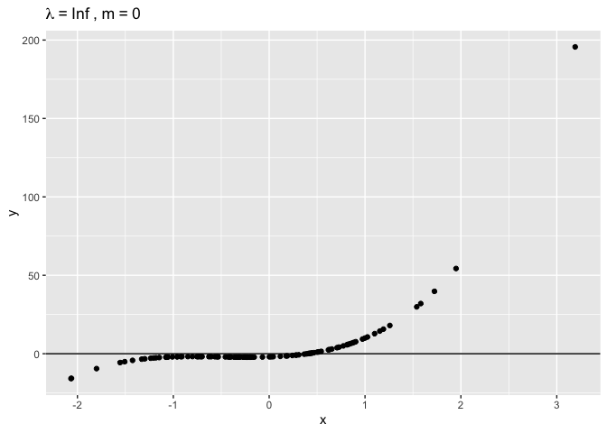

    ggplot2::ggplot(data = df) +
      ggplot2::geom_point(ggplot2::aes(x = x, y = y)) +
      ggplot2::geom_hline(ggplot2::aes(yintercept = mean(y))) +
      ggplot2::ggtitle(quote(lambda~`=`~Inf~`,`~m~`=`~1))

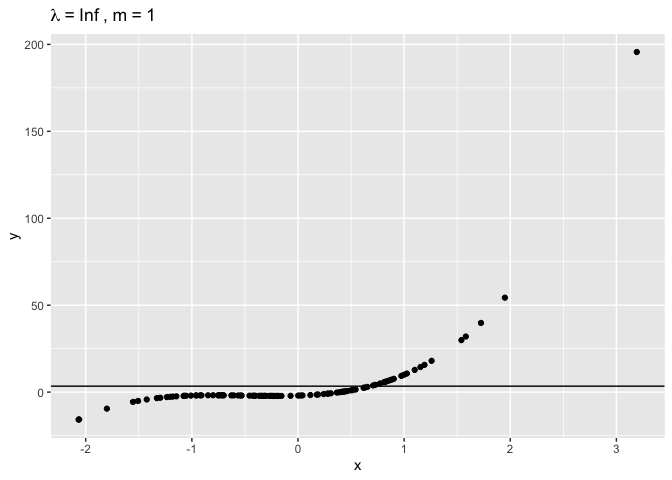

    model <- lm(y ~ x, data = df)
    coefs <- coef(model)
    intercept <- coefs[[1]]
    slope <- coefs[[2]]

    ggplot2::ggplot(data = df) +
      ggplot2::geom_point(ggplot2::aes(x = x, y = y)) +
      ggplot2::geom_abline(intercept = intercept, slope = slope) +
      ggplot2::ggtitle(quote(lambda~`=`~Inf~`,`~m~`=`~2))

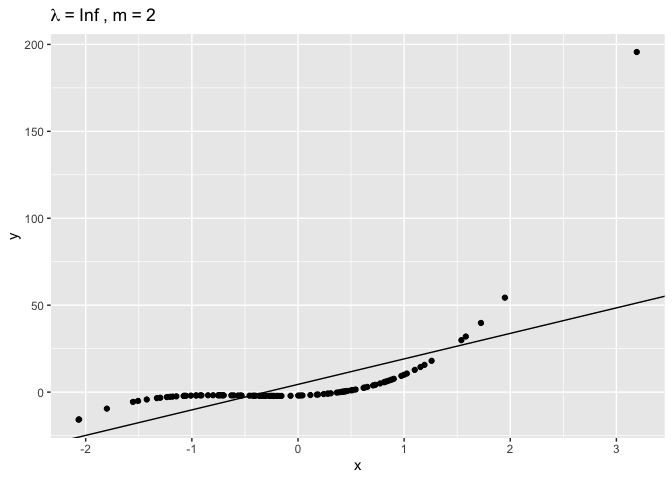

    model <- lm(y ~ poly(x, 2), data = df)
    preds <- predict(model)
    df$preds <- preds

    ggplot2::ggplot(data = df) +
      ggplot2::geom_point(ggplot2::aes(x = x, y = y)) +
      ggplot2::geom_line(aes(x = x, y = preds)) +
      ggplot2::ggtitle(quote(lambda~`=`~Inf~`,`~m~`=`~3))

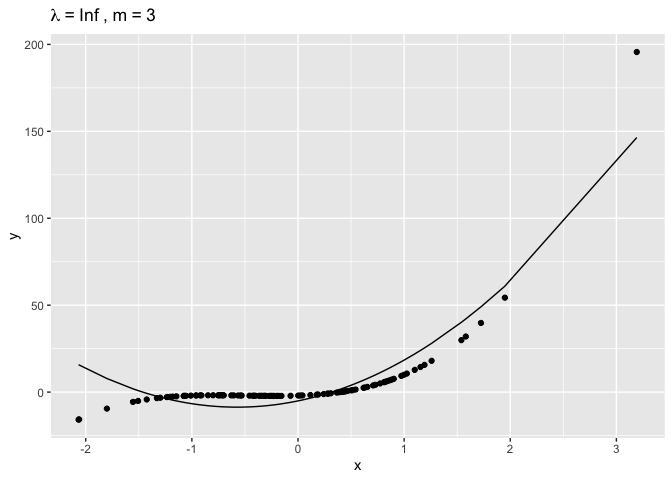

    ggplot2::ggplot(data = df) +
      ggplot2::geom_point(ggplot2::aes(x = x, y = y)) +
      ggplot2::geom_line(aes(x = x, y = y)) +
      ggplot2::ggtitle(quote(lambda~`=`~0~`,`~m~`=`~3))

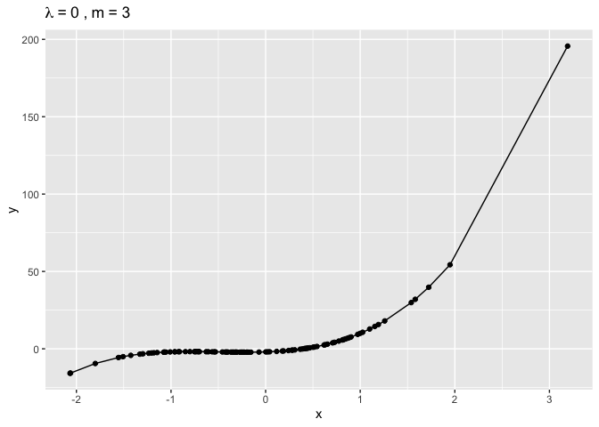

### Question 3

    x <- seq(-2, 2, length = 1000)
    y <- 1 + x -2 * (x - 1)^2 * (x >= 1)

    df <- data.frame(x = x, y = y)

    ggplot2::ggplot(data = df) +
      ggplot2::geom_line(ggplot2::aes(x = x, y = y))

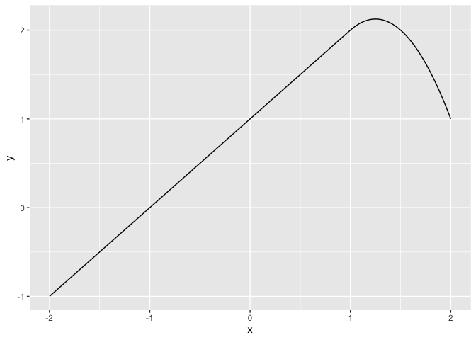

### Question 4

    x <- seq(-2, 5, length = 1000)
    y <- 1 + (x >= 0 & x <=2) - (x - 1) * (x >= 1 & x <=2) + 3 * ((x - 3) * (x >= 3 & x <= 4) + (x > 4 & x <=5))

    df <- data.frame(x = x, y = y)

    ggplot2::ggplot(data = df) +
      ggplot2::geom_line(ggplot2::aes(x = x, y = y))

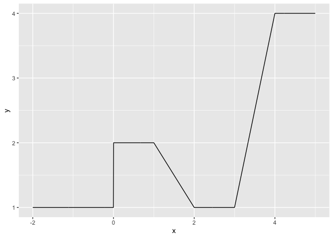

### Question 5

#### a

g2 will have smaller training RSS because the model will be more
flexible.

#### b

Impossible to tell; depends on the bias variance tradeoff.

#### c

The model from each curve will be the same in this case; any model that
interpolates the points. The training RSS will be zero no matter what,
and if we choose this interpolation function to be the same for both of
g1 and g2, then the test error will also be the same.

## Applied

### Question 6

#### a

  

    df_wage <- ISLR::Wage

    k <- 10
    max_degree <- 15
    degrees <- seq(max_degree)

    cv_results <- rep(0, length(degrees)) %>%
      setNames(., seq_along(.))

    set.seed(1)
    for (degree in seq_along(degrees)) {
      model <- glm(wage ~ poly(age, degree), data = df_wage)
      cv_results[[degree]] <- cv.glm(df_wage, model, K = 10)$delta[[1]]
    }

    model_full <- lm(wage ~ poly(age, max_degree), data = df_wage)

    print(cv_results[cv_results == min(cv_results)])

    ##        9 
    ## 1593.913

    print(summary(model_full))

    ## 
    ## Call:
    ## lm(formula = wage ~ poly(age, max_degree), data = df_wage)
    ## 
    ## Residuals:
    ##     Min      1Q  Median      3Q     Max 
    ## -99.917 -24.278  -4.799  15.519 199.524 
    ## 
    ## Coefficients:
    ##                          Estimate Std. Error t value Pr(>|t|)    
    ## (Intercept)              111.7036     0.7288 153.262  < 2e-16 ***
    ## poly(age, max_degree)1   447.0679    39.9202  11.199  < 2e-16 ***
    ## poly(age, max_degree)2  -478.3158    39.9202 -11.982  < 2e-16 ***
    ## poly(age, max_degree)3   125.5217    39.9202   3.144  0.00168 ** 
    ## poly(age, max_degree)4   -77.9112    39.9202  -1.952  0.05107 .  
    ## poly(age, max_degree)5   -35.8129    39.9202  -0.897  0.36973    
    ## poly(age, max_degree)6    62.7077    39.9202   1.571  0.11633    
    ## poly(age, max_degree)7    50.5498    39.9202   1.266  0.20551    
    ## poly(age, max_degree)8   -11.2547    39.9202  -0.282  0.77802    
    ## poly(age, max_degree)9   -83.6918    39.9202  -2.096  0.03612 *  
    ## poly(age, max_degree)10    1.6240    39.9202   0.041  0.96755    
    ## poly(age, max_degree)11   10.1588    39.9202   0.254  0.79914    
    ## poly(age, max_degree)12   -2.6076    39.9202  -0.065  0.94792    
    ## poly(age, max_degree)13   13.7669    39.9202   0.345  0.73022    
    ## poly(age, max_degree)14  -15.5730    39.9202  -0.390  0.69649    
    ## poly(age, max_degree)15  -28.1896    39.9202  -0.706  0.48015    
    ## ---
    ## Signif. codes:  0 '***' 0.001 '**' 0.01 '*' 0.05 '.' 0.1 ' ' 1
    ## 
    ## Residual standard error: 39.92 on 2984 degrees of freedom
    ## Multiple R-squared:  0.08937,    Adjusted R-squared:  0.0848 
    ## F-statistic: 19.52 on 15 and 2984 DF,  p-value: < 2.2e-16

    model_poly3 <- lm(wage ~ poly(age, 3), data = df_wage)

    df_for_plot <- data.frame(
      age = df_wage$age,
      predicted_wage = predict(model_poly3),
      wage = df_wage$wage,
      label = "predicted_wage"
    )

    ggplot2::ggplot(data = df_for_plot) +
      ggplot2::geom_point(ggplot2::aes(x = age, y = wage)) +
      ggplot2::geom_line(ggplot2::aes(x = age, y = predicted_wage, color = label)) +
      ggplot2::labs(color = NULL)

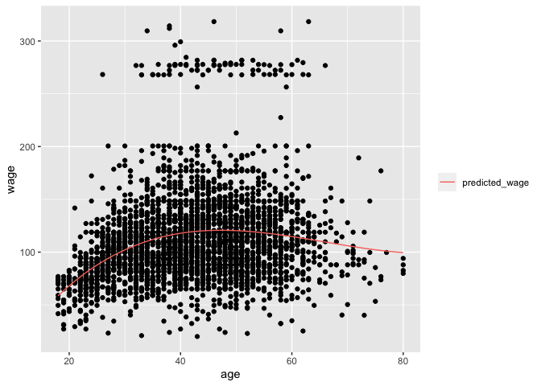
Cross-validation picks a polynomial of degree 6, although the difference
in MSE is trivial compared to the degree 3 model. In this case we would
probably pick the degree 3 model. Since the polynomials are orthogonal,
the p-value for the ANOVA between two models that differ by one degree
is the same as the p-value for that degree in the larger model. So we
can just look at the significance of each term in the largest model. We
see that any degrees larger than 3 are insignificant.

From our plot, we can see that the model fits the bulk of the data well,
but misses out on the high earners.

#### b

  

    max_cuts <- 15

    # since the number of cuts is somewhat small relative to the size of the dataset,
    # we don't have to worry about new factor levels being present in the test set of
    # each cross-validation fold. In production we would need to handle new levels
    # appropriately.

    df_wage_with_cuts <- df_wage
    for (n_cuts in seq(2, max_cuts)) {
      df_wage_with_cuts[[paste0("cut", n_cuts)]] <- cut(df_wage_with_cuts$age, n_cuts)
    }
    cut_vars <- paste0("cut", seq(2, max_cuts))

    set.seed(1)
    cv_results <- rep(0, max_cuts - 1) %>%
      setNames(., seq_along(.))
    for (n_cuts in seq(2, max_cuts)) {
      model_formula <- as.formula(paste("wage ~", cut_vars[[n_cuts - 1]]))
      model <- glm(model_formula, data = df_wage_with_cuts)

      cv_results[n_cuts - 1] <- cv.glm(df_wage_with_cuts, model, K = 2)$delta[[1]]
    }

    print(cv_results[cv_results == min(cv_results)])

    ##       10 
    ## 1595.995

    final_model <- lm(wage ~ cut10, data = df_wage_with_cuts)

    df_for_plot <- data.frame(
      age = df_wage_with_cuts$age,
      wage = df_wage_with_cuts$wage,
      predicted_wage = predict(final_model),
      label = "predicted_wage"
    )

    ggplot2::ggplot(data = df_for_plot) +
      ggplot2::geom_point(ggplot2::aes(x = age, y = wage)) +
      ggplot2::geom_line(ggplot2::aes(x = age, y = predicted_wage, color = label)) +
      ggplot2::labs(color = NULL)

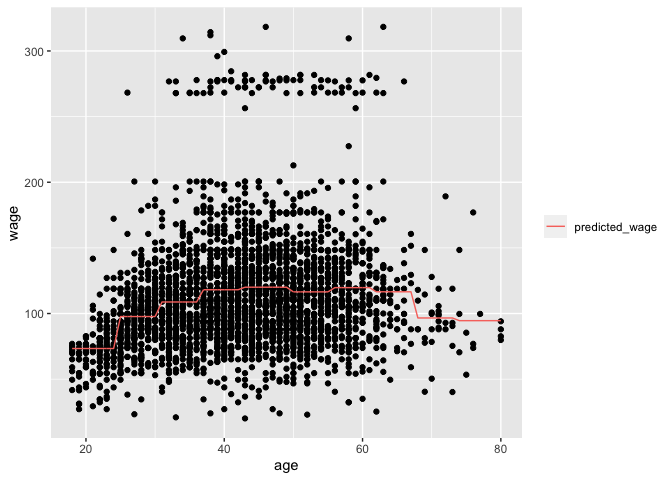

Again we see that the model captures the relationship well for most
observations, but doesn’t capture the wage of the high earners.

### Question 7

  

    # compare polynomial regression without extra vars to polynomial regression with extra vars

    model_with_extra_vars <- glm(
      wage ~ poly(age, 3) + year + maritl + race + education +
      jobclass + health +  health_ins, data = df_wage
    )
    cv_estimate <- cv.glm(df_wage, model_with_extra_vars, K = 10)$delta[[1]]

    print(cv_estimate)

    ## [1] 1146.213

    age_dfs <- seq(4, 6)
    year_dfs <- seq(4,5)
    param_grid <- expand.grid(age_dfs, year_dfs, c("ns", "bs", "s"), stringsAsFactors = FALSE) %>%
      setNames(., c("age", "year", "spline_type"))

    cv_estimates <- rep(0, nrow(param_grid))
    models <- vector("list", length = nrow(param_grid))

    set.seed(1)
    for (i in seq(nrow(param_grid))){
      spline_method <- param_grid[i, "spline_type"]
      if (identical(spline_method, "s")) {
        model_function <- gam::gam
        spline_method <- gam::s
      } else {
        model_function <- glm
        spline_method <- get(spline_method)
      }

      df_age <- param_grid[i, "age"]
      df_year <- param_grid[i, "year"]
      model <- model_function(
        wage ~ spline_method(age, df = df_age) + spline_method(year, df = df_year) + maritl + race + education +
        jobclass + health +  health_ins, data = df_wage
      )
      models[[i]] <- model
      cv_estimates[[i]] <- boot::cv.glm(df_wage, model, K = 10)$delta[[1]]
    }

    param_grid$cv_estimate <- cv_estimates

    best_model_idx <- which.min(param_grid$cv_estimate)

    print(param_grid[best_model_idx, ])

    ##   age year spline_type cv_estimate
    ## 2   5    4          ns    1144.329

    df_for_plot <- data.frame(
      wage = df_wage$wage,
      age = df_wage$age,
      year = df_wage$year,
      predicted_wage = predict(models[[best_model_idx]]),
      label = "predicted wage"
    )

    plots <- lapply(
      c("year", "age"),
      function(var, df) {
        ggplot2::ggplot(data = df) +
          ggplot2::geom_point(ggplot2::aes(x = .data[[var]], y = wage)) +
          ggplot2::geom_smooth(ggplot2::aes(x = .data[[var]], y = predicted_wage, color = label), method = "loess") +
          ggplot2::labs(color = NULL)
      },
      df = df_for_plot
    )

    do.call(gridExtra::grid.arrange, plots)

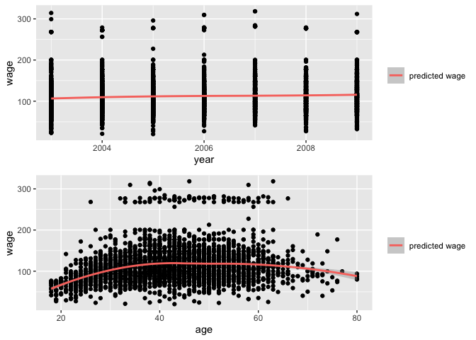

The best method is a natural spline with 5 degrees of freedom for age
and 4 degrees of freedom for year. Note that the decrease in MSE is very
small compared to the polynomial of degree 3 and the raw value of year,
in addition to the other covariates. Looking at the plots, although we
have fit a natural spline to year, the relationship looks very linear.
Age is certainly non-linear.

### Question 8

  

    df_auto <- ISLR::Auto

    features <- setdiff(colnames(df_auto), c("mpg", "origin", "name"))

    model_formula <- as.formula(
      paste(
        "mpg ~",
        paste(
          paste0("s(", features , ", 4)"),
          collapse = " + "
        )
      )
    )
    model <- gam::gam(model_formula, data = df_auto)

    par(mfrow = c(2, 3))

    plot(model)

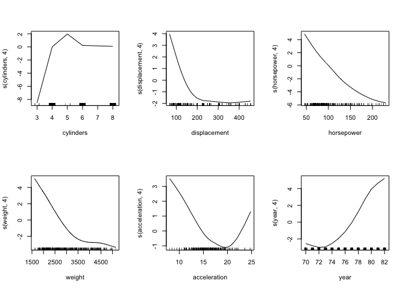 There is
evidence of non-linear relationships between all the variables we chose
and mpg.

### Question 9

#### a

  

    df_boston <- MASS::Boston

    model <- glm(nox ~ poly(dis, 3), data = df_boston)

    print(summary(model))

    ## 
    ## Call:
    ## glm(formula = nox ~ poly(dis, 3), data = df_boston)
    ## 
    ## Coefficients:
    ##                Estimate Std. Error t value Pr(>|t|)    
    ## (Intercept)    0.554695   0.002759 201.021  < 2e-16 ***
    ## poly(dis, 3)1 -2.003096   0.062071 -32.271  < 2e-16 ***
    ## poly(dis, 3)2  0.856330   0.062071  13.796  < 2e-16 ***
    ## poly(dis, 3)3 -0.318049   0.062071  -5.124 4.27e-07 ***
    ## ---
    ## Signif. codes:  0 '***' 0.001 '**' 0.01 '*' 0.05 '.' 0.1 ' ' 1
    ## 
    ## (Dispersion parameter for gaussian family taken to be 0.003852802)
    ## 
    ##     Null deviance: 6.7810  on 505  degrees of freedom
    ## Residual deviance: 1.9341  on 502  degrees of freedom
    ## AIC: -1370.9
    ## 
    ## Number of Fisher Scoring iterations: 2

    df_boston$preds <- predict(model)
    df_boston$label <- "predicted_nox"

    ggplot2::ggplot(data = df_boston) +
      ggplot2::geom_point(ggplot2::aes(x = dis, y = nox)) +
      ggplot2::geom_line(ggplot2::aes(x = dis, y = preds, color = label)) +
      ggplot2::labs(color = NULL)

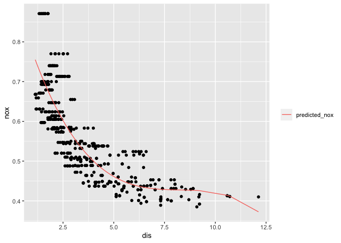

#### b - c

  

    max_poly_degree <- 10
    cv_estimates <- rep(0, max_poly_degree)
    training_rss <- cv_estimates
    for (degree in seq(max_poly_degree)) {
      model <- glm(nox ~ poly(dis, degree), data = df_boston)
      training_rss[[degree]] <- model$deviance / (nrow(df_boston))
      cv_estimates[[degree]] <- cv.glm(df_boston, model, K = 10)$delta[[1]]
    }

    df_for_plot <- data.frame(
      degree = rep(seq_along(cv_estimates), 2),
      error = c(cv_estimates, training_rss),
      type = rep(c("cross-validation mse", "training mse"), each = max_poly_degree),
      training_rss = training_rss
    )

    ggplot2::ggplot(data = df_for_plot) +
      ggplot2::geom_line(ggplot2::aes(x = degree, y = error, color = type)) +
      ggplot2::scale_x_continuous(breaks = seq(10), minor_breaks = NULL)

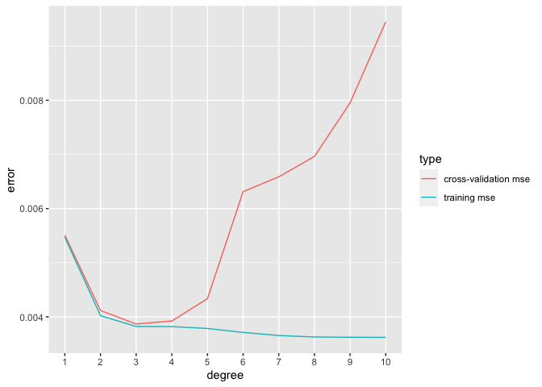

As expected, the MSE for the training error decreases as we add more
polynomial terms, but the cross-validation error reaches a minimum at
degree 3.

#### d - f

    dfs <- seq(4, 10)
    cv_estimates <- rep(0, length(dfs))
    training_rss <- cv_estimates
    for (i in seq_along(dfs)) {
      df <- dfs[[i]]
      model <- glm(nox ~ ns(dis, df = df), data = df_boston)
      training_rss[[i]] <- model$deviance / (nrow(df_boston))
      cv_estimates[[i]] <- cv.glm(df_boston, model, K = 10)$delta[[1]]
    }

    df_for_plot <- data.frame(
      degree = rep(dfs, 2),
      error = c(cv_estimates, training_rss),
      type = rep(c("cross-validation mse", "training mse"), each = length(dfs)),
      training_rss = training_rss
    )

    ggplot2::ggplot(data = df_for_plot) +
      ggplot2::geom_line(ggplot2::aes(x = degree, y = error, color = type)) +
      ggplot2::scale_x_continuous(breaks = seq(10), minor_breaks = NULL)

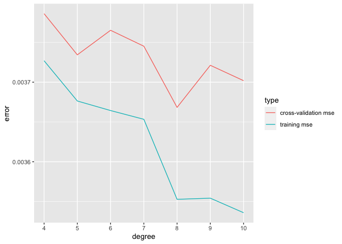

8 degrees of freedom gives the lowest CV error.

### Question 10

#### a

  

    df_college <- ISLR::College
    nrows <- nrow(df_college)
    train_idx <- sample(nrows, nrows %/% 2)

    df_train <- df_college[train_idx, ]
    df_test <- df_college[-train_idx, ]

    n_vars <- ncol(df_train) - 1
    best_subsets <- leaps::regsubsets(Outstate ~ ., data = df_train, nvmax = n_vars, method = "forward")

    x_test <- model.matrix(Outstate ~ ., df_test)

    mses <- rep(0, n_vars)
    for (i in seq(n_vars)) {
      coefs <- coef(best_subsets, i)
      x_test_sub <- x_test[, names(coefs)]
      preds <- x_test_sub %*% coefs
      mses[[i]] <- sum((preds - df_test$Outstate) ^ 2) / length(preds)
    }

    print(which.min(mses))

    ## [1] 17

    coefs <- names(coef(best_subsets, 13))
    continuous_coefs <- setdiff(coefs, c("(Intercept)", "PrivateYes"))

    model_formula <- as.formula(
      paste(
        "Outstate ~ Private +",
        paste(continuous_coefs, collapse = " + ")
      )
    )

    best_linear_model <- lm(model_formula, df_train)
    preds <- predict(best_linear_model, df_test)
    test_rmse <- sqrt(sum((preds - df_test$Outstate) ^ 2) / length(preds))

    print(test_rmse)

    ## [1] 1947.581

We see that the 13 variable model has the lowest test error here. So we
fit a GAM using those 13 variables. Note that one of the variables is
categorical so we don’t apply any smoothing to that variable.

    model_formula <- as.formula(
      paste(
        "Outstate ~ Private +",
        paste(
            paste0("s(", continuous_coefs, ", 4)"),
            collapse = " + "
        )
      )
    )

    gam_model <- gam::gam(model_formula, data = df_train)

    print(summary(gam_model))

    ## 
    ## Call: gam::gam(formula = model_formula, data = df_train)
    ## Deviance Residuals:
    ##      Min       1Q   Median       3Q      Max 
    ## -6105.86 -1041.60    88.71  1096.45  7264.62 
    ## 
    ## (Dispersion Parameter for gaussian family taken to be 3208487)
    ## 
    ##     Null Deviance: 6321773043 on 387 degrees of freedom
    ## Residual Deviance: 1084468156 on 337.9999 degrees of freedom
    ## AIC: 6962.316 
    ## 
    ## Number of Local Scoring Iterations: NA 
    ## 
    ## Anova for Parametric Effects
    ##                    Df     Sum Sq    Mean Sq  F value    Pr(>F)    
    ## Private             1 1786659474 1786659474 556.8542 < 2.2e-16 ***
    ## s(Apps, 4)          1  376228460  376228460 117.2604 < 2.2e-16 ***
    ## s(Accept, 4)        1   43887360   43887360  13.6785 0.0002531 ***
    ## s(Top10perc, 4)     1  598266986  598266986 186.4639 < 2.2e-16 ***
    ## s(Top25perc, 4)     1      93300      93300   0.0291 0.8646988    
    ## s(F.Undergrad, 4)   1  362348023  362348023 112.9342 < 2.2e-16 ***
    ## s(Room.Board, 4)    1  410007098  410007098 127.7883 < 2.2e-16 ***
    ## s(Books, 4)         1   10840043   10840043   3.3786 0.0669274 .  
    ## s(Terminal, 4)      1  122688574  122688574  38.2388 1.805e-09 ***
    ## s(S.F.Ratio, 4)     1   68864020   68864020  21.4631 5.156e-06 ***
    ## s(perc.alumni, 4)   1  123111569  123111569  38.3706 1.699e-09 ***
    ## s(Expend, 4)        1  344183836  344183836 107.2729 < 2.2e-16 ***
    ## s(Grad.Rate, 4)     1   16384421   16384421   5.1066 0.0244713 *  
    ## Residuals         338 1084468156    3208487                       
    ## ---
    ## Signif. codes:  0 '***' 0.001 '**' 0.01 '*' 0.05 '.' 0.1 ' ' 1
    ## 
    ## Anova for Nonparametric Effects
    ##                   Npar Df  Npar F     Pr(F)    
    ## (Intercept)                                    
    ## Private                                        
    ## s(Apps, 4)              3  2.4674  0.062006 .  
    ## s(Accept, 4)            3  4.0497  0.007544 ** 
    ## s(Top10perc, 4)         3  1.2726  0.283638    
    ## s(Top25perc, 4)         3  0.6673  0.572628    
    ## s(F.Undergrad, 4)       3  2.6677  0.047663 *  
    ## s(Room.Board, 4)        3  2.9149  0.034380 *  
    ## s(Books, 4)             3  1.2150  0.304180    
    ## s(Terminal, 4)          3  1.1921  0.312701    
    ## s(S.F.Ratio, 4)         3  2.6524  0.048631 *  
    ## s(perc.alumni, 4)       3  3.5466  0.014821 *  
    ## s(Expend, 4)            3 20.3984 3.581e-12 ***
    ## s(Grad.Rate, 4)         3  1.4806  0.219585    
    ## ---
    ## Signif. codes:  0 '***' 0.001 '**' 0.01 '*' 0.05 '.' 0.1 ' ' 1

    plot(gam_model)

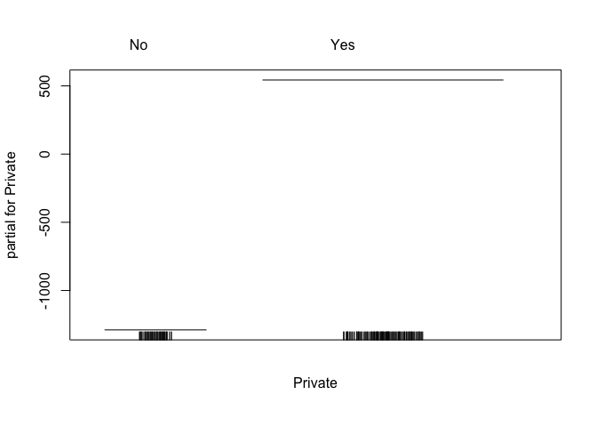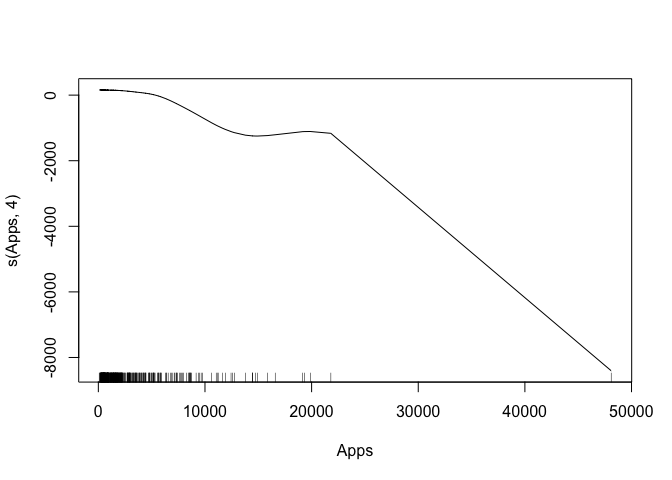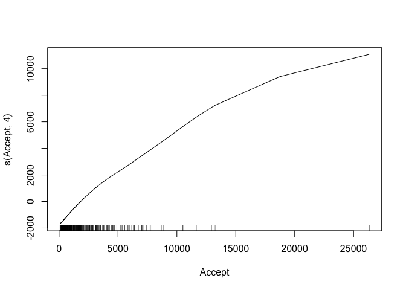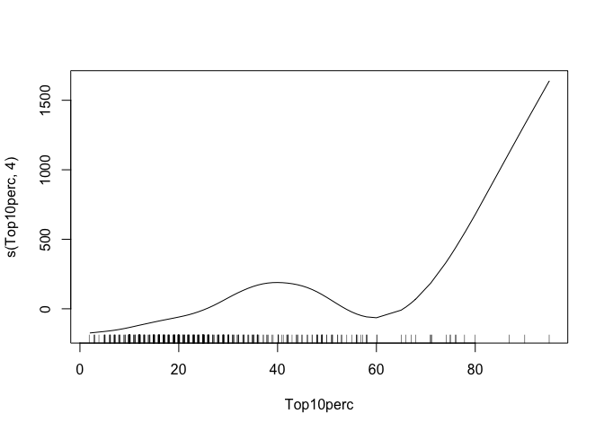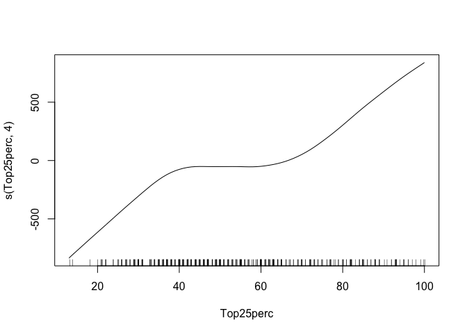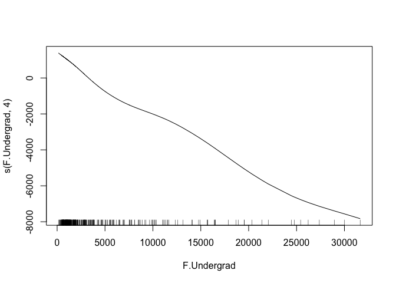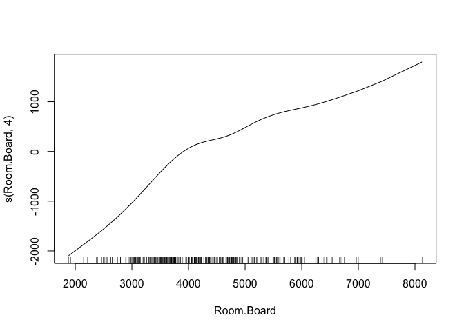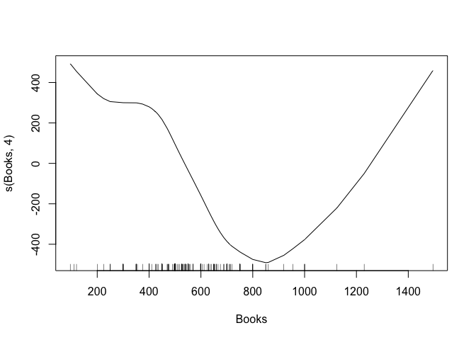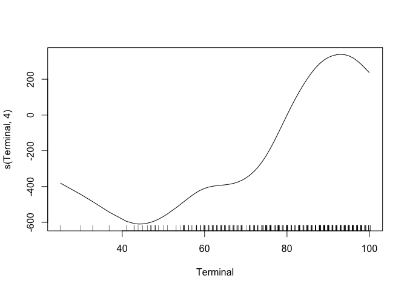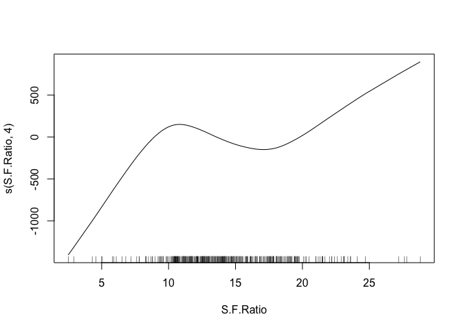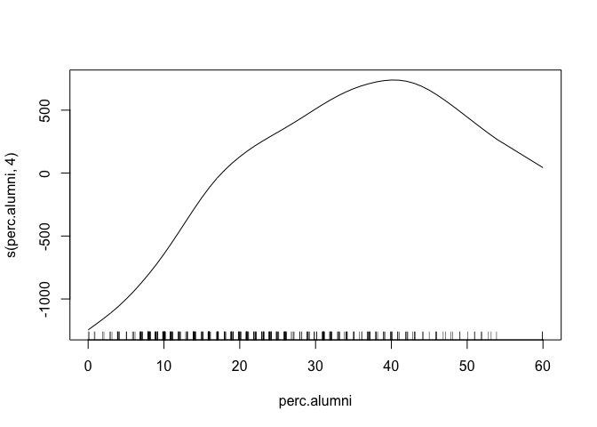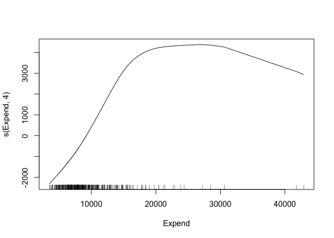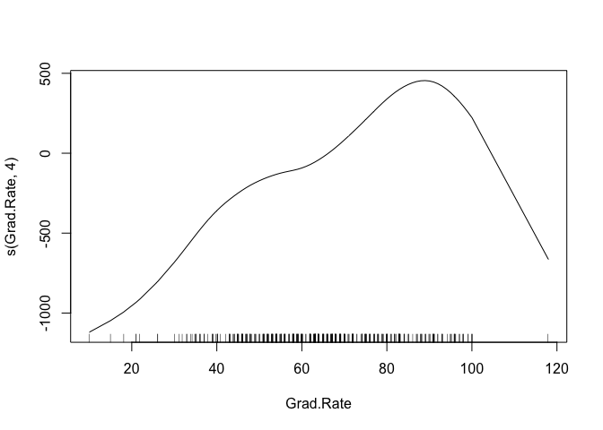

    preds <- predict(gam_model, df_test)
    test_rmse <- sqrt(sum((preds - df_test$Outstate) ^ 2) / length(preds))
    print(test_rmse)

    ## [1] 1849.644

We see evidence of non-linearity for many but not all of the covariates,
and a corresponding decrease in the test set rmse.

### Question 11

  

    set.seed(1)
    x1 <- rnorm(100)
    x2 <- rnorm(100)
    eps <- rnorm(100, sd = 0.25)

    y <- x1 + 2 * x2 + eps

    full_model <- lm(y ~ x1 + x2)
    full_model_coefs <- coef(full_model)

    print(full_model_coefs)

    ## (Intercept)          x1          x2 
    ## 0.006338357 1.005277542 1.986633296

    n_iterations <- 5

    beta_0 <- rep(0, n_iterations + 1)
    beta_1 <- rep(0, n_iterations + 1)
    beta_2 <- rep(0, n_iterations + 1)

    current_beta_0 <- 0
    current_beta_1 <- 0
    current_beta_2 <- 0

    beta_0[[1]] <- current_beta_0
    beta_1[[1]] <- current_beta_1
    beta_2[[1]] <- current_beta_2

    for (i in seq(2, n_iterations + 1)) {
      current_y <- y - current_beta_1 * x1
      model <- lm(current_y ~ x2)
      current_beta_2 <- coef(model)[[2]]

      current_y <- y - current_beta_2 * x2
      model <- lm(current_y ~ x1)
      current_beta_1 <- coef(model)[[2]]

      current_beta_0 <- coef(model)[[1]]

      beta_0[[i]] <- current_beta_0
      beta_1[[i]] <- current_beta_1
      beta_2[[i]] <- current_beta_2
    }

    df_backfitting <- data.frame(
      beta = c(beta_0, beta_1, beta_2),
      coefficient = rep(c("beta_0", "beta_1", "beta_2"), each = n_iterations + 1),
      iteration = seq(n_iterations + 1)
    )

    df_ols <- data.frame(
      beta = rep(full_model_coefs, 2),
      coefficient = rep(c("beta_0_regression", "beta_1_regression", "beta_2_regression"), 2),
      iteration = rep(c(1, n_iterations + 1), each = 3)
    )

    ggplot2::ggplot(data = df_backfitting) +
      ggplot2::geom_line(ggplot2::aes(x = iteration, y = beta, color = coefficient)) +
      ggplot2::geom_line(data = df_ols, ggplot2::aes(x = iteration, y=beta, group = coefficient), linetype = 3)

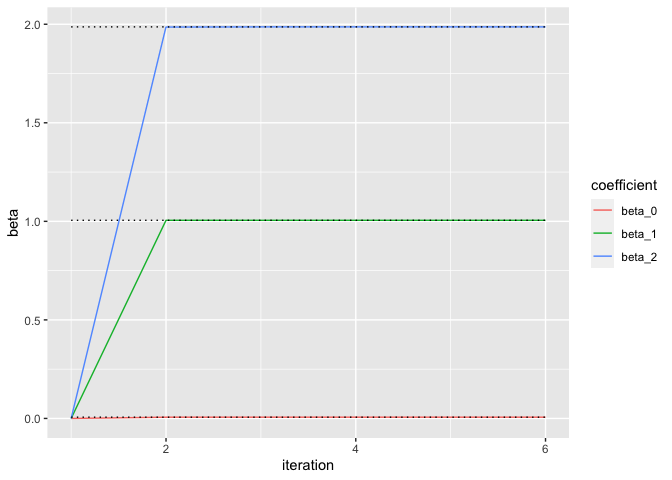

The algorithm converges in 2 iterations to the OLS coefficients, which
are overlayed as dotted lines on the coefficients from backfitting.

### Question 12

  

    n_iterations <- 10
    nrows <- 10000
    ncols <- 100
    X <- matrix(rnorm(nrows * ncols), nrows, ncols)
    eps <- rnorm(nrows, sd = 0.25)
    actual_betas <- sample(10, 100, replace = TRUE)

    y <- X %*% actual_betas + eps

    ols_coefs <- coef(lm(y ~ X))

    backfit <- function(y, X, n_iterations, ols_coefs) {

      ncols <- ncol(X)
      current_betas <- rep(0, ncols + 1)
      mean_squared_error <- rep(0, ncols + 1)
      mean_squared_error[[1]] <- mean((ols_coefs - current_betas) ^ 2)

      for (i in seq(2, n_iterations + 1)) {
        for (j in seq(1, length(current_betas) - 1)) {
          current_beta <- current_betas[[j + 1]]
          current_x <- X[, j]
          current_y <- y - X[, -j] %*% current_betas[2:length(current_betas)][-j]
          model <- lm(current_y ~ current_x)
          current_betas[[j + 1]] <- coef(model)[[2]]
        }
        current_betas[[1]] <- coef(model)[[1]]
        mean_squared_error[[i]] <- mean((ols_coefs - current_betas) ^ 2)

      }  

      mean_squared_error
    }

    mean_squared_errors <- backfit(y, X, 10, ols_coefs)

    df_for_plot <- data.frame(
      mean_squared_error = mean_squared_errors,
      iteration = seq_along(mean_squared_errors)
    )

    ggplot2::ggplot(data = df_for_plot) +
      ggplot2::geom_point(ggplot2::aes(x = iteration, y = mean_squared_error))

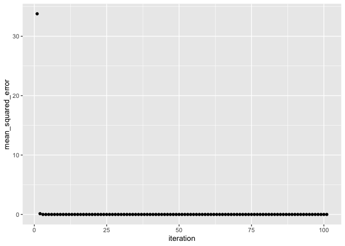

We see that after 3 iterations we have reached almost 0 error already.
