-   [Conceptual](#conceptual)
    -   [Question 1](#question-1)
    -   [Question 2](#question-2)
    -   [Question 3](#question-3)
    -   [Question 4](#question-4)
    -   [Question 5](#question-5)
-   [Applied](#applied)
    -   [Question 6](#question-6)
    -   [Question 7](#question-7)
    -   [Question 8](#question-8)
    -   [Question 9](#question-9)
    -   [Question 10](#question-10)
    -   [Question 11](#question-11)
    -   [Question 12](#question-12)

    library(ggplot2)
    library(randomForest)
    library(MASS)
    library(tree)
    library(ISLR)
    library(ROCR)
    library(gbm)
    library(class)

## Conceptual

### Question 1

    line_df <- data.frame(
      x = c(0, 0, 0, 0.5, 0, 1, 0, 0, 0.5),
      y = c(0, 0, 0.5, 0, 1, 1, 0.75, 0.125, 0.25),
      xend = c(0, 1, 0.5, 0.5, 1, 1, 0.5, 0.5, 1),
      yend = c(1, 0, 0.5, 1, 1, 0, 0.75, 0.125, 0.25)
    )
    ggplot2::ggplot(data = line_df) +
      ggplot2::geom_segment(aes(x = x, y = y, xend = xend, yend = yend))

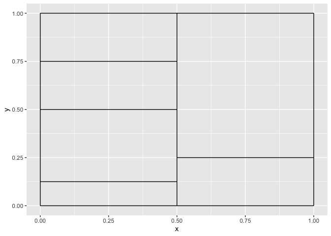

### Question 2

Since each tree has depth 1, it follows that each tree only uses a
single variable for splitting. That is each tree , indexed by `i` has
the following functional form:

*c* + *d***1***x**j* &lt;  = *t**j* = *f**i*(*x**j*)

If multiple trees share the same variable for splitting, we can combine
them into a single function
*g**j* = ∑*i* : *f**i* *i**s* *a* *f**u**n**c**t**i**o**n* *o**f* *x**j**λ**f**i*(*x**j*).
So the final model is of the form
$\hat{f} = \displaystyle\sum\_{j = 1}^{p} g\_j(x\_j)$, which is an
additive model of the predictors.

### Question 3

    p1 <- seq(0, 1, length = 100)
    p2 <- 1 - p1

    df <- data.frame(
      p1 = p1,
      p2 = p2,
      misclassification = 1 - pmax(p1, p2),
      gini = 2 * p1 * p2,
      entropy = -p1 * log(p1, 2) - p2 * log(p2, 2)
    )

    df <- tidyr::pivot_longer(df, cols = c("misclassification", "gini", "entropy"))

    ggplot2:::ggplot(data = df) +
      ggplot2::geom_line(ggplot2::aes(x = p1, y = value, color = name))

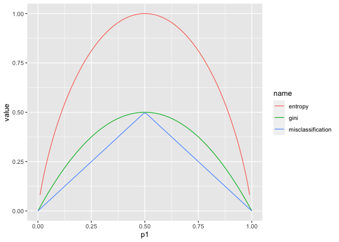

### Question 4

    line_df <- data.frame(
      x1 = c(-1, -1, 1, -1, 2, -1, -1, 0),
      x2 = c(0, 1, 0, 0, 0, 2, 3, 1),
      x1end = c(2, 2, 1, -1, 2, 2, 2, 0),
      x2end = c(0, 1, 1, 3, 3, 2, 3, 2)
    )
    ggplot2::ggplot(data = line_df) +
      ggplot2::geom_segment(aes(x = x1, y = x2, xend = x1end, yend = x2end))

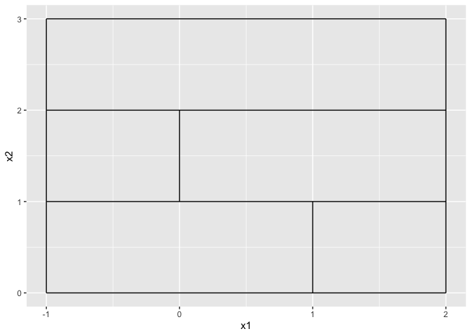

### Question 5

    probs <- c(0.1, 0.15, 0.2, 0.2, 0.55, 0.6, 0.6, 0.65, 0.7, 0.75)
    labels <- ifelse(probs <= 0.5, "Green", "Red")
    label_table <- table(labels)

    print(paste("Majority Vote: ", names(label_table)[label_table == max(label_table)]))

    ## [1] "Majority Vote:  Red"

    print(paste("Average Probability Approach:", if (mean(probs) >= 0.5) "Red" else "Green"))

    ## [1] "Average Probability Approach: Green"

## Applied

### Question 6

A regression tree is a recursive binary splitting algorithm. Given a set
of observations in a node, for each predictor and each value of the
predictor, we split the node into two sub-nodes, with observations in
each node corresponding to a split of either less than or equal to the
threshold, or greater than the threshold. For each split, we calculate
the prediction of the children nodes as the mean of the response
variable for the observations in that node. We then calculate the total
sum of squared errors for each possible split using that prediction, and
pick the split with the lowest total sum of squared errors. This process
is repeated on the children nodes recursively until the terminal nodes
have some minimum number of observations in them, or the tree has
reached the maximum allowed depth.

### Question 7

    df_boston <- MASS::Boston
    nrows <- nrow(df_boston)
    n_predictors <- ncol(df_boston) - 1

    set.seed(1)
    train_idx <- sample(nrows, nrows %/% 2)

    df_train <- df_boston[train_idx, ]
    df_test <- df_boston[-train_idx, ]

    params <- expand.grid(mtry = seq(n_predictors), ntree = c(10, 50, 100, 250, 500, 1000))
    test_error <- rep(0, nrow(params))

    for (i in seq_along(test_error)) {
      model <- do.call(randomForest::randomForest, c(formula = formula(medv ~ .), data = list(df_train), params[i, ]))
      preds <- predict(model, df_test)
      test_error[[i]] <- mean((preds - df_test$medv) ^ 2)
    }

    params$test_error <- test_error

    print(params[which.min(params$test_error), ])

    ##    mtry ntree test_error
    ## 30    4   100   17.83553

    ggplot2::ggplot(data = params) +
      ggplot2::geom_line(ggplot2::aes(x = mtry, y = test_error, color = as.factor(ntree))) +
      ggplot2::labs(x = "Number of variables considered at each split", y = "test mean squared error", color = "number of trees")

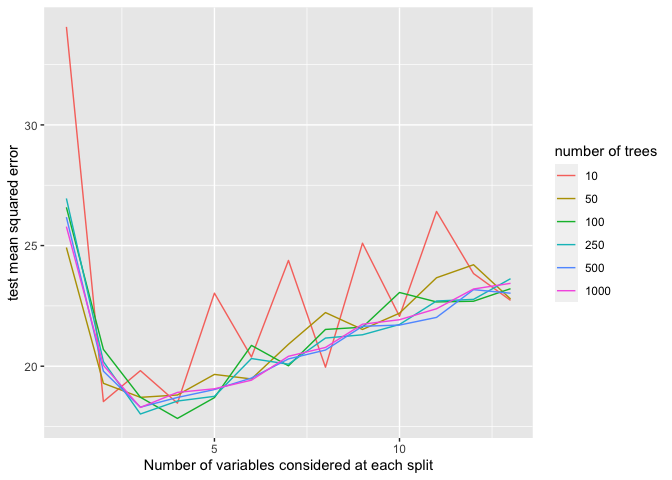

### Question 8

#### a-c

  

    df_carseats <- ISLR::Carseats
    nrows <- nrow(df_carseats)

    train_idx <- sample(nrows, nrows %/% 2)

    df_train <- df_carseats[train_idx, ]
    df_test <- df_carseats[-train_idx, ]

    regression_tree <- tree::tree(Sales ~ ., data = df_train)

    preds <- predict(regression_tree, df_test)

    test_mse <- mean((preds - df_test$Sales) ^ 2)

    print(paste("test mse from unpruned regression tree: ", test_mse))

    ## [1] "test mse from unpruned regression tree:  5.36105674402005"

    cv_regression_tree <- tree::cv.tree(regression_tree)

    print(cv_regression_tree$size[which.min(cv_regression_tree$dev)])

    ## [1] 15

    plot(cv_regression_tree)

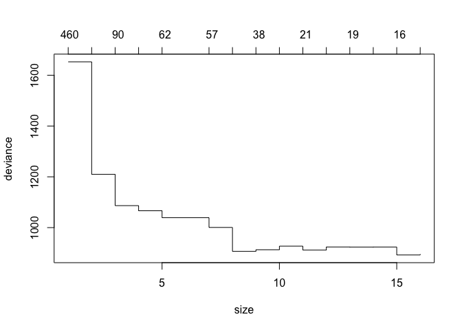

We see that the best cross-validation sum of squared errors occurs when
we use the model without any pruning.

    bagged_model <- randomForest::randomForest(Sales ~ ., data = df_train, mtry = ncol(df_train) - 1, importance = TRUE)

    preds <- predict(bagged_model, df_test)

    test_mse <- mean((preds - df_test$Sales) ^ 2)

    print(paste("test mse from bagged model: ", test_mse))

    ## [1] "test mse from bagged model:  2.66345847106232"

    print(importance(bagged_model))

    ##                %IncMSE IncNodePurity
    ## CompPrice   21.1899036    149.506414
    ## Income       4.9379469     86.519623
    ## Advertising 12.6315874     93.514472
    ## Population   1.4900747     52.152711
    ## Price       58.9910503    476.387513
    ## ShelveLoc   60.9905744    498.372021
    ## Age         18.8152627    163.418586
    ## Education   -0.9169529     38.589570
    ## Urban        2.9348068      7.649432
    ## US           2.4007764      7.197300

Bagging improves the test mse considerably. The education variable
actually decreases the MSE using permutation importance on the OOB
samples.

    param_grid <- expand.grid(mtry = seq(ncol(df_train) - 1), ntree = c(10, 20, 50, 100, 500, 1000))
    n_params <- nrow(param_grid)
    test_mses <- rep(0, n_params)
    models <- vector("list", length = n_params)

    set.seed(1)
    for (i in seq(n_params)) {
      model <- do.call(
        randomForest::randomForest,
        c(formula = formula(Sales ~ .), data = list(df_train), importance = TRUE, param_grid[i, ])
      )
      preds <- predict(model, df_test)
      test_mses[[i]] <- mean((preds - df_test$Sales) ^ 2)
      models[[i]] <- model
    }

    param_grid$test_mse <- test_mses
    best_model_idx <- which.min(test_mses)
    best_model_params <- param_grid[best_model_idx, ]

    print(best_model_params)

    ##    mtry ntree test_mse
    ## 27    7    50 2.472395

    ggplot2::ggplot(data = param_grid) +
      ggplot2::geom_line(ggplot2::aes(x = mtry, y = test_mse, color = as.factor(ntree))) +
      ggplot2::labs(x = "Number of variables considered", y = "test mse", color = "number of trees")

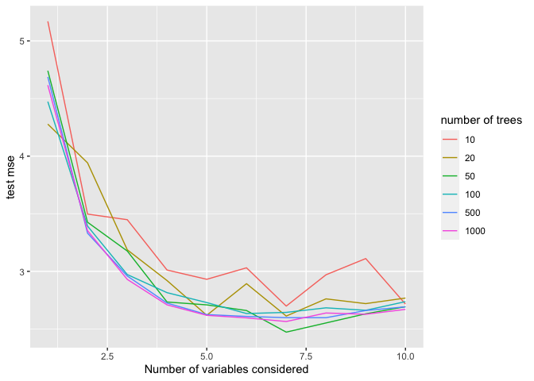

    print(importance(models[[best_model_idx]]))

    ##                %IncMSE IncNodePurity
    ## CompPrice    8.0966773    150.657892
    ## Income       2.6453460     93.208673
    ## Advertising  5.6666706     96.518922
    ## Population   2.4803834     61.938575
    ## Price       14.8123680    466.497913
    ## ShelveLoc   15.1036644    493.749884
    ## Age          4.5545935    163.705090
    ## Education   -1.5820984     46.960790
    ## Urban        0.5390858      9.076557
    ## US           1.2626993      9.027394

`ShelveLoc` and `Price` are the most important variables by both
metrics. The random forest slightly outperforms the bagged model.

### Question 9

    df_oj <- ISLR::OJ
    set.seed(1)

    train_idx <- sample(nrow(df_oj), 800)

    df_train <- df_oj[train_idx, ]
    df_test <- df_oj[-train_idx, ]

    models <- list(
      gini = NULL,
      deviance = NULL
    )
    test_aucs <- rep(0, length(models)) %>%
      setNames(., names(models))

    for (method in c("gini", "deviance")) {
      model <- tree::tree(Purchase ~ ., data = df_train, split = method)
      models[[method]] <- model
      test_preds <- predict(model, df_test)[, "MM"]

      dep_var <- ifelse(df_test$Purchase == "MM", 1, 0)
      predob <- prediction(test_preds, dep_var)
      auc <- performance(predob, "auc")@y.values[[1]]
      test_aucs[[method]] <- auc
    }

    for (model_name in names(models)){
      print(model_name)
      print(summary(models[[model_name]]))
    }

    ## [1] "gini"
    ## 
    ## Classification tree:
    ## tree::tree(formula = Purchase ~ ., data = df_train, split = method)
    ## Variables actually used in tree construction:
    ##  [1] "SpecialMM"      "SpecialCH"      "DiscCH"         "DiscMM"        
    ##  [5] "LoyalCH"        "WeekofPurchase" "STORE"          "PriceMM"       
    ##  [9] "StoreID"        "PriceCH"        "PriceDiff"      "SalePriceMM"   
    ## [13] "ListPriceDiff"  "Store7"        
    ## Number of terminal nodes:  88 
    ## Residual mean deviance:  0.6112 = 435.1 / 712 
    ## Misclassification error rate: 0.1375 = 110 / 800 
    ## [1] "deviance"
    ## 
    ## Classification tree:
    ## tree::tree(formula = Purchase ~ ., data = df_train, split = method)
    ## Variables actually used in tree construction:
    ## [1] "LoyalCH"       "PriceDiff"     "SpecialCH"     "ListPriceDiff"
    ## [5] "PctDiscMM"    
    ## Number of terminal nodes:  9 
    ## Residual mean deviance:  0.7432 = 587.8 / 791 
    ## Misclassification error rate: 0.1588 = 127 / 800

    print(test_aucs)

    ##      gini  deviance 
    ## 0.8316118 0.8947829

    plot(models$deviance)
    text(models$deviance)

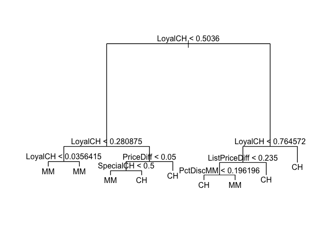

    test_preds <- predict(models$deviance, df_test, type = "class")

    table(test_preds, df_test$Purchase, dnn = c("Predicted", "Actual"))

    ##          Actual
    ## Predicted  CH  MM
    ##        CH 160  38
    ##        MM   8  64

    mean(test_preds != df_test$Purchase)

    ## [1] 0.1703704

    cv_tree <- tree::cv.tree(models$deviance, FUN = prune.misclass)

    plot(cv_tree)

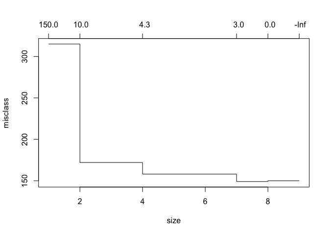

    smaller_tree <- tree::prune.tree(models$deviance, best = 7, method = "misclass")

    test_preds <- predict(models$deviance, df_test, type = "class")

    table(test_preds, df_test$Purchase, dnn = c("Predicted", "Actual"))

    ##          Actual
    ## Predicted  CH  MM
    ##        CH 160  38
    ##        MM   8  64

    mean(test_preds != df_test$Purchase)

    ## [1] 0.1703704

We see that the model built using Gini has better training deviance but
worse AUC on the test set. It is likely overfit, especially given the
large number of terminal nodes. The model built using deviance has
slightly higher error rate on the test set than on the training set,
which is to be expected. The best tree using cross validation uses 7
terminal nodes. It has the same misclassification error as the full tree
on the test set.

### Question 10

    df_hitters <- ISLR::Hitters %>%
      dplyr::filter(., !is.na(Salary)) %>%
      dplyr::mutate(., Salary = log(Salary))

    train_idx <- seq(200)
    df_train <- df_hitters[train_idx, ]
    df_test <- df_hitters[-train_idx, ]

    etas <- c(0.001, 0.01, 0.05, 0.1, 0.5, 1)
    test_mse <- rep(0, length(etas)) %>%
      setNames(., etas)

    models <- vector("list", length = length(etas)) %>%
      setNames(., etas)

    for (eta in etas) {
      model <- gbm::gbm(Salary ~ ., data = df_train, n.trees = 1000, shrinkage = eta, distribution = "gaussian")
      models[[as.character(eta)]] <- model
      preds <- predict(model, df_test)
      test_mse[[as.character(eta)]] <- mean((preds - df_test$Salary) ^ 2)
    }

    df_for_plot <- data.frame(
      shrinkage = etas,
      test_mse = test_mse
    )

    ggplot2::ggplot(data = df_for_plot) +
      ggplot2::geom_line(ggplot2::aes(x = shrinkage, y = test_mse))

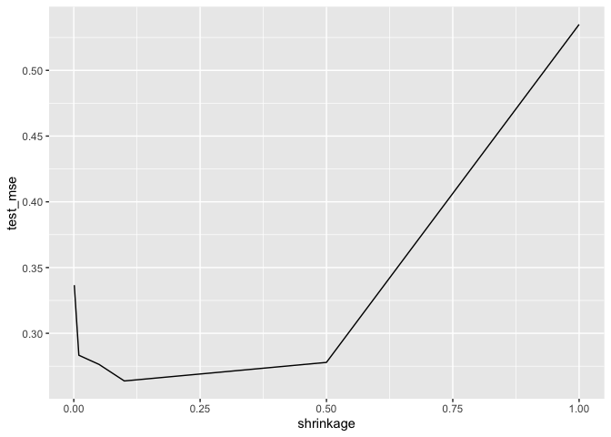

    best_idx <- which.min(test_mse)
    print(min(test_mse))

    ## [1] 0.2637596

    x_train <- model.matrix(Salary ~ ., df_train)
    y_train <- df_train$Salary

    x_test <- model.matrix(Salary ~ ., df_test)

    # Ridge regression
    glmnet_model <- glmnet::cv.glmnet(x_train, y_train)

    glmnet_preds <- predict(glmnet_model, x_test)

    print(paste("Lasso test mse", mean((glmnet_preds - df_test$Salary) ^ 2)))

    ## [1] "Lasso test mse 0.442599198536883"

    ols_model <- lm(Salary ~ ., data = df_train)
    ols_preds <- predict(ols_model, df_test)

    print(paste("Ols test mse", mean((ols_preds - df_test$Salary) ^ 2)))

    ## [1] "Ols test mse 0.491795937545494"

    summary(models[[best_idx]])

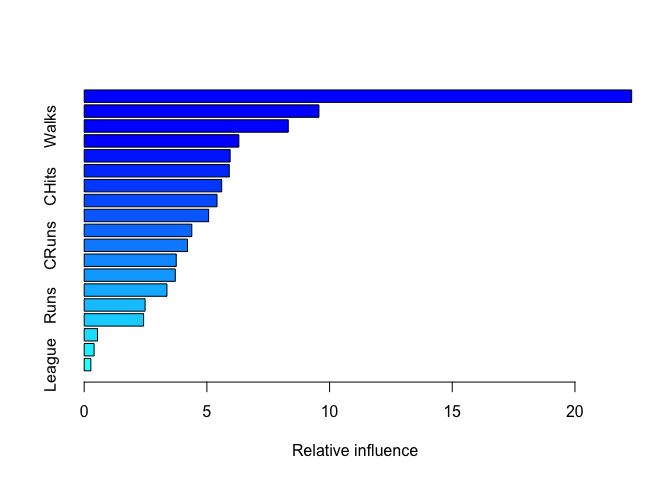

    ##                 var    rel.inf
    ## CAtBat       CAtBat 22.3125853
    ## PutOuts     PutOuts  9.5668391
    ## Walks         Walks  8.3169907
    ## CRBI           CRBI  6.3034269
    ## Years         Years  5.9480997
    ## CHmRun       CHmRun  5.9125803
    ## CHits         CHits  5.6036941
    ## CWalks       CWalks  5.4129709
    ## Assists     Assists  5.0711934
    ## Hits           Hits  4.3864218
    ## CRuns         CRuns  4.2098295
    ## RBI             RBI  3.7513709
    ## AtBat         AtBat  3.7125735
    ## HmRun         HmRun  3.3722281
    ## Runs           Runs  2.4815950
    ## Errors       Errors  2.4215422
    ## Division   Division  0.5415515
    ## NewLeague NewLeague  0.4031839
    ## League       League  0.2713233

    bagged_model <- randomForest::randomForest(Salary ~ ., data = df_train, mtry = ncol(df_train) - 1)

    bagged_preds <- predict(bagged_model, df_test)

    print(paste("Bagging test mse", mean((bagged_preds - df_test$Salary) ^ 2)))

    ## [1] "Bagging test mse 0.232820139593086"

Boosting performs much better than both LASSO and OLS. `CHits` and
`CAtBat` are the most important variables. Bagging performs slightly
better than boosting on this problem.

### Question 11

    set.seed(1)
    df_caravan <- ISLR::Caravan
    df_caravan$Purchase <- ifelse(df_caravan$Purchase == "Yes", 1, 0)

    train_idx <- seq(1000)

    df_train <- df_caravan[train_idx, ]
    df_test <- df_caravan[-train_idx, ]

    model <- gbm::gbm(Purchase ~., data = df_train, n.trees = 1000, shrinkage = 0.01)

    ## Distribution not specified, assuming bernoulli ...

    summary(model)

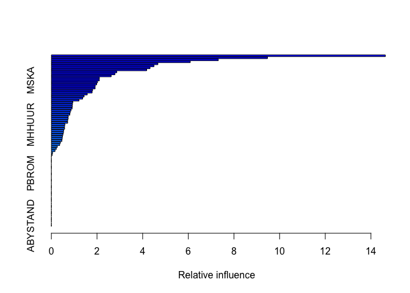

    ##               var     rel.inf
    ## PPERSAUT PPERSAUT 14.63504779
    ## MKOOPKLA MKOOPKLA  9.47091649
    ## MOPLHOOG MOPLHOOG  7.31457416
    ## MBERMIDD MBERMIDD  6.08651965
    ## PBRAND     PBRAND  4.66766122
    ## MGODGE     MGODGE  4.49463264
    ## ABRAND     ABRAND  4.32427755
    ## MINK3045 MINK3045  4.17590619
    ## MOSTYPE   MOSTYPE  2.86402583
    ## PWAPART   PWAPART  2.78191075
    ## MAUT1       MAUT1  2.61929152
    ## MBERARBG MBERARBG  2.10480508
    ## MSKA         MSKA  2.10185152
    ## MAUT2       MAUT2  2.02172510
    ## MSKC         MSKC  1.98684345
    ## MINKGEM   MINKGEM  1.92122708
    ## MGODPR     MGODPR  1.91777542
    ## MBERHOOG MBERHOOG  1.80710618
    ## MGODOV     MGODOV  1.78693913
    ## PBYSTAND PBYSTAND  1.57279593
    ## MSKB1       MSKB1  1.43551401
    ## MFWEKIND MFWEKIND  1.37264255
    ## MRELGE     MRELGE  1.20805179
    ## MOPLMIDD MOPLMIDD  0.93791970
    ## MINK7512 MINK7512  0.92590720
    ## MINK4575 MINK4575  0.91745993
    ## MGODRK     MGODRK  0.90765539
    ## MFGEKIND MFGEKIND  0.85745374
    ## MZPART     MZPART  0.82531066
    ## MRELOV     MRELOV  0.80731252
    ## MINKM30   MINKM30  0.74126812
    ## MHKOOP     MHKOOP  0.73690793
    ## MZFONDS   MZFONDS  0.71638323
    ## MAUT0       MAUT0  0.71388052
    ## MHHUUR     MHHUUR  0.59287247
    ## APERSAUT APERSAUT  0.58056986
    ## MOSHOOFD MOSHOOFD  0.58029563
    ## MSKB2       MSKB2  0.53885275
    ## PLEVEN     PLEVEN  0.53052444
    ## MINK123M MINK123M  0.50660603
    ## MBERARBO MBERARBO  0.48596479
    ## MGEMOMV   MGEMOMV  0.47614792
    ## PMOTSCO   PMOTSCO  0.46163590
    ## MSKD         MSKD  0.39735297
    ## MBERBOER MBERBOER  0.36417546
    ## MGEMLEEF MGEMLEEF  0.26166240
    ## MFALLEEN MFALLEEN  0.21448118
    ## MBERZELF MBERZELF  0.15906143
    ## MOPLLAAG MOPLLAAG  0.05263665
    ## MAANTHUI MAANTHUI  0.03766014
    ## MRELSA     MRELSA  0.00000000
    ## PWABEDR   PWABEDR  0.00000000
    ## PWALAND   PWALAND  0.00000000
    ## PBESAUT   PBESAUT  0.00000000
    ## PVRAAUT   PVRAAUT  0.00000000
    ## PAANHANG PAANHANG  0.00000000
    ## PTRACTOR PTRACTOR  0.00000000
    ## PWERKT     PWERKT  0.00000000
    ## PBROM       PBROM  0.00000000
    ## PPERSONG PPERSONG  0.00000000
    ## PGEZONG   PGEZONG  0.00000000
    ## PWAOREG   PWAOREG  0.00000000
    ## PZEILPL   PZEILPL  0.00000000
    ## PPLEZIER PPLEZIER  0.00000000
    ## PFIETS     PFIETS  0.00000000
    ## PINBOED   PINBOED  0.00000000
    ## AWAPART   AWAPART  0.00000000
    ## AWABEDR   AWABEDR  0.00000000
    ## AWALAND   AWALAND  0.00000000
    ## ABESAUT   ABESAUT  0.00000000
    ## AMOTSCO   AMOTSCO  0.00000000
    ## AVRAAUT   AVRAAUT  0.00000000
    ## AAANHANG AAANHANG  0.00000000
    ## ATRACTOR ATRACTOR  0.00000000
    ## AWERKT     AWERKT  0.00000000
    ## ABROM       ABROM  0.00000000
    ## ALEVEN     ALEVEN  0.00000000
    ## APERSONG APERSONG  0.00000000
    ## AGEZONG   AGEZONG  0.00000000
    ## AWAOREG   AWAOREG  0.00000000
    ## AZEILPL   AZEILPL  0.00000000
    ## APLEZIER APLEZIER  0.00000000
    ## AFIETS     AFIETS  0.00000000
    ## AINBOED   AINBOED  0.00000000
    ## ABYSTAND ABYSTAND  0.00000000

    preds <- predict(model, df_test, type = "response")
    pred_labels <- ifelse(preds >= 0.2, 1, 0)

    table(pred_labels, df_test$Purchase, dnn = c("predicted", "actual"))

    ##          actual
    ## predicted    0    1
    ##         0 4410  256
    ##         1  123   33

    print(paste("Precision from gbm:", 33 / (33 + 123) ))

    ## [1] "Precision from gbm: 0.211538461538462"

    x_train <- model.matrix(Purchase ~ ., data = df_train)
    x_test <- model.matrix(Purchase ~ ., data = df_test)
    y_train <- df_train$Purchase

    knn_preds <- class::knn(x_train, x_test, y_train, k = 8, prob = TRUE)
    probs <- attr(knn_preds, "prob")
    probs <- ifelse(knn_preds == 1, probs, 1 - probs )

    pred_labels <- ifelse(probs >= 0.2, 1, 0)

    table(pred_labels, df_test$Purchase, dnn = c("predicted", "actual"))

    ##          actual
    ## predicted    0    1
    ##         0 4020  222
    ##         1  513   67

    print(paste("Precision from knn:", 67 / (67 + 513)))

    ## [1] "Precision from knn: 0.11551724137931"

    logistic_regression_model <- glm(Purchase ~ ., data = df_train, family = "binomial")
    preds <- predict(logistic_regression_model, df_test, type = "response")

    pred_labels <- ifelse(preds >= 0.2, 1, 0)

    table(pred_labels, df_test$Purchase, dnn = c("predicted", "actual"))

    ##          actual
    ## predicted    0    1
    ##         0 4183  231
    ##         1  350   58

    print(paste("Precision from LR:", 58 / (58 + 350) ))

    ## [1] "Precision from LR: 0.142156862745098"

### Question 12

    df_auto <- ISLR::Auto %>%
      dplyr::select(., -name) %>%
      dplyr::mutate(., mpg = ifelse(mpg >= median(mpg), 1, 0))

    nrows <- nrow(df_auto)

    set.seed(1)
    train_idx <- sample(nrows, nrows %/% 2)

    df_train <- df_auto[train_idx, ]
    df_test <- df_auto[-train_idx, ]

    bagged_model <- randomForest::randomForest(as.factor(mpg) ~ ., data = df_train, mtry = ncol(df_train) - 1)

    preds_bagged <- predict(bagged_model, df_test)

    print(paste("error rate from bagging trees:", mean(preds_bagged != df_test$mpg)))

    ## [1] "error rate from bagging trees: 0.0969387755102041"

    random_forest_model <- randomForest::randomForest(as.factor(mpg) ~ ., data = df_train)

    preds_random_forest <- predict(random_forest_model, df_test)

    print(paste("error rate from random forest:", mean(preds_random_forest != df_test$mpg)))

    ## [1] "error rate from random forest: 0.0969387755102041"

    boosted_model <- gbm::gbm(mpg ~ ., data = df_train, n.trees = 1000, shrinkage = 0.05)

    ## Distribution not specified, assuming bernoulli ...

    preds_boosted <- predict(boosted_model, df_test, type = "response")
    preds_boosted <- preds_boosted >= 0.5

    print(paste("error rate from gbm:", mean(preds_boosted != df_test$mpg)))

    ## [1] "error rate from gbm: 0.0816326530612245"

random forest and bagging have the same error rate on the test set,
while boosting has slightly higher error.
