-   [Conceptual](#conceptual)
    -   [Question 1](#question-1)
    -   [Question 2](#question-2)
    -   [Question 3](#question-3)
-   [Applied](#applied)
    -   [Question 4](#question-4)
    -   [Question 5](#question-5)
    -   [Question 6](#question-6)
    -   [Question 7](#question-7)
    -   [Question 8](#question-8)

    library(ggplot2)

## Conceptual

### Question 1

  

    x1 <- seq(-1000, 1000)
    x2 <- 1 + 3 * x1
    x3 <- 1 - x1 / 2

    df_for_plot <- data.frame(x1 = x1, x2 = x2, x3 = x3)

    ggplot2::ggplot(data = df_for_plot) +
      ggplot2::geom_line(ggplot2::aes(x = x1, y = x2), color = "red") +
      ggplot2::geom_text(x = -500, y = 2000, label = "1 + 3 * X1 - X2 < 0", color = "red") +
      ggplot2::geom_text(x = 500, y = -2000, label = "1 + 3 * X1 - X2 > 0", color = "red") +
      ggplot2::geom_line(ggplot2::aes(x = x1, y = x3), color = "black") +
      ggplot2::geom_text(x = -250, y = -2000, label = "-2 + X1 + 2X2 < 0") +
      ggplot2::geom_text(x = 250, y = 2000, label = "-2 + X1 + 2X2 > 0")

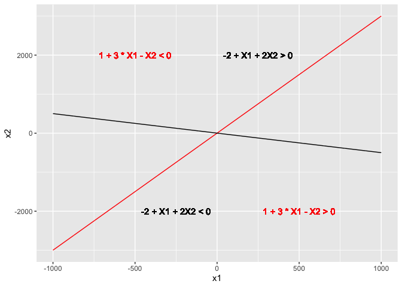

### Question 2

  

    x1 <- seq(-3, 1, length = 1000)

    x2 <- c(
      2 + sqrt(4 - (1 + x1) ^ 2),
      2 - sqrt(4 - (1 + x1) ^ 2)
    )
    x1 <- rep(x1, 2)

    df_for_plot <- data.frame(x1 = x1, x2 = x2)

    df_test_points <- data.frame(
      x1 = c(0, -1, 2, 3),
      x2 = c(0, 1, 2, 8),
      predicted_class = c("blue", "red", "blue", "blue")
    )

    ggplot2::ggplot(data = df_for_plot) +
      ggplot2::geom_point(ggplot2::aes(x = x1, y = x2)) +
      ggplot2::geom_text(x = -1, y = 5, label = "(1 + x[1])^2 + (2 - x[2])^2 > 4", parse = TRUE) +
      ggplot2::geom_text(x = -1, y =2, label = "(1 + x[1])^2 + (2 - x[2])^2 < 4", parse = TRUE) +
      ggplot2::geom_point(data = df_test_points, ggplot2::aes(x = x1, y = x2, color = predicted_class)) +
      ggplot2::scale_color_manual(values = list(blue = "blue", red = "red"), breaks = NULL) +
      ggplot2::lims(x = c(-8, 8), y = c(-5, 8))

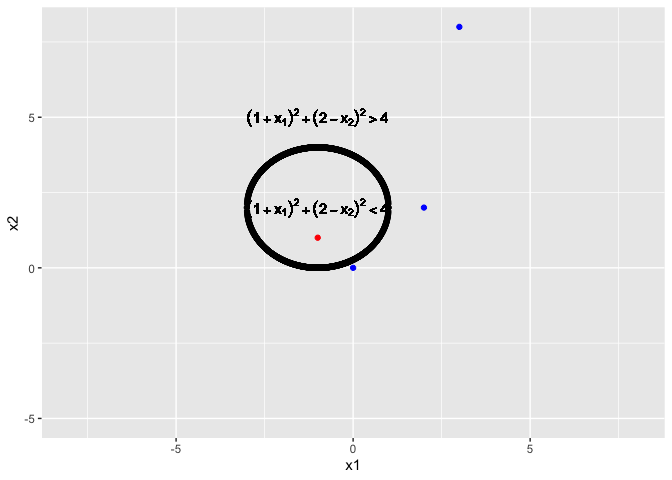

(1+*X*1)2 + (2−*X*2)2 = 4

1 + 2*X*1 + *X*12 + 4 − 4*X*2 + *X*22 = 4

which is linear in
*X*1, *X*12, *X*2, *X*22

### Question 3

  

    df <- data.frame(
      x1 = c(3, 2, 4, 1, 2, 4, 4),
      x2 = c(4, 2, 4, 4, 1, 3, 1),
      y = c(rep("red", 4), rep("blue", 3))
    )

    support_vectors <- data.frame(
      x1 = c(2, 4, 2, 4),
      x2 = c(2, 4, 1, 3)
    )

    slope <- 1
    intercept <- -0.5

    ggplot2::ggplot(data = df) +
      ggplot2::geom_point(ggplot2::aes(x = x1, y = x2, color = y)) +
      ggplot2::scale_color_manual(values = list(red = "red", blue = "blue"), breaks = NULL) +
      ggplot2::geom_abline(intercept = intercept, slope = slope) +
      ggplot2::geom_abline(intercept = intercept + 0.5, slope = slope, linetype = 3) +
      ggplot2::geom_abline(intercept = intercept - 0.5, slope = slope, linetype = 3) +
      ggplot2::geom_point(data = support_vectors, ggplot2::aes(x = x1, y = x2), shape = 4, size = 5) +
      ggplot2::geom_text(x = 3.5, y = 1.5, label = "red observation s.t problem is \nnot linearly separable")

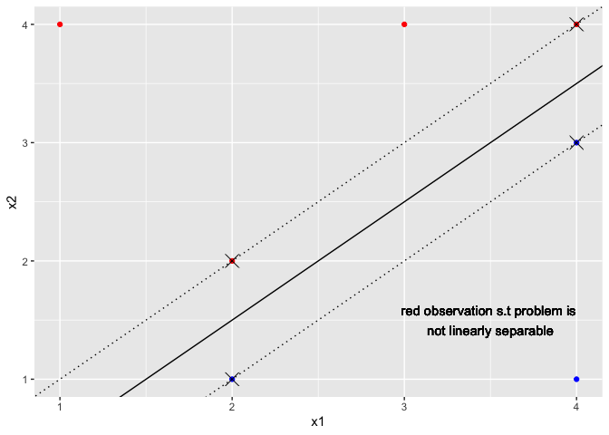

Classify to `red` if  − 0.5 + *β*1 − *β*2 &lt; 0,
classify to `blue` otherwise. Point 7 is not a support vector so a
slight perturbation will not change the optimization problem. Either of
the dotted lines would not be the optimal separating hyperplane; the
equation of the top line is *β*1 − *β*2 = 0

## Applied

### Question 4

  

    nrows <- 100
    ncols <- 2
    set.seed(1)
    x <- matrix(rnorm(nrows * ncols), nrows, ncols)
    response <- x[, 1] + x[, 2] ^ 2

    y <- response > 1

    # Make the classes clearly separable
    df <- as.data.frame(x) %>%
      setNames(., c("X1", "X2")) %>%
      dplyr::mutate(y = as.factor(y)) %>%
      dplyr::filter(., abs(response - 1) > 0.5)

    ggplot2::ggplot(data = df) +
      ggplot2::geom_point(ggplot2::aes(x = X1, y = X2, color = y), show.legend = FALSE)

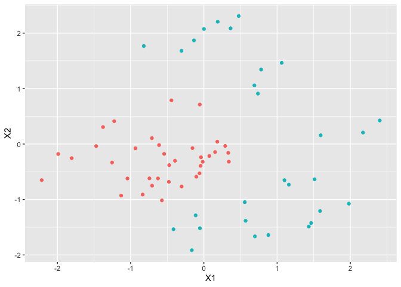

    nrows <- nrow(df)
    train_idx <- sample(nrows, nrows %/% 2)
    df_train <- df[train_idx, ]
    df_test <- df[-train_idx, ]

    linear_model <- e1071::svm(y ~ ., data = df_train, kernel = "linear")

    table(linear_model$fitted, df_train$y, dnn = c("predicted", "actual"))

    ##          actual
    ## predicted FALSE TRUE
    ##     FALSE    18    4
    ##     TRUE      0   10

    mean(linear_model$fitted != df_train$y)

    ## [1] 0.125

    polynomial_model <- e1071::svm(y ~ ., data = df_train, kernel = "polynomial", cost = 100)

    table(polynomial_model$fitted, df_train$y, dnn = c("predicted", "actual"))

    ##          actual
    ## predicted FALSE TRUE
    ##     FALSE    18    1
    ##     TRUE      0   13

    mean(polynomial_model$fitted != df_train$y)

    ## [1] 0.03125

    radial_model <- e1071::svm(y ~ ., data = df_train, kernel = "radial", cost = 100)

    table(radial_model$fitted, df_train$y)

    ##        
    ##         FALSE TRUE
    ##   FALSE    18    0
    ##   TRUE      0   14

    mean(radial_model$fitted != df_train$y)

    ## [1] 0

    models <- list(linear = linear_model, polynomial = polynomial_model, radial = radial_model)
    for (model_name in names(models)) {
      preds <- predict(models[[model_name]], df_test)
      test_error_rate <- mean(preds != df_test$y)
      print(paste("Test error rate for", model_name, ":", test_error_rate))
    }

    ## [1] "Test error rate for linear : 0.151515151515152"
    ## [1] "Test error rate for polynomial : 0.151515151515152"
    ## [1] "Test error rate for radial : 0"

    plot(linear_model, data = df_train)

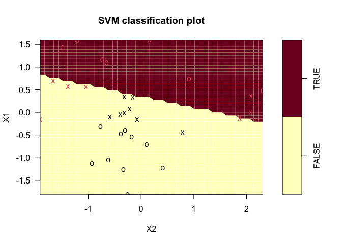

    plot(polynomial_model, data = df_train)

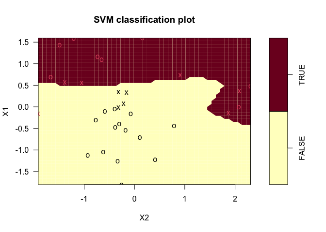

    plot(radial_model, data = df_train)

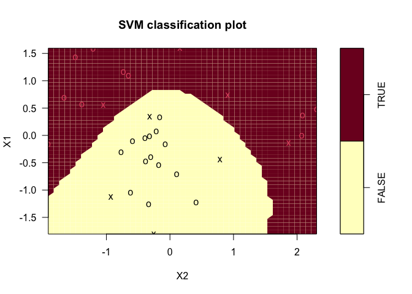

The radial model gets perfect training accuracy as well as perfect test
accuracy.

### Question 5

  

    ncols <- 2
    nrows <- 500
    set.seed(1)

    df <- data.frame(
      x1 = rnorm(nrows),
      x2 = rnorm(nrows)
    )

    df$y <- as.factor((df$x1 ^ 2 - df$x2 ^ 2) > 0)

    ggplot2::ggplot(data = df) +
      ggplot2::geom_point(ggplot2::aes(x = x1, y = x2, color = y), show.legend = FALSE)

    model <- glm(y ~ ., data = df, family = "binomial")
    df$logistic_regression_pred <- as.factor(predict(model, type = "response") >= 0.5)

    coefs <- coef(model)

    decision_boundary_intercept <- -coefs[[1]] / coefs[[3]]
    decision_boundary_slope <- -coefs[[2]] / coefs[[3]]

    ggplot2::ggplot(data = df) +
      ggplot2::geom_point(ggplot2::aes(x = x1, y = x2, color = logistic_regression_pred), show.legend = FALSE) +
      ggplot2::geom_abline(intercept = decision_boundary_intercept, slope = decision_boundary_slope)

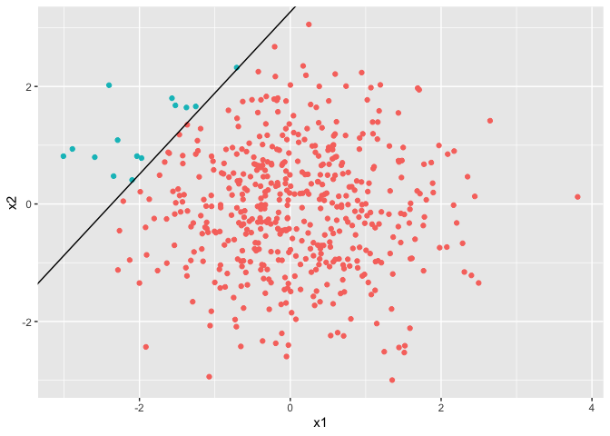

    model <- glm(y ~ poly(x1, 2) + poly(x2, 2), data = df, family = "binomial")
    df$logistic_regression_non_linear_pred <- as.factor(predict(model, type = "response") >= 0.5)

    ggplot2::ggplot(data = df) +
      ggplot2::geom_point(ggplot2::aes(x = x1, y = x2, color = logistic_regression_non_linear_pred), show.legend = FALSE)

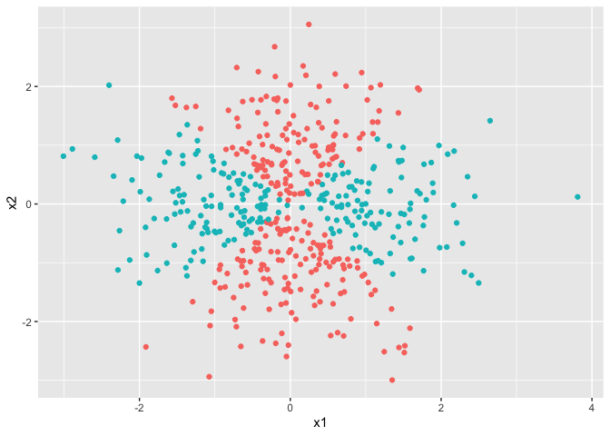

    # Note that the classes are linearly separable so the coefficient estimates are unstable

    model <- e1071::svm(y ~ x1 + x2, data = df, kernel = "linear")
    df$svc_pred <- predict(model)

    plot(model, df[c("y", "x1", "x2")])

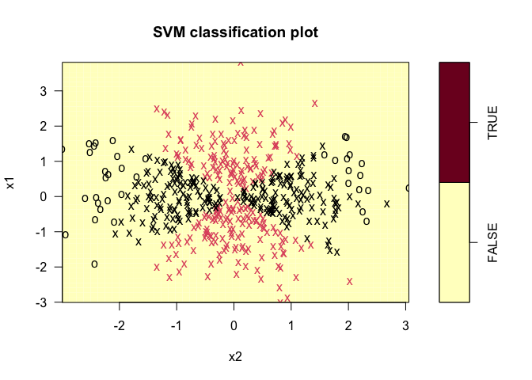

    ggplot2::ggplot(data = df) +
      ggplot2::geom_point(ggplot2::aes(x = x1, y = x2, color = svc_pred), show.legend = FALSE)

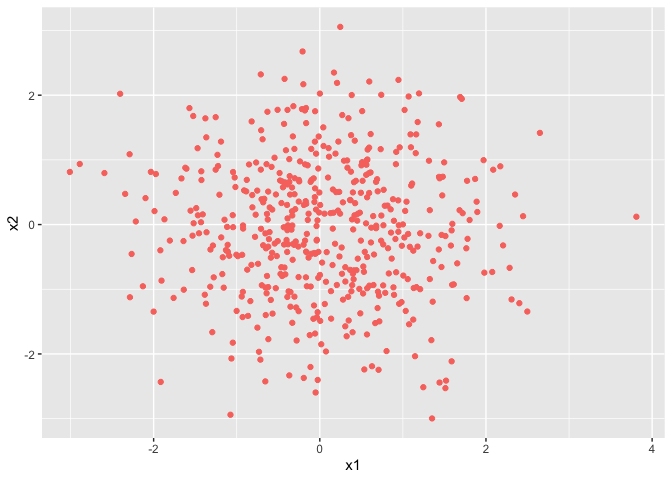

    model <- e1071::svm(y ~ x1 + x2, data = df, kernel = "radial")
    df$svm_pred <- predict(model)

    plot(model, df[c("y", "x1", "x2")])

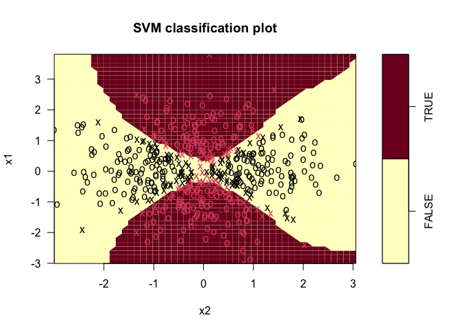

    ggplot2::ggplot(data = df) +
      ggplot2::geom_point(ggplot2::aes(x = x1, y = x2, color = svm_pred), show.legend = FALSE)

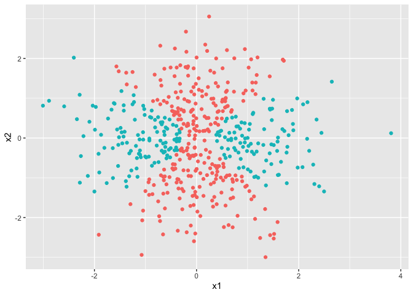

### Question 6

  

    set.seed(1)
    ncols <- 2
    nrows <- 100
    x <- matrix(rnorm(nrows * ncols), nrows, ncols)

    y <- as.factor(x[, 1] - x[, 2] > 0)

    df <- x %>%
      as.data.frame(.) %>%
      setNames(., c("X1", "X2")) %>%
      dplyr::mutate(., y = y)

    df_easily_separable <- df %>%
      dplyr::filter(., abs(X1 - X2) > 0.4)

    df_not_easily_separable <- df %>%
      dplyr::filter(., abs(X1 - X2) <= 0.05) %>%
      head(., 1)

    df_train <- dplyr::bind_rows(df_easily_separable, df_not_easily_separable)

    ggplot2::ggplot(data = df_train) +
      ggplot2::geom_point(ggplot2::aes(x = X1, y = X2, color = y), show.legend = TRUE)

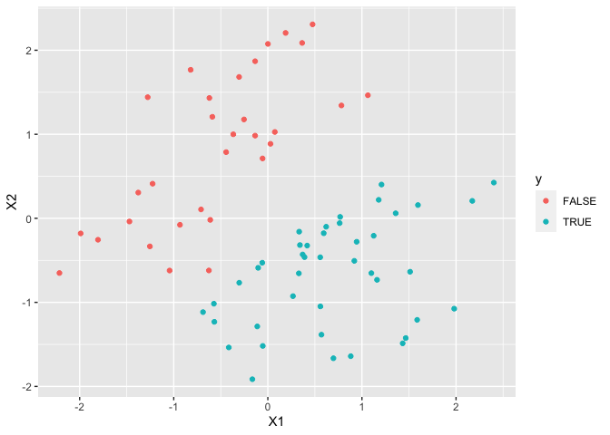

    x <- matrix(rnorm(nrows * ncols), nrows, ncols)

    y <- as.factor(x[, 1] - x[, 2] > 0)

    df_test <- x %>%
      as.data.frame(.) %>%
      setNames(., c("X1", "X2")) %>%
      dplyr::mutate(., y = y)

    cv_results <- e1071::tune(
      e1071::svm, y ~ ., data = df_train,
      ranges = list(cost = c(0.01, 1, 100, 1000, 5000)), kernel = "linear"
    )
    best_model <- cv_results$best.model

    print(summary(cv_results))

    ## 
    ## Parameter tuning of 'e1071::svm':
    ## 
    ## - sampling method: 10-fold cross validation 
    ## 
    ## - best parameters:
    ##  cost
    ##   100
    ## 
    ## - best performance: 0 
    ## 
    ## - Detailed performance results:
    ##    cost     error dispersion
    ## 1 1e-02 0.2410714 0.25894568
    ## 2 1e+00 0.0125000 0.03952847
    ## 3 1e+02 0.0000000 0.00000000
    ## 4 1e+03 0.0000000 0.00000000
    ## 5 5e+03 0.0000000 0.00000000

    train_preds <- predict(best_model)

    mean(train_preds != df_train$y)

    ## [1] 0

    models <- lapply(
      c(0.01, 1, 100, 1000, 5000) %>% setNames(., .),
      function(cost, df) {
        svm(y ~ ., data = df, kernel = "linear", cost = cost)
      },
      df = df_train
    )

    train_errors <- sapply(
      models,
      function(model, df) {
        mean(predict(model) != df$y)
      },
      df = df_train
    )

    names(train_errors)[which.min(train_errors)]

    ## [1] "100"

    test_errors <- sapply(
      models,
      function(model, df) {
        mean(predict(model, df) != df$y)
      },
      df = df_test
    )

    names(test_errors)[which.min(test_errors)]

    ## [1] "1"

### Question 7

    df_auto <- ISLR::Auto %>%
      dplyr::mutate(., mpg = as.factor(ifelse(mpg >= median(mpg), 1, 0)))

    cross_validation <- e1071::tune(
      e1071::svm, mpg ~ ., data = df_auto,
      ranges = list(
        cost = c(0.01, 0.1, 1, 10, 50, 100, 500),
        kernel = c("linear", "polynomial", "radial"),
        degree = c(2, 3, 4),
        gamma = c(0.01, 0.1, 0.5, 1)
      )
    )

    print(summary(cross_validation))

    ## 
    ## Parameter tuning of 'e1071::svm':
    ## 
    ## - sampling method: 10-fold cross validation 
    ## 
    ## - best parameters:
    ##  cost kernel degree gamma
    ##    10 radial      2   0.5
    ## 
    ## - best performance: 0.08153846 
    ## 
    ## - Detailed performance results:
    ##      cost     kernel degree gamma      error dispersion
    ## 1   1e-02     linear      2  0.01 0.08916667 0.05395327
    ## 2   1e-01     linear      2  0.01 0.09173077 0.04968530
    ## 3   1e+00     linear      2  0.01 0.09166667 0.03974704
    ## 4   1e+01     linear      2  0.01 0.11192308 0.05284927
    ## 5   5e+01     linear      2  0.01 0.11967949 0.06065068
    ## 6   1e+02     linear      2  0.01 0.11724359 0.06146307
    ## 7   5e+02     linear      2  0.01 0.11467949 0.05906599
    ## 8   1e-02 polynomial      2  0.01 0.55108974 0.03316037
    ## 9   1e-01 polynomial      2  0.01 0.55108974 0.03316037
    ## 10  1e+00 polynomial      2  0.01 0.53076923 0.05746552
    ## 11  1e+01 polynomial      2  0.01 0.30634615 0.06755682
    ## 12  5e+01 polynomial      2  0.01 0.26551282 0.05595011
    ## 13  1e+02 polynomial      2  0.01 0.29096154 0.05073286
    ## 14  5e+02 polynomial      2  0.01 0.17608974 0.06102592
    ## 15  1e-02     radial      2  0.01 0.55108974 0.03316037
    ## 16  1e-01     radial      2  0.01 0.11461538 0.05038188
    ## 17  1e+00     radial      2  0.01 0.08916667 0.05395327
    ## 18  1e+01     radial      2  0.01 0.08660256 0.04658164
    ## 19  5e+01     radial      2  0.01 0.09153846 0.04089835
    ## 20  1e+02     radial      2  0.01 0.08916667 0.03203197
    ## 21  5e+02     radial      2  0.01 0.10955128 0.05074366
    ## 22  1e-02     linear      3  0.01 0.08916667 0.05395327
    ## 23  1e-01     linear      3  0.01 0.09173077 0.04968530
    ## 24  1e+00     linear      3  0.01 0.09166667 0.03974704
    ## 25  1e+01     linear      3  0.01 0.11192308 0.05284927
    ## 26  5e+01     linear      3  0.01 0.11967949 0.06065068
    ## 27  1e+02     linear      3  0.01 0.11724359 0.06146307
    ## 28  5e+02     linear      3  0.01 0.11467949 0.05906599
    ## 29  1e-02 polynomial      3  0.01 0.55108974 0.03316037
    ## 30  1e-01 polynomial      3  0.01 0.55108974 0.03316037
    ## 31  1e+00 polynomial      3  0.01 0.55108974 0.03316037
    ## 32  1e+01 polynomial      3  0.01 0.29865385 0.06957315
    ## 33  5e+01 polynomial      3  0.01 0.25775641 0.05052364
    ## 34  1e+02 polynomial      3  0.01 0.25525641 0.04726890
    ## 35  5e+02 polynomial      3  0.01 0.09429487 0.04645208
    ## 36  1e-02     radial      3  0.01 0.55108974 0.03316037
    ## 37  1e-01     radial      3  0.01 0.11461538 0.05038188
    ## 38  1e+00     radial      3  0.01 0.08916667 0.05395327
    ## 39  1e+01     radial      3  0.01 0.08660256 0.04658164
    ## 40  5e+01     radial      3  0.01 0.09153846 0.04089835
    ## 41  1e+02     radial      3  0.01 0.08916667 0.03203197
    ## 42  5e+02     radial      3  0.01 0.10955128 0.05074366
    ## 43  1e-02     linear      4  0.01 0.08916667 0.05395327
    ## 44  1e-01     linear      4  0.01 0.09173077 0.04968530
    ## 45  1e+00     linear      4  0.01 0.09166667 0.03974704
    ## 46  1e+01     linear      4  0.01 0.11192308 0.05284927
    ## 47  5e+01     linear      4  0.01 0.11967949 0.06065068
    ## 48  1e+02     linear      4  0.01 0.11724359 0.06146307
    ## 49  5e+02     linear      4  0.01 0.11467949 0.05906599
    ## 50  1e-02 polynomial      4  0.01 0.55108974 0.03316037
    ## 51  1e-01 polynomial      4  0.01 0.55108974 0.03316037
    ## 52  1e+00 polynomial      4  0.01 0.55108974 0.03316037
    ## 53  1e+01 polynomial      4  0.01 0.55108974 0.03316037
    ## 54  5e+01 polynomial      4  0.01 0.45179487 0.08673308
    ## 55  1e+02 polynomial      4  0.01 0.43653846 0.07638941
    ## 56  5e+02 polynomial      4  0.01 0.37544872 0.08139991
    ## 57  1e-02     radial      4  0.01 0.55108974 0.03316037
    ## 58  1e-01     radial      4  0.01 0.11461538 0.05038188
    ## 59  1e+00     radial      4  0.01 0.08916667 0.05395327
    ## 60  1e+01     radial      4  0.01 0.08660256 0.04658164
    ## 61  5e+01     radial      4  0.01 0.09153846 0.04089835
    ## 62  1e+02     radial      4  0.01 0.08916667 0.03203197
    ## 63  5e+02     radial      4  0.01 0.10955128 0.05074366
    ## 64  1e-02     linear      2  0.10 0.08916667 0.05395327
    ## 65  1e-01     linear      2  0.10 0.09173077 0.04968530
    ## 66  1e+00     linear      2  0.10 0.09166667 0.03974704
    ## 67  1e+01     linear      2  0.10 0.11192308 0.05284927
    ## 68  5e+01     linear      2  0.10 0.11967949 0.06065068
    ## 69  1e+02     linear      2  0.10 0.11724359 0.06146307
    ## 70  5e+02     linear      2  0.10 0.11467949 0.05906599
    ## 71  1e-02 polynomial      2  0.10 0.53076923 0.05746552
    ## 72  1e-01 polynomial      2  0.10 0.30634615 0.06755682
    ## 73  1e+00 polynomial      2  0.10 0.29096154 0.05073286
    ## 74  1e+01 polynomial      2  0.10 0.17102564 0.05017119
    ## 75  5e+01 polynomial      2  0.10 0.18128205 0.04489906
    ## 76  1e+02 polynomial      2  0.10 0.19141026 0.05466011
    ## 77  5e+02 polynomial      2  0.10 0.21198718 0.07114457
    ## 78  1e-02     radial      2  0.10 0.22467949 0.07471135
    ## 79  1e-01     radial      2  0.10 0.08916667 0.05117372
    ## 80  1e+00     radial      2  0.10 0.08660256 0.04498607
    ## 81  1e+01     radial      2  0.10 0.08410256 0.03401237
    ## 82  5e+01     radial      2  0.10 0.09929487 0.04172136
    ## 83  1e+02     radial      2  0.10 0.09929487 0.03993206
    ## 84  5e+02     radial      2  0.10 0.10448718 0.04529108
    ## 85  1e-02     linear      3  0.10 0.08916667 0.05395327
    ## 86  1e-01     linear      3  0.10 0.09173077 0.04968530
    ## 87  1e+00     linear      3  0.10 0.09166667 0.03974704
    ## 88  1e+01     linear      3  0.10 0.11192308 0.05284927
    ## 89  5e+01     linear      3  0.10 0.11967949 0.06065068
    ## 90  1e+02     linear      3  0.10 0.11724359 0.06146307
    ## 91  5e+02     linear      3  0.10 0.11467949 0.05906599
    ## 92  1e-02 polynomial      3  0.10 0.29865385 0.06957315
    ## 93  1e-01 polynomial      3  0.10 0.25525641 0.04726890
    ## 94  1e+00 polynomial      3  0.10 0.09448718 0.04548342
    ## 95  1e+01 polynomial      3  0.10 0.09192308 0.06079141
    ## 96  5e+01 polynomial      3  0.10 0.08160256 0.02896233
    ## 97  1e+02 polynomial      3  0.10 0.08923077 0.03222715
    ## 98  5e+02 polynomial      3  0.10 0.09948718 0.03703652
    ## 99  1e-02     radial      3  0.10 0.22467949 0.07471135
    ## 100 1e-01     radial      3  0.10 0.08916667 0.05117372
    ## 101 1e+00     radial      3  0.10 0.08660256 0.04498607
    ## 102 1e+01     radial      3  0.10 0.08410256 0.03401237
    ## 103 5e+01     radial      3  0.10 0.09929487 0.04172136
    ## 104 1e+02     radial      3  0.10 0.09929487 0.03993206
    ## 105 5e+02     radial      3  0.10 0.10448718 0.04529108
    ## 106 1e-02     linear      4  0.10 0.08916667 0.05395327
    ## 107 1e-01     linear      4  0.10 0.09173077 0.04968530
    ## 108 1e+00     linear      4  0.10 0.09166667 0.03974704
    ## 109 1e+01     linear      4  0.10 0.11192308 0.05284927
    ## 110 5e+01     linear      4  0.10 0.11967949 0.06065068
    ## 111 1e+02     linear      4  0.10 0.11724359 0.06146307
    ## 112 5e+02     linear      4  0.10 0.11467949 0.05906599
    ## 113 1e-02 polynomial      4  0.10 0.43653846 0.07638941
    ## 114 1e-01 polynomial      4  0.10 0.34217949 0.07026296
    ## 115 1e+00 polynomial      4  0.10 0.26038462 0.04709859
    ## 116 1e+01 polynomial      4  0.10 0.21929487 0.05086229
    ## 117 5e+01 polynomial      4  0.10 0.21442308 0.03300193
    ## 118 1e+02 polynomial      4  0.10 0.21705128 0.03963108
    ## 119 5e+02 polynomial      4  0.10 0.21705128 0.07327546
    ## 120 1e-02     radial      4  0.10 0.22467949 0.07471135
    ## 121 1e-01     radial      4  0.10 0.08916667 0.05117372
    ## 122 1e+00     radial      4  0.10 0.08660256 0.04498607
    ## 123 1e+01     radial      4  0.10 0.08410256 0.03401237
    ## 124 5e+01     radial      4  0.10 0.09929487 0.04172136
    ## 125 1e+02     radial      4  0.10 0.09929487 0.03993206
    ## 126 5e+02     radial      4  0.10 0.10448718 0.04529108
    ## 127 1e-02     linear      2  0.50 0.08916667 0.05395327
    ## 128 1e-01     linear      2  0.50 0.09173077 0.04968530
    ## 129 1e+00     linear      2  0.50 0.09166667 0.03974704
    ## 130 1e+01     linear      2  0.50 0.11192308 0.05284927
    ## 131 5e+01     linear      2  0.50 0.11967949 0.06065068
    ## 132 1e+02     linear      2  0.50 0.11724359 0.06146307
    ## 133 5e+02     linear      2  0.50 0.11467949 0.05906599
    ## 134 1e-02 polynomial      2  0.50 0.26294872 0.05053299
    ## 135 1e-01 polynomial      2  0.50 0.18628205 0.02456466
    ## 136 1e+00 polynomial      2  0.50 0.17871795 0.05030116
    ## 137 1e+01 polynomial      2  0.50 0.20679487 0.06146660
    ## 138 5e+01 polynomial      2  0.50 0.22737179 0.08736262
    ## 139 1e+02 polynomial      2  0.50 0.25025641 0.08229531
    ## 140 5e+02 polynomial      2  0.50 0.25788462 0.08095559
    ## 141 1e-02     radial      2  0.50 0.55108974 0.03316037
    ## 142 1e-01     radial      2  0.50 0.08923077 0.04828946
    ## 143 1e+00     radial      2  0.50 0.08660256 0.04161179
    ## 144 1e+01     radial      2  0.50 0.08153846 0.02592049
    ## 145 5e+01     radial      2  0.50 0.08410256 0.02377428
    ## 146 1e+02     radial      2  0.50 0.08410256 0.02377428
    ## 147 5e+02     radial      2  0.50 0.08410256 0.02377428
    ## 148 1e-02     linear      3  0.50 0.08916667 0.05395327
    ## 149 1e-01     linear      3  0.50 0.09173077 0.04968530
    ## 150 1e+00     linear      3  0.50 0.09166667 0.03974704
    ## 151 1e+01     linear      3  0.50 0.11192308 0.05284927
    ## 152 5e+01     linear      3  0.50 0.11967949 0.06065068
    ## 153 1e+02     linear      3  0.50 0.11724359 0.06146307
    ## 154 5e+02     linear      3  0.50 0.11467949 0.05906599
    ## 155 1e-02 polynomial      3  0.50 0.08935897 0.03884801
    ## 156 1e-01 polynomial      3  0.50 0.09192308 0.05833858
    ## 157 1e+00 polynomial      3  0.50 0.08923077 0.03222715
    ## 158 1e+01 polynomial      3  0.50 0.10205128 0.02691595
    ## 159 5e+01 polynomial      3  0.50 0.10717949 0.02910661
    ## 160 1e+02 polynomial      3  0.50 0.10717949 0.02910661
    ## 161 5e+02 polynomial      3  0.50 0.10717949 0.02910661
    ## 162 1e-02     radial      3  0.50 0.55108974 0.03316037
    ## 163 1e-01     radial      3  0.50 0.08923077 0.04828946
    ## 164 1e+00     radial      3  0.50 0.08660256 0.04161179
    ## 165 1e+01     radial      3  0.50 0.08153846 0.02592049
    ## 166 5e+01     radial      3  0.50 0.08410256 0.02377428
    ## 167 1e+02     radial      3  0.50 0.08410256 0.02377428
    ## 168 5e+02     radial      3  0.50 0.08410256 0.02377428
    ## 169 1e-02     linear      4  0.50 0.08916667 0.05395327
    ## 170 1e-01     linear      4  0.50 0.09173077 0.04968530
    ## 171 1e+00     linear      4  0.50 0.09166667 0.03974704
    ## 172 1e+01     linear      4  0.50 0.11192308 0.05284927
    ## 173 5e+01     linear      4  0.50 0.11967949 0.06065068
    ## 174 1e+02     linear      4  0.50 0.11724359 0.06146307
    ## 175 5e+02     linear      4  0.50 0.11467949 0.05906599
    ## 176 1e-02 polynomial      4  0.50 0.20653846 0.05133349
    ## 177 1e-01 polynomial      4  0.50 0.21698718 0.03319505
    ## 178 1e+00 polynomial      4  0.50 0.20935897 0.06858422
    ## 179 1e+01 polynomial      4  0.50 0.22467949 0.05171227
    ## 180 5e+01 polynomial      4  0.50 0.22980769 0.05743473
    ## 181 1e+02 polynomial      4  0.50 0.22980769 0.05743473
    ## 182 5e+02 polynomial      4  0.50 0.22980769 0.05743473
    ## 183 1e-02     radial      4  0.50 0.55108974 0.03316037
    ## 184 1e-01     radial      4  0.50 0.08923077 0.04828946
    ## 185 1e+00     radial      4  0.50 0.08660256 0.04161179
    ## 186 1e+01     radial      4  0.50 0.08153846 0.02592049
    ## 187 5e+01     radial      4  0.50 0.08410256 0.02377428
    ## 188 1e+02     radial      4  0.50 0.08410256 0.02377428
    ## 189 5e+02     radial      4  0.50 0.08410256 0.02377428
    ## 190 1e-02     linear      2  1.00 0.08916667 0.05395327
    ## 191 1e-01     linear      2  1.00 0.09173077 0.04968530
    ## 192 1e+00     linear      2  1.00 0.09166667 0.03974704
    ## 193 1e+01     linear      2  1.00 0.11192308 0.05284927
    ## 194 5e+01     linear      2  1.00 0.11967949 0.06065068
    ## 195 1e+02     linear      2  1.00 0.11724359 0.06146307
    ## 196 5e+02     linear      2  1.00 0.11467949 0.05906599
    ## 197 1e-02 polynomial      2  1.00 0.29096154 0.05073286
    ## 198 1e-01 polynomial      2  1.00 0.17102564 0.05017119
    ## 199 1e+00 polynomial      2  1.00 0.19141026 0.05466011
    ## 200 1e+01 polynomial      2  1.00 0.22737179 0.07376101
    ## 201 5e+01 polynomial      2  1.00 0.25788462 0.08095559
    ## 202 1e+02 polynomial      2  1.00 0.25788462 0.08095559
    ## 203 5e+02 polynomial      2  1.00 0.25788462 0.08095559
    ## 204 1e-02     radial      2  1.00 0.55108974 0.03316037
    ## 205 1e-01     radial      2  1.00 0.55108974 0.03316037
    ## 206 1e+00     radial      2  1.00 0.08416667 0.03805105
    ## 207 1e+01     radial      2  1.00 0.08929487 0.02741720
    ## 208 5e+01     radial      2  1.00 0.08929487 0.02741720
    ## 209 1e+02     radial      2  1.00 0.08929487 0.02741720
    ## 210 5e+02     radial      2  1.00 0.08929487 0.02741720
    ## 211 1e-02     linear      3  1.00 0.08916667 0.05395327
    ## 212 1e-01     linear      3  1.00 0.09173077 0.04968530
    ## 213 1e+00     linear      3  1.00 0.09166667 0.03974704
    ## 214 1e+01     linear      3  1.00 0.11192308 0.05284927
    ## 215 5e+01     linear      3  1.00 0.11967949 0.06065068
    ## 216 1e+02     linear      3  1.00 0.11724359 0.06146307
    ## 217 5e+02     linear      3  1.00 0.11467949 0.05906599
    ## 218 1e-02 polynomial      3  1.00 0.09192308 0.06079141
    ## 219 1e-01 polynomial      3  1.00 0.08923077 0.03222715
    ## 220 1e+00 polynomial      3  1.00 0.10461538 0.03294453
    ## 221 1e+01 polynomial      3  1.00 0.10717949 0.02910661
    ## 222 5e+01 polynomial      3  1.00 0.10717949 0.02910661
    ## 223 1e+02 polynomial      3  1.00 0.10717949 0.02910661
    ## 224 5e+02 polynomial      3  1.00 0.10717949 0.02910661
    ## 225 1e-02     radial      3  1.00 0.55108974 0.03316037
    ## 226 1e-01     radial      3  1.00 0.55108974 0.03316037
    ## 227 1e+00     radial      3  1.00 0.08416667 0.03805105
    ## 228 1e+01     radial      3  1.00 0.08929487 0.02741720
    ## 229 5e+01     radial      3  1.00 0.08929487 0.02741720
    ## 230 1e+02     radial      3  1.00 0.08929487 0.02741720
    ## 231 5e+02     radial      3  1.00 0.08929487 0.02741720
    ## 232 1e-02     linear      4  1.00 0.08916667 0.05395327
    ## 233 1e-01     linear      4  1.00 0.09173077 0.04968530
    ## 234 1e+00     linear      4  1.00 0.09166667 0.03974704
    ## 235 1e+01     linear      4  1.00 0.11192308 0.05284927
    ## 236 5e+01     linear      4  1.00 0.11967949 0.06065068
    ## 237 1e+02     linear      4  1.00 0.11724359 0.06146307
    ## 238 5e+02     linear      4  1.00 0.11467949 0.05906599
    ## 239 1e-02 polynomial      4  1.00 0.21705128 0.03963108
    ## 240 1e-01 polynomial      4  1.00 0.21961538 0.06591193
    ## 241 1e+00 polynomial      4  1.00 0.22980769 0.05743473
    ## 242 1e+01 polynomial      4  1.00 0.22980769 0.05743473
    ## 243 5e+01 polynomial      4  1.00 0.22980769 0.05743473
    ## 244 1e+02 polynomial      4  1.00 0.22980769 0.05743473
    ## 245 5e+02 polynomial      4  1.00 0.22980769 0.05743473
    ## 246 1e-02     radial      4  1.00 0.55108974 0.03316037
    ## 247 1e-01     radial      4  1.00 0.55108974 0.03316037
    ## 248 1e+00     radial      4  1.00 0.08416667 0.03805105
    ## 249 1e+01     radial      4  1.00 0.08929487 0.02741720
    ## 250 5e+01     radial      4  1.00 0.08929487 0.02741720
    ## 251 1e+02     radial      4  1.00 0.08929487 0.02741720
    ## 252 5e+02     radial      4  1.00 0.08929487 0.02741720

### Question 8

    df_oj <- ISLR::OJ

    train_idx <- sample(nrow(df_oj), 800)
    df_train <- df_oj[train_idx, ]
    df_test <- df_oj[-train_idx, ]

    linear_model <- e1071::svm(Purchase ~ ., data = df_train, kernel = "linear", cost = 0.01)
    summary(linear_model)

    ## 
    ## Call:
    ## svm(formula = Purchase ~ ., data = df_train, kernel = "linear", cost = 0.01)
    ## 
    ## 
    ## Parameters:
    ##    SVM-Type:  C-classification 
    ##  SVM-Kernel:  linear 
    ##        cost:  0.01 
    ## 
    ## Number of Support Vectors:  451
    ## 
    ##  ( 224 227 )
    ## 
    ## 
    ## Number of Classes:  2 
    ## 
    ## Levels: 
    ##  CH MM

    print(paste("Train error linear default: ", mean(predict(linear_model) != df_train$Purchase)))

    ## [1] "Train error linear default:  0.17375"

    print(paste("Test error linear default: ", mean(predict(linear_model, df_test) != df_test$Purchase)))

    ## [1] "Test error linear default:  0.144444444444444"

    cv_model <- e1071::tune(
      e1071::svm, Purchase ~ ., data = df_train, kernel = "linear",
      ranges = list(cost = c(0.01, 0.1, 1, 100, 500, 1000))
    )

    print(summary(cv_model))

    ## 
    ## Parameter tuning of 'e1071::svm':
    ## 
    ## - sampling method: 10-fold cross validation 
    ## 
    ## - best parameters:
    ##  cost
    ##   0.1
    ## 
    ## - best performance: 0.175 
    ## 
    ## - Detailed performance results:
    ##    cost   error dispersion
    ## 1 1e-02 0.18000 0.03641962
    ## 2 1e-01 0.17500 0.03818813
    ## 3 1e+00 0.17500 0.04208127
    ## 4 1e+02 0.17625 0.04226652
    ## 5 5e+02 0.17625 0.04226652
    ## 6 1e+03 0.17750 0.03899786

    best_model <- cv_model$best.model

    print(paste("Train error linear best: ", mean(predict(best_model) != df_train$Purchase)))

    ## [1] "Train error linear best:  0.16875"

    print(paste("Test error linear best: ", mean(predict(best_model, df_test) != df_test$Purchase)))

    ## [1] "Test error linear best:  0.148148148148148"

    polynomial_model <- e1071::svm(Purchase ~ ., data = df_train, kernel = "polynomial", cost = 0.01, degree = 2)
    summary(polynomial_model)

    ## 
    ## Call:
    ## svm(formula = Purchase ~ ., data = df_train, kernel = "polynomial", 
    ##     cost = 0.01, degree = 2)
    ## 
    ## 
    ## Parameters:
    ##    SVM-Type:  C-classification 
    ##  SVM-Kernel:  polynomial 
    ##        cost:  0.01 
    ##      degree:  2 
    ##      coef.0:  0 
    ## 
    ## Number of Support Vectors:  652
    ## 
    ##  ( 323 329 )
    ## 
    ## 
    ## Number of Classes:  2 
    ## 
    ## Levels: 
    ##  CH MM

    print(paste("Train error polynomial default: ", mean(predict(polynomial_model) != df_train$Purchase)))

    ## [1] "Train error polynomial default:  0.38"

    print(paste("Test error polynomial default: ", mean(predict(polynomial_model, df_test) != df_test$Purchase)))

    ## [1] "Test error polynomial default:  0.337037037037037"

    cv_model <- e1071::tune(
      e1071::svm, Purchase ~ ., data = df_train, kernel = "polynomial", degree = 2,
      ranges = list(cost = c(0.01, 0.1, 1, 100, 500, 1000))
    )

    print(summary(cv_model))

    ## 
    ## Parameter tuning of 'e1071::svm':
    ## 
    ## - sampling method: 10-fold cross validation 
    ## 
    ## - best parameters:
    ##  cost
    ##   100
    ## 
    ## - best performance: 0.1775 
    ## 
    ## - Detailed performance results:
    ##    cost   error dispersion
    ## 1 1e-02 0.39500 0.05342440
    ## 2 1e-01 0.32875 0.03488573
    ## 3 1e+00 0.21625 0.04489571
    ## 4 1e+02 0.17750 0.05197489
    ## 5 5e+02 0.18500 0.05767485
    ## 6 1e+03 0.18500 0.06089609

    best_model <- cv_model$best.model

    print(paste("Train error polynomial best: ", mean(predict(best_model) != df_train$Purchase)))

    ## [1] "Train error polynomial best:  0.14"

    print(paste("Test error polynomial best: ", mean(predict(best_model, df_test) != df_test$Purchase)))

    ## [1] "Test error polynomial best:  0.166666666666667"

    radial_model <- e1071::svm(Purchase ~ ., data = df_train, kernel = "radial", cost = 0.01)
    summary(radial_model)

    ## 
    ## Call:
    ## svm(formula = Purchase ~ ., data = df_train, kernel = "radial", cost = 0.01)
    ## 
    ## 
    ## Parameters:
    ##    SVM-Type:  C-classification 
    ##  SVM-Kernel:  radial 
    ##        cost:  0.01 
    ## 
    ## Number of Support Vectors:  648
    ## 
    ##  ( 323 325 )
    ## 
    ## 
    ## Number of Classes:  2 
    ## 
    ## Levels: 
    ##  CH MM

    print(paste("Train error radial default: ", mean(predict(radial_model) != df_train$Purchase)))

    ## [1] "Train error radial default:  0.40375"

    print(paste("Test error radial default: ", mean(predict(radial_model, df_test) != df_test$Purchase)))

    ## [1] "Test error radial default:  0.348148148148148"

    cv_model <- e1071::tune(
      e1071::svm, Purchase ~ ., data = df_train, kernel = "radial",
      ranges = list(cost = c(0.01, 0.1, 1, 100, 500, 1000))
    )

    print(summary(cv_model))

    ## 
    ## Parameter tuning of 'e1071::svm':
    ## 
    ## - sampling method: 10-fold cross validation 
    ## 
    ## - best parameters:
    ##  cost
    ##     1
    ## 
    ## - best performance: 0.175 
    ## 
    ## - Detailed performance results:
    ##    cost   error dispersion
    ## 1 1e-02 0.40375 0.04372023
    ## 2 1e-01 0.19250 0.04048319
    ## 3 1e+00 0.17500 0.03679900
    ## 4 1e+02 0.20000 0.04526159
    ## 5 5e+02 0.22000 0.05244044
    ## 6 1e+03 0.22375 0.05050096

    best_model <- cv_model$best.model

    print(paste("Train error radial best: ", mean(predict(best_model) != df_train$Purchase)))

    ## [1] "Train error radial best:  0.1525"

    print(paste("Test error radial best: ", mean(predict(best_model, df_test) != df_test$Purchase)))

    ## [1] "Test error radial best:  0.151851851851852"

Linear kernel performs the best.
